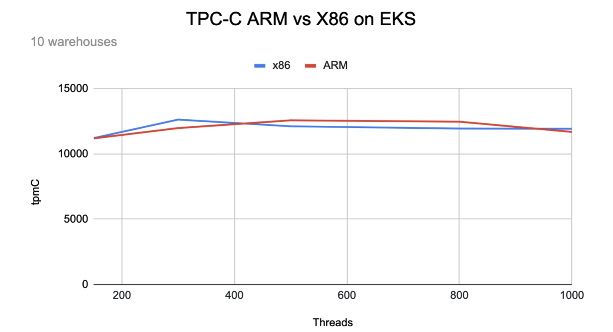

---
title: 'TiDB on an ARM-based Kubernetes Cluster: x86 Performance at 15% Lower Cost'
author: ['Ron Xing']
date: 2021-03-10
summary: Running TiDB on EKS clusters with Graviton processors offers performance comparable to an x86-based cluster, but at a 15% saving. This article discusses the benchmark tests we ran.
tags: ['Benchmark']
categories: ['Product']
image: /images/blog/tidb-on-eks-arm-vs-x86-benchmark.jpg
--- 


## Benchmark purpose

The following tests compare the performance of [TiDB](https://docs.pingcap.com/tidb/stable/), a MySQL compatible NewSQL database, running on an ARM-based Amazon Elastic Kubernetes Service (EKS) cluster and on an x86-based EKS cluster. The tests use an Online Transactional Processing (OLTP) workload, and the benchmarking tools are TPC-C and sysbench.

## Benchmark environment

The test used two EKS clusters with the following instance types and topology.

### Instance types

The following table summarizes all the EC2 instances we used in the EKS clusters as well as the benchmark node.

<table>
  <tr>
   <td><strong>Instance size (CPU Architecture)</strong>
   </td>
   <td><strong>vCPUs</strong>
   </td>
   <td><strong>Memory (GiB)</strong>
   </td>
   <td><strong>Instance storage (GB)</strong>
   </td>
   <td><strong>Network bandwidth (Gbps)</strong>
   </td>
   <td><strong>EBS bandwidth (Mbps)</strong>
   </td>
  </tr>
  <tr>
   <td>c6g.large(ARM)
   </td>
   <td>4
   </td>
   <td>8
   </td>
   <td>EBS-only
   </td>
   <td>Up to 10
   </td>
   <td>Up to 4,750
   </td>
  </tr>
  <tr>
   <td>c6g.2xlarge(ARM)
   </td>
   <td>8
   </td>
   <td>16
   </td>
   <td>EBS-only
   </td>
   <td>Up to 10
   </td>
   <td>Up to 4,750
   </td>
  </tr>
  <tr>
   <td>r6g.2xlarge(ARM)
   </td>
   <td>8
   </td>
   <td>64
   </td>
   <td>EBS-only
   </td>
   <td>Up to 10
   </td>
   <td>Up to 4,750
   </td>
  </tr>
  <tr>
   <td>c5.large(x86)
   </td>
   <td>4
   </td>
   <td>8
   </td>
   <td>EBS-only
   </td>
   <td>Up to 10
   </td>
   <td>Up to 4,750
   </td>
  </tr>
  <tr>
   <td>c5.2xlarge(x86)
   </td>
   <td>8
   </td>
   <td>16
   </td>
   <td>EBS-only
   </td>
   <td>Up to 10
   </td>
   <td>Up to 4,750
   </td>
  </tr>
  <tr>
   <td>r5.2xlarge(x86)
   </td>
   <td>8
   </td>
   <td>64
   </td>
   <td>EBS-only
   </td>
   <td>Up to 10
   </td>
   <td>Up to 4,750
   </td>
  </tr>
  <tr>
   <td>c5.4xlarge(x86)
   </td>
   <td>16
   </td>
   <td>32
   </td>
   <td>EBS-only
   </td>
   <td>10
   </td>
   <td>4,750
   </td>
  </tr>
</table>

### Storage

The following table summarizes the disk that we used for different components.

> **Note:**
>
> We didn't use EBS gp3 because the ARM support of the EBS CSI driver was not stable until the date of benchmarking. We believe that once EBS CSI driver on ARM is officially supported, gp3 provides significantly improved performance at similar costs.

<table>
  <tr>
   <td><strong>Service type</strong>
   </td>
   <td><strong>Storage</strong>
   </td>
   <td><strong>Size (GB)</strong>
   </td>
   <td><strong>IOPS</strong>
   </td>
   <td><strong>Throughput (MiB/s)</strong>
   </td>
   <td><strong>Instances</strong>
   </td>
  </tr>
  <tr>
   <td>TiKV
   </td>
   <td>EBS gp2
   </td>
   <td>1,000
   </td>
   <td>3,000
   </td>
   <td>250
   </td>
   <td>3
   </td>
  </tr>
  <tr>
   <td>PD
   </td>
   <td>EBS gp2
   </td>
   <td>50
   </td>
   <td>100
   </td>
   <td>128
   </td>
   <td>1
   </td>
  </tr>
  <tr>
   <td>TPC-C/sysbench
   </td>
   <td>EBS gp3
   </td>
   <td>1,500
   </td>
   <td>16,000
   </td>
   <td>1,000
   </td>
   <td>1
   </td>
  </tr>
</table>

### Topology

We used one c5.4xlarge EC2 instance as a benchmark node where TPC-C and sysbench are deployed.

Each EKS cluster consists of seven worker nodes and one admin (control plane) node. Seven worker nodes serve as dedicated TiDB, TiKV, and PD nodes.

<table>
  <tr>
   <td><strong>Cluster/processor</strong>
   </td>
   <td><strong>Service type</strong>
   </td>
   <td><strong>EC2 type</strong>
   </td>
   <td><strong>Instances</strong>
   </td>
  </tr>
  <tr>
   <td rowspan="4" >Cluster 1: Graviton2 ARM
   </td>
   <td>TiDB
   </td>
   <td>c6g.2xlarge
   </td>
   <td>3
   </td>
  </tr>
  <tr>
   <td>TiKV
   </td>
   <td>r6g.2xlarge
   </td>
   <td>3
   </td>
  </tr>
  <tr>
   <td>PD
   </td>
   <td>c6g.large
   </td>
   <td>1
   </td>
  </tr>
  <tr>
   <td>Admin node
   </td>
   <td>c6g.large
   </td>
   <td>1
   </td>
  </tr>
  <tr>
   <td rowspan="4" >Cluster 2: Intel Xeon Platinum 8000 series
   </td>
   <td>TiDB
   </td>
   <td>c5.2xlarge
   </td>
   <td>3
   </td>
  </tr>
  <tr>
   <td>TiKV
   </td>
   <td>r5.2xlarge
   </td>
   <td>3
   </td>
  </tr>
  <tr>
   <td>PD
   </td>
   <td>c5.large
   </td>
   <td>1
   </td>
  </tr>
  <tr>
   <td>Admin node
   </td>
   <td>c5.large
   </td>
   <td>1
   </td>
  </tr>
</table>

### Software version

The TiDB cluster software versions and the sysbench tool version are listed below.

<table>
  <tr>
   <td><strong>Service type</strong>
   </td>
   <td><strong>Software version</strong>
   </td>
  </tr>
  <tr>
   <td>TiDB
   </td>
   <td>v4.0.10
   </td>
  </tr>
  <tr>
   <td>TiKV
   </td>
   <td>v4.0.10
   </td>
  </tr>
  <tr>
   <td>PD
   </td>
   <td>v4.0.10
   </td>
  </tr>
  <tr>
   <td>TPC-C (embedded with TiUP)
   </td>
   <td>v1.0.8
   </td>
  </tr>
  <tr>
   <td>sysbench
   </td>
   <td>v1.0.20
   </td>
  </tr>
</table>

## Cost

In the following cost examples:

* Cost calculations are based on the on-demand rate for instances in the **US West (Oregon)** and **Asia Pacific (Singapore)** regions in US dollars (USD) per month. 
* Monthly calculations are based on 730 hours of usage per month.

### Storage

In the following table, the total cost per month includes a daily snapshot.

<table>
  <tr>
   <td><strong>Volume type</strong>
   </td>
   <td><strong>Size (GB)</strong>
   </td>
   <td><strong>IOPS</strong>
   </td>
   <td><strong>Throughput (MiB/s)</strong>
   </td>
   <td><strong>Instances </strong>
   </td>
   <td><strong>Monthly cost (US)</strong>
   </td>
   <td><strong>Monthly cost (APAC)</strong>
   </td>
  </tr>
  <tr>
   <td>gp2
   </td>
   <td>1,000
   </td>
   <td><p style="text-align: right">
3,000</p>

   </td>
   <td><p style="text-align: right">
250 </p>

   </td>
   <td><p style="text-align: right">
3</p>

   </td>
   <td><p style="text-align: right">
456.75</p>

   </td>
   <td><p style="text-align: right">
516.75</p>

   </td>
  </tr>
  <tr>
   <td>gp2
   </td>
   <td>50
   </td>
   <td><p style="text-align: right">
100</p>

   </td>
   <td><p style="text-align: right">
128 </p>

   </td>
   <td><p style="text-align: right">
1</p>

   </td>
   <td><p style="text-align: right">
9.75</p>

   </td>
   <td><p style="text-align: right">
10.75</p>

   </td>
  </tr>
</table>

### EC2

We used the following Graviton2 ARM processor based instances. Note that unit prices are based on the rate in both the US region and the APAC region.

<table>
  <tr>
   <td rowspan="2" ><strong>Service type</strong>
   </td>
   <td rowspan="2" ><strong>EC2 type</strong>
   </td>
   <td rowspan="2" ><strong>Instances</strong>
   </td>
   <td colspan="2" ><strong>US region</strong>
   </td>
   <td colspan="2" ><strong>APAC region</strong>
   </td>
  </tr>
  <tr>
   <td><strong>Unit price (USD/hr)</strong>
   </td>
   <td><strong>Monthly cost</strong>
   </td>
   <td><strong>Unit price (USD/hr) </strong>
   </td>
   <td><strong>Monthly cost </strong>
   </td>
  </tr>
  <tr>
   <td>TiDB
   </td>
   <td>c6g.2xlarge
   </td>
   <td><p style="text-align: right">
3</p>

   </td>
   <td><p style="text-align: right">
0.272</p>

   </td>
   <td><p style="text-align: right">
595.68</p>

   </td>
   <td><p style="text-align: right">
0.3136</p>

   </td>
   <td><p style="text-align: right">
686.78</p>

   </td>
  </tr>
  <tr>
   <td>TiKV
   </td>
   <td>r6g.2xlarge
   </td>
   <td><p style="text-align: right">
3</p>

   </td>
   <td><p style="text-align: right">
0.4032</p>

   </td>
   <td><p style="text-align: right">
883.01</p>

   </td>
   <td><p style="text-align: right">
0.4864</p>

   </td>
   <td><p style="text-align: right">
1,065.21</p>

   </td>
  </tr>
  <tr>
   <td>PD
   </td>
   <td>c6g.large
   </td>
   <td><p style="text-align: right">
1</p>

   </td>
   <td><p style="text-align: right">
0.068</p>

   </td>
   <td><p style="text-align: right">
49.64</p>

   </td>
   <td><p style="text-align: right">
0.0784</p>

   </td>
   <td><p style="text-align: right">
57.23</p>

   </td>
  </tr>
  <tr>
   <td>Control plane
   </td>
   <td>c6g.large
   </td>
   <td><p style="text-align: right">
1</p>

   </td>
   <td><p style="text-align: right">
0.068</p>

   </td>
   <td><p style="text-align: right">
49.64</p>

   </td>
   <td><p style="text-align: right">
0.0784</p>

   </td>
   <td><p style="text-align: right">
57.23</p>

   </td>
  </tr>
  <tr>
   <td><strong>Total</strong>
   </td>
   <td>
   </td>
   <td>
   </td>
   <td>
   </td>
   <td><p style="text-align: right">
<strong>1,577.97</strong></p>

   </td>
   <td>
   </td>
   <td><p style="text-align: right">
<strong>1,866.46</strong></p>

   </td>
  </tr>
</table>

Here are the configurations and costs of our Intel Xeon Platinum 8000 series processors based instances:

<table>
  <tr>
   <td rowspan="2" ><strong>Service type</strong>
   </td>
   <td rowspan="2" ><strong>EC2 type</strong>
   </td>
   <td rowspan="2" ><strong>Instances</strong>
   </td>
   <td colspan="2" ><strong>US region</strong>
   </td>
   <td colspan="2" ><strong>APAC region</strong>
   </td>
  </tr>
  <tr>
   <td><strong>Unit price (USD/hr)</strong>
   </td>
   <td><strong>Monthly cost</strong>
   </td>
   <td><strong>Unit price (USD/hr) </strong>
   </td>
   <td><strong>Monthly cost</strong>
   </td>
  </tr>
  <tr>
   <td>TiDB
   </td>
   <td>c5.2xlarge
   </td>
   <td><p style="text-align: right">
3</p>

   </td>
   <td><p style="text-align: right">
0.34</p>

   </td>
   <td><p style="text-align: right">
744.60</p>

   </td>
   <td><p style="text-align: right">
0.392</p>

   </td>
   <td><p style="text-align: right">
858.48</p>

   </td>
  </tr>
  <tr>
   <td>TiKV
   </td>
   <td>r5.2xlarge
   </td>
   <td><p style="text-align: right">
3</p>

   </td>
   <td><p style="text-align: right">
0.504</p>

   </td>
   <td><p style="text-align: right">
1,103.76</p>

   </td>
   <td><p style="text-align: right">
0.608</p>

   </td>
   <td><p style="text-align: right">
1,331.52</p>

   </td>
  </tr>
  <tr>
   <td>PD
   </td>
   <td>c5.large
   </td>
   <td><p style="text-align: right">
1</p>

   </td>
   <td><p style="text-align: right">
0.085</p>

   </td>
   <td><p style="text-align: right">
62.05</p>

   </td>
   <td><p style="text-align: right">
0.098</p>

   </td>
   <td><p style="text-align: right">
71.54</p>

   </td>
  </tr>
  <tr>
   <td>Control plane
   </td>
   <td>c5.large
   </td>
   <td><p style="text-align: right">
1</p>

   </td>
   <td><p style="text-align: right">
0.085</p>

   </td>
   <td><p style="text-align: right">
62.05</p>

   </td>
   <td><p style="text-align: right">
0.098</p>

   </td>
   <td><p style="text-align: right">
71.54</p>

   </td>
  </tr>
  <tr>
   <td><strong>Total</strong>
   </td>
   <td>
   </td>
   <td>
   </td>
   <td>
   </td>
   <td><p style="text-align: right">
<strong>1,972.46</strong></p>

   </td>
   <td>
   </td>
   <td><p style="text-align: right">
<strong>2,333.08</strong></p>

   </td>
  </tr>
</table>

### Total cost

The following tables summarize the total costs per month in the **US West (Oregon)** and **Asian Pacific (Singapore)** regions. All costs are in US dollars per month.

AWS US West (Oregon) 

<table>
  <tr>
   <td><strong>CPU type</strong>
   </td>
   <td><strong>EC2 cost</strong>
   </td>
   <td><strong>Storage cost</strong>
   </td>
   <td><strong>EKS cost</strong>
   </td>
   <td><strong>Total cost</strong>
   </td>
  </tr>
  <tr>
   <td>ARM
   </td>
   <td><p style="text-align: right">
1,577.97</p>

   </td>
   <td><p style="text-align: right">
466.50</p>

   </td>
   <td><p style="text-align: right">
73.00</p>

   </td>
   <td><p style="text-align: right">
2,117.47</p>

   </td>
  </tr>
  <tr>
   <td>X86
   </td>
   <td><p style="text-align: right">
1,972.46</p>

   </td>
   <td><p style="text-align: right">
466.50</p>

   </td>
   <td><p style="text-align: right">
73.00</p>

   </td>
   <td><p style="text-align: right">
2,511.96</p>

   </td>
  </tr>
</table>

AWS Asia Pacific (Singapore)

<table>
  <tr>
   <td><strong>CPU type</strong>
   </td>
   <td><strong>EC2 cost</strong>
   </td>
   <td><strong>Storage cost</strong>
   </td>
   <td><strong>EKS cost</strong>
   </td>
   <td><strong>Total cost</strong>
   </td>
  </tr>
  <tr>
   <td>ARM
   </td>
   <td><p style="text-align: right">
1,866.46</p>

   </td>
   <td><p style="text-align: right">
527.50</p>

   </td>
   <td><p style="text-align: right">
73.00</p>

   </td>
   <td><p style="text-align: right">
2,466.96</p>

   </td>
  </tr>
  <tr>
   <td>X86
   </td>
   <td><p style="text-align: right">
2,333.08</p>

   </td>
   <td><p style="text-align: right">
527.50</p>

   </td>
   <td><p style="text-align: right">
73.00</p>

   </td>
   <td><p style="text-align: right">
2,933.58</p>

   </td>
  </tr>
</table>

## Preparation

To deploy a TiDB cluster on an x86-based EKS cluster, follow the steps in [Deploy TiDB on AWS EKS](https://docs.pingcap.com/tidb-in-kubernetes/stable/deploy-on-aws-eks#deploy-tidb-on-aws-eks).

To deploy a TiDB cluster on an ARM-based EKS cluster, follow the steps in [TiDB Deployment on Graviton2-based EKS](https://github.com/xinghua0123/tidb-deployment/blob/main/README.md). The following [temporary ARM images](https://hub.docker.com/u/pingcap2021) are used for benchmarking:

* pingcap2021/tidb-operator:v1.1.14
* pingcap2021/pd:v4.0.10
* pingcap2021/tikv:v4.0.10
* pingcap2021/tidb:v4.0.10
* pingcap2021/tidb-monitor-initializer:v4.0.10

Above images are temporary and not meant for a production environment. Stay tuned for the official ARM images.

## TPC-C benchmark

As you review the following benchmark tests, keep in mind that these are preliminary results. They should not be considered official TPC-C results.

To facilitate benchmarking, TiUP has integrated the bench component, which provides two workloads for stress testing: TPC-C and TPC-H. The commands and flags are as follows:

```shell
$ tiup bench 
Starting component `bench`: /Users/joshua/.tiup/components/bench/v0.0.1/bench 
Benchmark database with different workloads

Usage:
  tiup bench [command]

Available Commands:
  help        Help about any command
  tpcc
  tpch

Flags:
      --count int           Total execution count, 0 means infinite
  -D, --db string           Database name (default "test")
  -d, --driver string       Database driver: mysql
      --dropdata            Cleanup data before prepare
  -h, --help                help for /Users/joshua/.tiup/components/bench/v0.0.1/bench
  -H, --host string         Database host (default "127.0.0.1")
      --ignore-error        Ignore error when running workload
      --interval duration   Output interval time (default 10s)
      --isolation int       Isolation Level 0: Default, 1: ReadUncommitted, 
                            2: ReadCommitted, 3: WriteCommitted, 4: RepeatableRead, 
                            5: Snapshot, 6: Serializable, 7: Linerizable
      --max-procs int       runtime.GOMAXPROCS
  -p, --password string     Database password
  -P, --port int            Database port (default 4000)
      --pprof string        Address of pprof endpoint
      --silence             Do not print error when running workload
      --summary             Print summary TPM only, or also print current TPM when running workload
  -T, --threads int         Thread concurrency (default 16)
      --time duration       Total execution time (default 2562047h47m16.854775807s)
  -U, --user string         Database user (default "root")
```

For TPC-C, the TiUP bench component supports the following commands and flags to run the test:

```shell
$ tiup bench tpcc
Available Commands:
  check       Check data consistency for the workload
  cleanup     Cleanup data for the workload
  prepare     Prepare data for the workload
  run         Run workload

Flags:
      --check-all        Run all consistency checks
  -h, --help             help for tpcc
      --output string    Output directory for generating csv file when preparing data
      --parts int        Number to partition warehouses (default 1)
      --tables string    Specified tables for generating file, separated by ','. Valid only if output is set. If this flag is not set, generate all tables by default.
      --warehouses int   Number of warehouses (default 10)
```

### Workloads

This table summarizes the workloads we used, both in terms of the number of warehouses and the data sizes.

<table>
  <tr>
   <td><strong>Workload</strong>
   </td>
   <td><strong>Warehouses</strong>
   </td>
   <td><strong>Data size</strong>
   </td>
  </tr>
  <tr>
   <td>Small
   </td>
   <td>10
   </td>
   <td>~1 GB
   </td>
  </tr>
  <tr>
   <td>Medium1
   </td>
   <td>100
   </td>
   <td>~10 GB
   </td>
  </tr>
  <tr>
   <td>Medium2
   </td>
   <td>500
   </td>
   <td>~50 GB
   </td>
  </tr>
</table>

For large workloads, we will test after the gp3 storageclass is stably supported on ARM-based EKS to avoid any potential bottlenecks from the disk I/O perspective.

### Test procedures

1. On the benchmark VM (c5.4xlarge), deploy the latest version of TiUP.

2. Create warehouses. You should specify the hostname as the load balancer's DNS name since we deployed the TiDB in EKS and exposed the database service as the LoadBalancer type:

    ```shell
   $ tiup bench tpcc --warehouses 10 --host xxxxxxxxxxx.elb.us-west-2.amazonaws.com prepare
    ```

3. Run the TPC-C test for different threads. (We used 150, 300, 500, 800, and 1000). Each test runs for 10 minutes.

    ```shell
    $ tiup bench tpcc --warehouses 10 --host xxxxxxxxxxx.elb.us-west-2.amazonaws.com --threads 150 --time 10m run
    ```

4. Note the tpmC result for each test case. The following is sample output:

    ```shell
    Finished
    [Summary] DELIVERY - Takes(s): 119.5, Count: 2036, TPM: 1022.6, Sum(ms): 642294, Avg(ms): 315, 90th(ms): 512, 99th(ms): 1000, 99.9th(ms): 2000
    [Summary] DELIVERY_ERR - Takes(s): 119.5, Count: 8, TPM: 4.0, Sum(ms): 1836, Avg(ms): 229, 90th(ms): 512, 99th(ms): 512, 99.9th(ms): 512
    [Summary] NEW_ORDER - Takes(s): 119.7, Count: 23288, TPM: 11673.2, Sum(ms): 7075203, Avg(ms): 303, 90th(ms): 1000, 99th(ms): 2000, 99.9th(ms): 4000
    [Summary] NEW_ORDER_ERR - Takes(s): 119.7, Count: 52, TPM: 26.1, Sum(ms): 14735, Avg(ms): 283, 90th(ms): 1000, 99th(ms): 1000, 99.9th(ms): 1000
    [Summary] ORDER_STATUS - Takes(s): 119.8, Count: 2023, TPM: 1013.5, Sum(ms): 30272, Avg(ms): 14, 90th(ms): 20, 99th(ms): 32, 99.9th(ms): 40
    [Summary] ORDER_STATUS_ERR - Takes(s): 119.8, Count: 1, TPM: 0.5, Sum(ms): 0, Avg(ms): 0, 90th(ms): 1, 99th(ms): 1, 99.9th(ms): 1
    [Summary] PAYMENT - Takes(s): 119.7, Count: 22045, TPM: 11046.1, Sum(ms): 10108739, Avg(ms): 458, 90th(ms): 1000, 99th(ms): 2000, 99.9th(ms): 4000
    [Summary] PAYMENT_ERR - Takes(s): 119.7, Count: 78, TPM: 39.1, Sum(ms): 25008, Avg(ms): 320, 90th(ms): 1000, 99th(ms): 1500, 99.9th(ms): 1500
    [Summary] STOCK_LEVEL - Takes(s): 119.7, Count: 2124, TPM: 1064.5, Sum(ms): 37020, Avg(ms): 17, 90th(ms): 24, 99th(ms): 40, 99.9th(ms): 48
    tpmC: 11673.2
    ```

5. In preparation for the next workload, clean up the data.

    ```shell
    tiup bench tpcc --warehouses 10 --host xxxxxxxxxxx.elb.us-west-2.amazonaws.com cleanup
    ```

6. Beginning at step 2, repeat this procedure for different numbers of warehouses.

### Benchmark results

The following table shows the results for a small workload:

<table>
  <tr>
   <td><strong>tpmC</strong>
   </td>
   <td><strong>150</strong>
   </td>
   <td><strong>300</strong>
   </td>
   <td><strong>500</strong>
   </td>
   <td><strong>800</strong>
   </td>
   <td><strong>1000</strong>
   </td>
  </tr>
  <tr>
   <td>x86
   </td>
   <td><p style="text-align: right">
11,211.4</p>

   </td>
   <td><p style="text-align: right">
12,624.8</p>

   </td>
   <td><p style="text-align: right">
12,111.7</p>

   </td>
   <td><p style="text-align: right">
11,941.0</p>

   </td>
   <td><p style="text-align: right">
11,919.4</p>

   </td>
  </tr>
  <tr>
   <td>ARM
   </td>
   <td><p style="text-align: right">
11,186.3</p>

   </td>
   <td><p style="text-align: right">
11,977.6</p>

   </td>
   <td><p style="text-align: right">
12,570.0</p>

   </td>
   <td><p style="text-align: right">
12,465.1</p>

   </td>
   <td><p style="text-align: right">
11,680.0</p>

   </td>
  </tr>
  <tr>
   <td>(ARM-x86)/x86
   </td>
   <td><p style="text-align: right">
-0.22%</p>

   </td>
   <td><p style="text-align: right">
-5.13%</p>

   </td>
   <td><p style="text-align: right">
3.78%</p>

   </td>
   <td><p style="text-align: right">
4.39%</p>

   </td>
   <td><p style="text-align: right">
-2.01%</p>

   </td>
  </tr>
</table>


<div class="caption-center"> TPC-C ARM vs. x86 on EKS for a small workload </div>

The following table shows the results for a medium1 workload:

<table>
  <tr>
   <td><strong>tpmC</strong>
   </td>
   <td><strong>150</strong>
   </td>
   <td><strong>300</strong>
   </td>
   <td><strong>500</strong>
   </td>
   <td><strong>800</strong>
   </td>
   <td><strong>1,000</strong>
   </td>
  </tr>
  <tr>
   <td>x86
   </td>
   <td><p style="text-align: right">
34,407.8</p>

   </td>
   <td><p style="text-align: right">
49,379.5</p>

   </td>
   <td><p style="text-align: right">
53,965.8</p>

   </td>
   <td><p style="text-align: right">
54,459.9</p>

   </td>
   <td><p style="text-align: right">
52,319.8</p>

   </td>
  </tr>
  <tr>
   <td>ARM
   </td>
   <td><p style="text-align: right">
32,089.5</p>

   </td>
   <td><p style="text-align: right">
52,382.1</p>

   </td>
   <td><p style="text-align: right">
55,479.4</p>

   </td>
   <td><p style="text-align: right">
53,914.1</p>

   </td>
   <td><p style="text-align: right">
56,058.6</p>

   </td>
  </tr>
  <tr>
   <td>(ARM-x86)/x86
   </td>
   <td><p style="text-align: right">
-6.74%</p>

   </td>
   <td><p style="text-align: right">
6.08%</p>

   </td>
   <td><p style="text-align: right">
2.80%</p>

   </td>
   <td><p style="text-align: right">
-1.00%</p>

   </td>
   <td><p style="text-align: right">
7.14%</p>

   </td>
  </tr>
</table>


<div class="caption-center"> TPC-C ARM vs. x86 on EKS for a medium1 workload </div>

The following table shows the results for a medium2 workload:

<table>
  <tr>
   <td><strong>tpmC</strong>
   </td>
   <td><strong>150</strong>
   </td>
   <td><strong>300</strong>
   </td>
   <td><strong>500</strong>
   </td>
   <td><strong>800</strong>
   </td>
   <td><strong>1,000</strong>
   </td>
  </tr>
  <tr>
   <td>x86
   </td>
   <td><p style="text-align: right">
37,893.7</p>

   </td>
   <td><p style="text-align: right">
57,138.3</p>

   </td>
   <td><p style="text-align: right">
61,601.6</p>

   </td>
   <td><p style="text-align: right">
65,132.7</p>

   </td>
   <td><p style="text-align: right">
63,240.5</p>

   </td>
  </tr>
  <tr>
   <td>ARM
   </td>
   <td><p style="text-align: right">
44,141.2</p>

   </td>
   <td><p style="text-align: right">
57,666.4</p>

   </td>
   <td><p style="text-align: right">
62,466.7</p>

   </td>
   <td><p style="text-align: right">
67,230.7</p>

   </td>
   <td><p style="text-align: right">
68,067.7</p>

   </td>
  </tr>
  <tr>
   <td>(ARM-x86)/x86
   </td>
   <td><p style="text-align: right">
16.49%</p>

   </td>
   <td><p style="text-align: right">
0.92%</p>

   </td>
   <td><p style="text-align: right">
1.40%</p>

   </td>
   <td><p style="text-align: right">
3.22%</p>

   </td>
   <td><p style="text-align: right">
7.63%</p>

   </td>
  </tr>
</table>


<div class="caption-center"> TPC-C ARM vs. x86 on EKS for a medium2 workload </div>

### Price-performance ratio

In the following price-performance table:

* The tpmC values are derived from the average tpmC among 300, 500, and 800 threads.
* The total system costs for the US and APAC regions reflect the estimated five year hardware cost.
* The price-performance ratios compare x86 and Graviton2 ARM processors. A lower cost for more performance is better. 
* All costs are in US dollars.

<table>
  <tr>
   <td rowspan="2" >
   </td>
   <td rowspan="2" >
<strong>Workload</strong>
   </td>
   <td rowspan="2" ><strong>tpmC</strong>
   </td>
   <td colspan="2" ><strong>US region</strong>
   </td>
   <td colspan="2" ><strong>APAC region</strong>
   </td>
  </tr>
  <tr>
   <td><strong>Total system cost</strong>
   </td>
   <td><strong>Price-performance</strong>
   </td>
   <td><strong>Total system cost</strong>
   </td>
   <td><strong>Price-performance</strong>
   </td>
  </tr>
  <tr>
   <td>x86
   </td>
   <td>Small
   </td>
   <td><p style="text-align: right">
12,225</p>

   </td>
   <td><p style="text-align: right">
150,717.6</p>

   </td>
   <td><p style="text-align: right">
12.33</p>

   </td>
   <td><p style="text-align: right">
176,014.80</p>

   </td>
   <td><p style="text-align: right">
14.40</p>

   </td>
  </tr>
  <tr>
   <td>ARM
   </td>
   <td>Small
   </td>
   <td><p style="text-align: right">
12,337</p>

   </td>
   <td><p style="text-align: right">
127,048.2</p>

   </td>
   <td><p style="text-align: right">
10.30</p>

   </td>
   <td><p style="text-align: right">
148,017.60</p>

   </td>
   <td><p style="text-align: right">
12.00</p>

   </td>
  </tr>
  <tr>
   <td>(ARM-x86)/x86
   </td>
   <td>
   </td>
   <td>
   </td>
   <td>
   </td>
   <td><p style="text-align: right">
-16.5%</p>

   </td>
   <td>
   </td>
   <td><p style="text-align: right">
-16.67%</p>

   </td>
  </tr>
  <tr>
   <td>x86
   </td>
   <td>Medium1
   </td>
   <td><p style="text-align: right">
52,601</p>

   </td>
   <td><p style="text-align: right">
150,717.6</p>

   </td>
   <td><p style="text-align: right">
2.87</p>

   </td>
   <td><p style="text-align: right">
176,014.80</p>

   </td>
   <td><p style="text-align: right">
3.35</p>

   </td>
  </tr>
  <tr>
   <td>ARM
   </td>
   <td>Medium1
   </td>
   <td><p style="text-align: right">
53,925</p>

   </td>
   <td><p style="text-align: right">
127,048.2</p>

   </td>
   <td><p style="text-align: right">
2.35</p>

   </td>
   <td><p style="text-align: right">
148,017.60</p>

   </td>
   <td><p style="text-align: right">
2.74</p>

   </td>
  </tr>
  <tr>
   <td>(ARM-x86)/x86
   </td>
   <td>
   </td>
   <td>
   </td>
   <td>
   </td>
   <td><p style="text-align: right">
-18.11%</p>

   </td>
   <td>
   </td>
   <td><p style="text-align: right">
-17.97%</p>

   </td>
  </tr>
  <tr>
   <td>x86
   </td>
   <td>Medium2
   </td>
   <td><p style="text-align: right">
61,290</p>

   </td>
   <td><p style="text-align: right">
150,717.6</p>

   </td>
   <td><p style="text-align: right">
2.46</p>

   </td>
   <td><p style="text-align: right">
176,014.80</p>

   </td>
   <td><p style="text-align: right">
2.87</p>

   </td>
  </tr>
  <tr>
   <td>ARM
   </td>
   <td>Medium2
   </td>
   <td><p style="text-align: right">
62,454</p>

   </td>
   <td><p style="text-align: right">
127,048.2</p>

   </td>
   <td><p style="text-align: right">
2.03</p>

   </td>
   <td><p style="text-align: right">
148,017.60</p>

   </td>
   <td><p style="text-align: right">
2.37</p>

   </td>
  </tr>
  <tr>
   <td>(ARM-x86)/x86
   </td>
   <td>
   </td>
   <td>
   </td>
   <td>
   </td>
   <td><p style="text-align: right">
-17.47%</p>

   </td>
   <td>
   </td>
   <td><p style="text-align: right">
-17.47%</p>

   </td>
  </tr>
</table>

As the following graphic shows, when we compare the absolute tpmC performance under each workload, the ARM-based system and the x86-based system do not differ that much. After we factor in the hardware cost, the ARM price-performance ratio is at least 15% lower than x86, regardless of the workload.


<div class="caption-center"> TPC-C price-performance ratio </div>

## Sysbench

We will be using `oltp_read_write.lua` to test the performance for the OLTP workload.

### Workloads

* Read (75%) and Write (25%)
* Table: 16
* Table size: 10 M rows per table
* Data size: around 100 GB

### Test procedures

1. Deploy the latest version of sysbench on the benchmark VM (c5.4xlarge).

2. Set the sysbench configurations and save them in the configuration file. The following is a sample configuration file:

    ```shell
    mysql-host={TIDB_HOST}
    mysql-port=4000
    mysql-user=root
    mysql-password=password
    mysql-db=sbtest
    time=600
    threads=8 # set to 8 while importing the data
    report-interval=10
    db-driver=mysql
    ```

3. Before you import the data, it is necessary to make some settings to TiDB. Execute the following command in MySQL client:

    ```sql
    set global tidb_disable_txn_auto_retry = off;
    ```

4. Use [BR](https://docs.pingcap.com/tidb/stable/backup-and-restore-tool) to import the prepared data in S3.

5. Change the thread in config file to 300.

6. Run the sysbench test:

    ```shell
    sysbench --config-file=config oltp_read_write --tables=16 --table-size=10000000 run
    ```

7. Note the test results. The following are sample test results:

    ```shell
    SQL statistics:
        queries performed:
            read:                            10457930
            write:                           2966386
            other:                           1515584
            total:                           14939900
        transactions:                        746995 (2489.02 per sec.)
        queries:                             14939900 (49780.45 per sec.)
        ignored errors:                      0      (0.00 per sec.)
        reconnects:                          0      (0.00 per sec.)

    General statistics:
        total time:                          300.1146s
        total number of events:              746995

    Latency (ms):
            min:                                   43.84
            avg:                                  120.50
            max:                                  381.92
            95th percentile:                      153.02
            sum:                             90013122.40

    Threads fairness:
        events (avg/stddev):           2489.9833/235.76
        execution time (avg/stddev):   300.0437/0.03
    ```

8. Beginning at step 5, repeat this procedure and set the thread to 600 and 900.

### Benchmark results

Results for 300, 600, and 900 threads are listed below. Since the QPS and TPS in sysbench are proportional, we will only compare the TPS in our test.

<table>
  <tr>
   <td><strong>Metrics</strong>
   </td>
   <td><strong>300</strong>
   </td>
   <td><strong>600</strong>
   </td>
   <td><strong>900</strong>
   </td>
  </tr>
  <tr>
   <td>x86 P95 latency (ms) 
   </td>
   <td><p style="text-align: right">
153.02</p>

   </td>
   <td><p style="text-align: right">
277.21</p>

   </td>
   <td><p style="text-align: right">
397.39</p>

   </td>
  </tr>
  <tr>
   <td>ARM P95 latency (ms)
   </td>
   <td><p style="text-align: right">
167.44</p>

   </td>
   <td><p style="text-align: right">
267.41</p>

   </td>
   <td><p style="text-align: right">
390.30</p>

   </td>
  </tr>
  <tr>
   <td>x86 QPS
   </td>
   <td><p style="text-align: right">
49,780.45</p>

   </td>
   <td><p style="text-align: right">
53,962.19</p>

   </td>
   <td><p style="text-align: right">
54,929.00</p>

   </td>
  </tr>
  <tr>
   <td>ARM QPS
   </td>
   <td><p style="text-align: right">
47,944.82</p>

   </td>
   <td><p style="text-align: right">
54,912.82</p>

   </td>
   <td><p style="text-align: right">
56,397.01</p>

   </td>
  </tr>
  <tr>
   <td>x86 TPS
   </td>
   <td><p style="text-align: right">
2,489.02</p>

   </td>
   <td><p style="text-align: right">
2,698.11</p>

   </td>
   <td><p style="text-align: right">
2,746.45</p>

   </td>
  </tr>
  <tr>
   <td>ARM TPS
   </td>
   <td><p style="text-align: right">
2,397.24</p>

   </td>
   <td><p style="text-align: right">
2,745.64</p>

   </td>
   <td><p style="text-align: right">
2,819.85</p>

   </td>
  </tr>
  <tr>
   <td>For TPS: (ARM-x86)/x86
   </td>
   <td><p style="text-align: right">
-3.68%</p>

   </td>
   <td><p style="text-align: right">
1.76%</p>

   </td>
   <td><p style="text-align: right">
2.67%</p>

   </td>
  </tr>
</table>


<div class="caption-center"> Sysbench ARM vs. x86 on EKS </div>

### Price-performance ratio

In the following price-performance table:

* TPS values are derived from the average TPS among 300, 600, and 900 threads.
* The total system cost reflects the estimated five year hardware cost. All costs are in US dollars.
* Price-performance compares x86 and Graviton2 ARM processors. A lower value is better. That indicates a lower cost for more performance.

<table>
  <tr>
   <td rowspan="2" >
   </td>
   <td rowspan="2" >
<strong>TPS</strong>
   </td>
   <td colspan="2" ><strong>US region</strong>
   </td>
   <td colspan="2" ><strong>APAC region</strong>
   </td>
  </tr>
  <tr>
   <td><strong>Total system cost</strong>
   </td>
   <td><strong>Price-performance</strong>
   </td>
   <td><strong>Total system cost</strong>
   </td>
   <td><strong>Price-performance</strong>
   </td>
  </tr>
  <tr>
   <td>x86
   </td>
   <td><p style="text-align: right">
2,644.53</p>

   </td>
   <td><p style="text-align: right">
150,717.6</p>

   </td>
   <td><p style="text-align: right">
56.99</p>

   </td>
   <td><p style="text-align: right">
176,014.80</p>

   </td>
   <td><p style="text-align: right">
66.56</p>

   </td>
  </tr>
  <tr>
   <td>ARM
   </td>
   <td><p style="text-align: right">
2,654.21</p>

   </td>
   <td><p style="text-align: right">
127,048.2</p>

   </td>
   <td><p style="text-align: right">
47.87</p>

   </td>
   <td><p style="text-align: right">
148,017.60</p>

   </td>
   <td><p style="text-align: right">
55.77</p>

   </td>
  </tr>
  <tr>
   <td>(ARM-x86)/x86
   </td>
   <td>
   </td>
   <td>
   </td>
   <td><p style="text-align: right">
-16.00%</p>

   </td>
   <td>
   </td>
   <td><p style="text-align: right">
-16.21%</p>

   </td>
  </tr>
</table>

## Conclusion

Benchmarking results from both TPC-C and sysbench have shown that the Graviton2 processor has comparable performance to the x86 processor. In some cases, when the concurrency of the workload increases, Graviton2 outperforms x86. After factoring in the hardware cost, the Graviton2 processor has a better price-performance ratio than the x86—on average 15% lower. In other words, the Graviton2 processor can achieve the same performance as the x86 processor with 15% lower cost for running TiDB on EKS for TPC-C and sysbench. The results are only based on the small and medium workloads we tested. In the future, we will include more complex and large workloads with better EBS storage support. 
