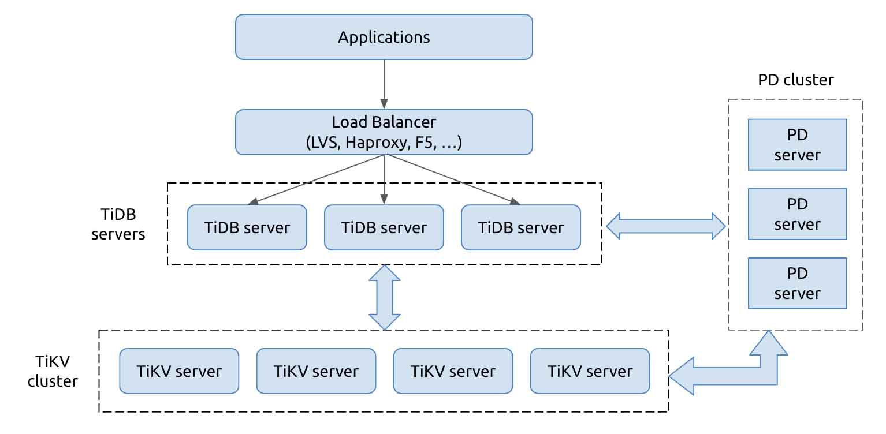
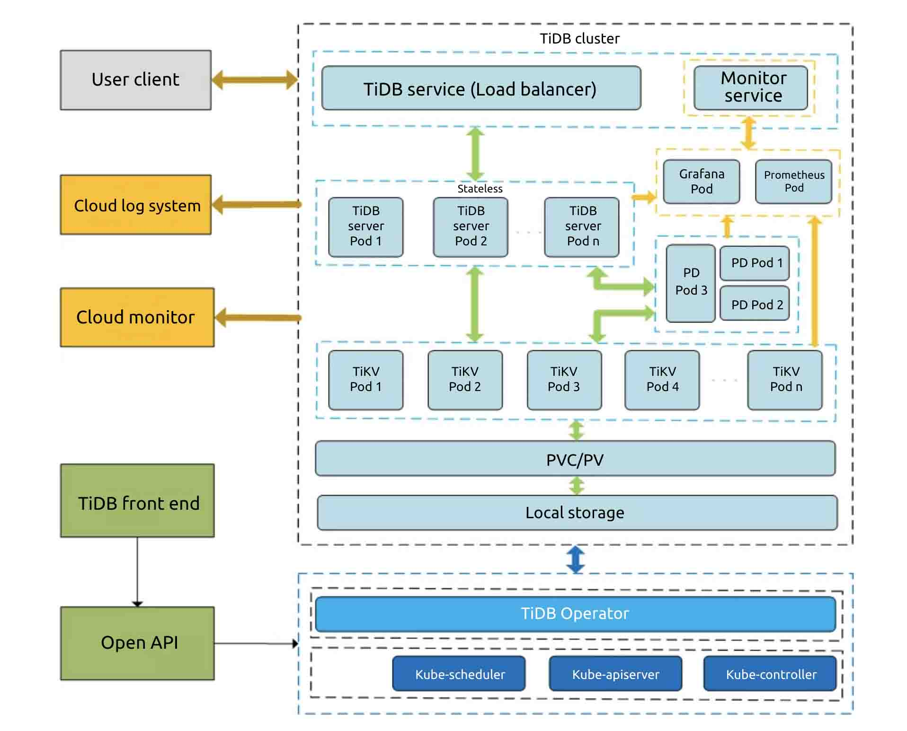
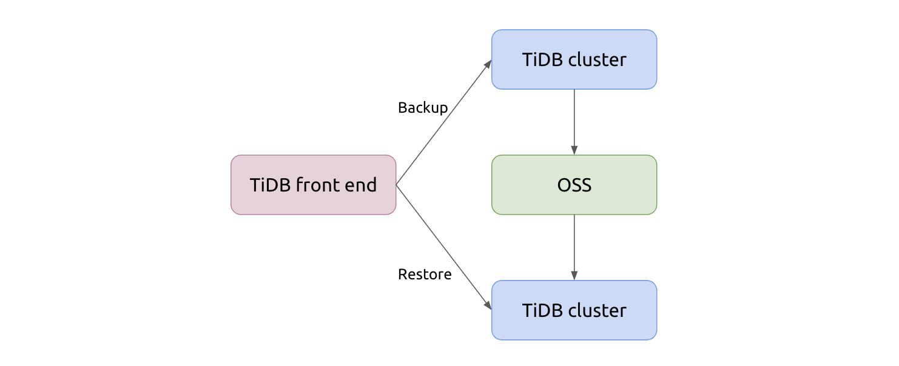
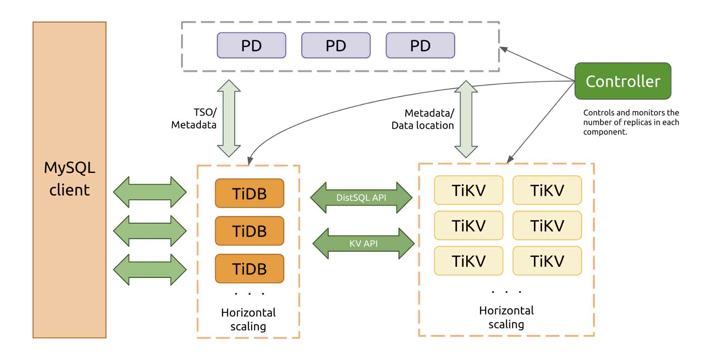
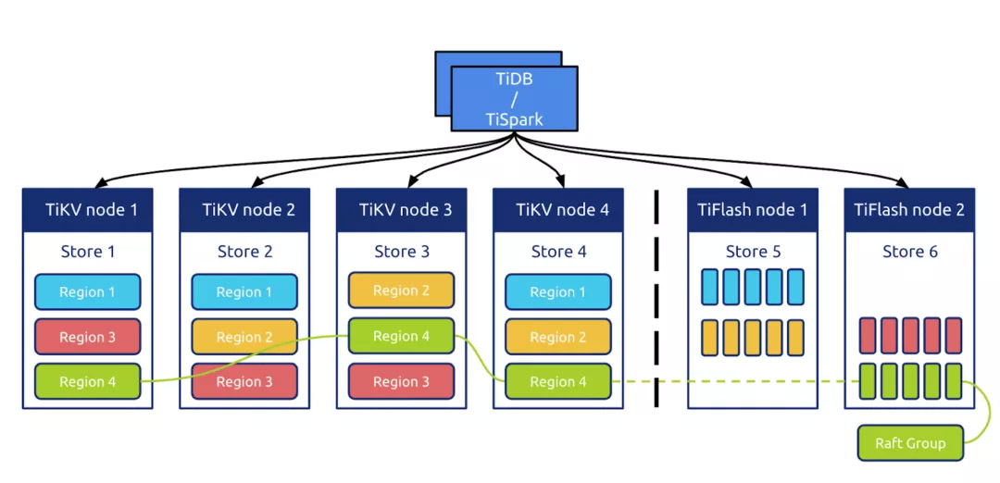
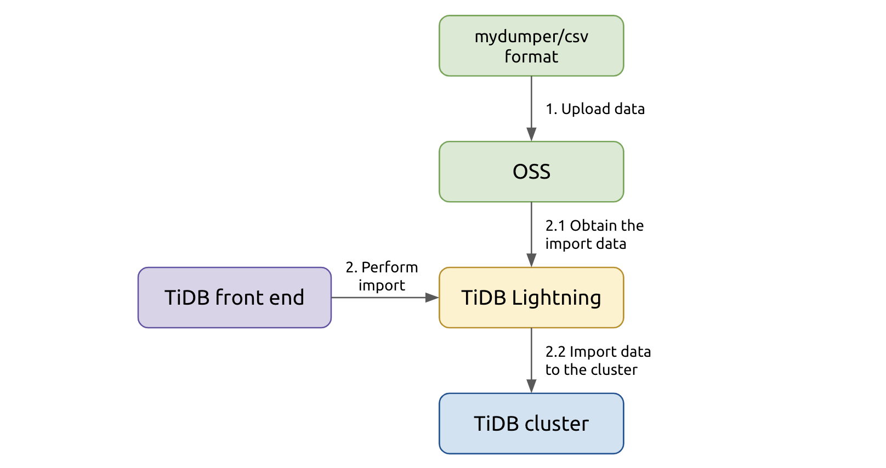
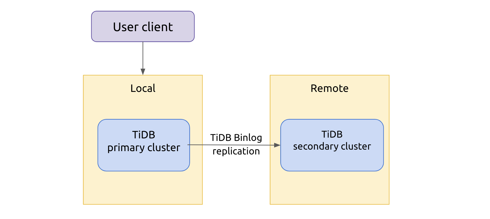
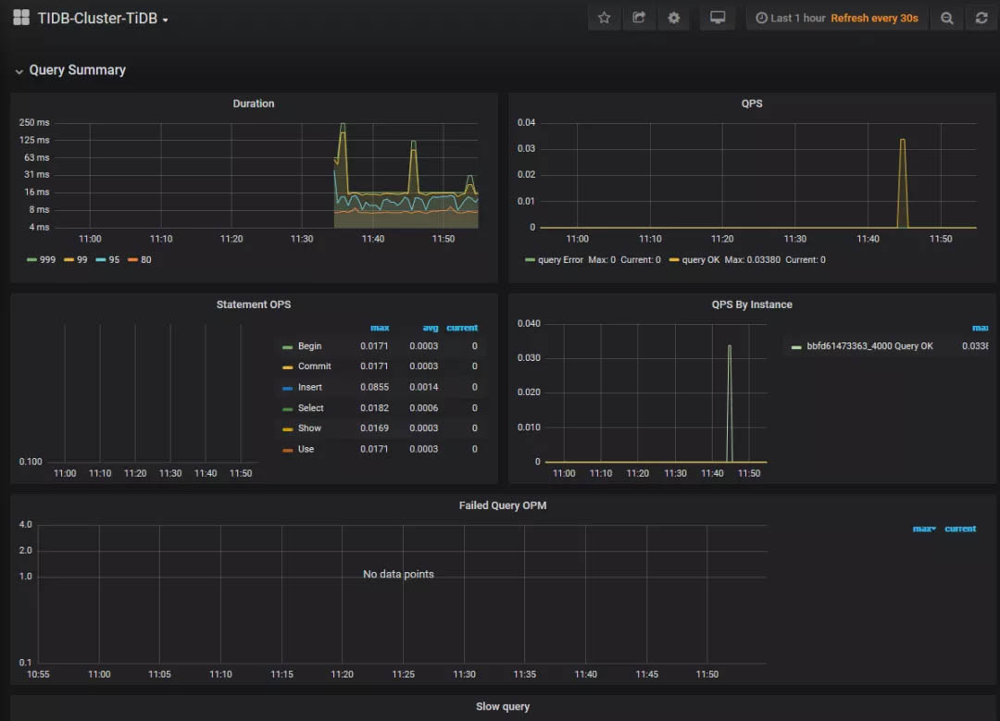
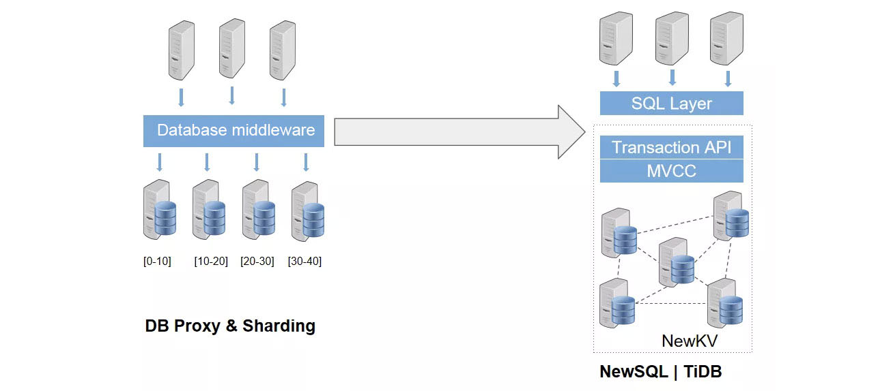

**Author:** JD Cloud database team

In the past year, as most people practiced social distancing, they relied heavily on online services for shopping, remote working, and socializing. Online services surged, and as the requests and data flooded in, the database systems faced severe challenges.

After surveying hundreds of enterprises, we at [JD Cloud](https://www.jdcloud.com/) developed a portrait of their ideal database:

* It can dynamically allocate resources to meet the application's requirements.
* It supports ACID-compliant transactions and is MySQL-compatible.
* It is highly available across data centers and automatically fails over without manual intervention.

To provide a cloud database service that meets these expectations, JD Cloud teamed up with [PingCAP](https://pingcap.com/about) to provide a distributed database service on the cloud: [Cloud-TiDB](https://www.jdcloud.com/en/products/tidb-service).

## TiDB, a cloud-native database

[TiDB](https://docs.pingcap.com/tidb/stable/) is an open-source, cloud-native distributed database. It features horizontal scalability and MySQL compatibility. As a distributed database, TiDB can be deployed across data centers, and it stores data in multiple replicas with strong consistency. It also supports automatic failover. In addition, TiDB performs remarkably for Online Analytical Processing (OLAP) workloads to provide a one-stop Hybrid Transactional/Analytical Processing (HTAP) solution.

TiDB's architecture is shown below. It has a multi-layered architecture with three modules: TiDB, TiKV, and PD.

 TiDB architecture 

* [TiDB](https://pingcap.com/blog/2017-07-11-tidbinternal2) is the SQL layer. It is connected to the client and answers queries from the applications. TiDB parses SQL statements and generates the execution plan. TiDB is stateless, and you can launch multiple TiDB nodes to balance the load of the application connections. TiDB nodes don't store data, but only relay requests to the storage layer, TiKV.
* [TiKV](https://pingcap.com/blog/2017-07-11-tidbinternal1) is the distributed KV storage layer, which supports elastic scaling out and in. TiKV stores data in multiple storage nodes, and it dynamically and automatically balances the load. Its API provides native support for distributed transactions at the Key-Value layer and ensures snapshot isolation. All data in TiKV has multiple replicas (three by default), and thus the database system is highly available and can automatically fail over.
* [Placement Driver](https://pingcap.com/blog/2017-07-20-tidbinternal3) (PD) is the metadata management module of the TiDB cluster. It stores the data distribution status in each TiKV node and the topology of the entire cluster, and allocates transaction IDs for the distributed transactions. In addition, PD analyzes TiKV data status in real time and, based on the status, schedules data among TiKV nodes. PD also has at least three nodes for high availability.

## Cloud-TiDB

On JD cloud, we deploy TiDB in Kubernetes to make TiDB more flexible and reliable. The deployment architecture is as follows:

 Cloud-TiDB architecture 

The user's client accesses the TiDB cluster via the network load balancer (NLB). The NLB balances the load among multiple TiDB nodes in the cluster. The cluster can have three replicas in three availability zones (AZ). By setting affinity, the number of TiKV instances is roughly balanced in each AZ. PD instances are also distributed in each AZ.

In this architecture, each component in the cluster is highly available, and the database has no single point of failure. Even if one AZ fails, the database service is still available, and no data is lost. If an individual node fails, the TiDB cluster still provides services for the external application.

The TiDB cluster is also connected to the JD cloud monitoring and alert service and the logging system, which work together to supervise the status of TiDB instances. Users can manage the lifecycle of TiDB instances on the JD Cloud console.

### Data backup and restore

Cloud-TiDB can automatically perform full backup and stores the backup data in object storage service (OSS). During the backup, TiDB doesn't write data to the local disks directly, but caches it in memory first and then sends it to OSS. This write approach improves backup efficiency and reduces wear and tear on the disks.

During the restore, TiDB can restore data from OSS into a new cluster without overwriting the original instance. This greatly ensures data safety and avoids any damage caused by operator error.

 Cloud-TiDB data backup and restore 

### Online horizontal scaling

Cloud-TiDB can scale out by adding nodes online dynamically. TiDB can horizontally scale its computing capacity and storage to an almost infinite extent.

* Adding TiDB nodes can improve the overall computing capacity. More TiDB nodes can process more SQL requests and provide higher throughput.
* Adding more TiKV nodes can increase  the storage capacity. Data is moved to newly added nodes in increments of storage known as  [Regions](https://docs.pingcap.com/tidb/dev/glossary#regionpeerraft-group).

When users first launch a new application, a small number of instances may be enough for the service. (The minimum configuration is 3 TiKV, 3 PD, and 2 TiDB.) As the data volume grows, they can add more TiKV or TiDB instances as needed.

 TiDB online horizontal scaling architecture 

### Real-time data analytics

Cloud-TiDB supports real-time data analytics by adding TiFlash nodes. [TiFlash](https://docs.pingcap.com/tidb/stable/tiflash-overview/) is a columnar storage engine, the key component that makes TiDB an HTAP database. As a columnar extension of TiKV, TiFlash replicates data from TiKV in real time and provides the same Snapshot Isolation level of consistency as TiKV does. By virtue of the Raft consensus algorithm, TiFlash makes sure that the application reads fresh data.

When TiDB processes a query, it decides whether to read from TiFlash or TiKV. It can even use both storage engines in a single query to boost the query performance.

 TiDB real-time data analytics architecture 

### Data migration

You can import data in CSV format into TiDB clusters at a stunning speed of 500 GB per hour, several times faster than traditional SQL import. The import process is as follows:

 How TiDB imports data 

* First, the data files to be imported are stored in OSS. TiDB parses the data source and filters Data Definition Language (DDL) statements to create schemas and tables in the target cluster.
* Second, TiDB parses the table data, converts them into Key-Value (KV) pairs with the same encoding as TiDB, sorts the KV pairs, and then writes them into the temporary local files.
* Finally, TiDB writes all KV pairs in batch into different TiKV nodes.

After the import, TiDB compares the checksum of the data source and the target cluster to make sure that the data is correctly imported.

### Primary-secondary clusters

JD Cloud-TiDB supports deploying primary-secondary clusters. The primary-secondary clusters keep data in sync using [TiDB Binlog](https://docs.pingcap.com/tidb/stable/tidb-binlog-overview), which replicates data from the primary cluster to the secondary cluster (deployed in any data center) in near real time.

The primary cluster connects with the application and performs read and write operations, while the secondary cluster replicates all the data from the primary cluster and takes over the service when the primary cluster fails. In addition, the secondary cluster can also provide data analytics services, such as generating reports. This is to offload the pressure from the primary cluster and consume resources more efficiently. This feature will be available soon.

 TiDB primary-secondary architecture 

### Monitor and alert

TiDB has a comprehensive monitoring and alert service. There are two types of alerts:

* Resource alerts: The Task Monitor component monitors the resource status and usage in the cluster, including CPU utilization, memory usage, and node status. If it finds any anomaly, the system sends an alert via SMS or email.
* Keyword alerts: The system monitors the logs of Kubernetes Pods and TiDB clusters, and, when it detects preconfigured keywords in the logs, sends alerts.

The TiDB cluster provides bountiful monitoring metrics. You can access the monitoring dashboard via a browser and read hundreds of TiDB monitoring items as shown below:

 TiDB monitoring dashboard 

## The most suitable scenarios for TiDB

TiDB is a good match for two types of scenarios:

* High-concurrency OLTP systems with massive data

    TiDB is an elegant and ideal alternative for traditional database middleware and sharding solutions. Because TiDB clusters scale out almost unlimitedly and linearly, TiDB can process data with highly concurrent throughput. In this regard, you can **use TiDB simply as an infinitely scalable MySQL alternative**, which greatly reduces the maintenance complexity.

    

* Real-time data analytics for massive data

    TiDB can also provide powerful data analytics. With the distributed query engine, TiDB processes complex queries ten times—sometimes even 100 times—faster than MySQL. You can **use TiDB for various real-time data analytics**, such as reporting and risk control.

    

## Try out TiDB on JD Cloud

Cloud-TiDB is now available on JD Cloud, and you can [apply for a beta test](https://www.jdcloud.com/en/products/tidb-service) for free. If you have any questions, [join our community](https://slack.tidb.io/invite?team=tidb-community&channel=everyone&ref=pingcap-blog) on Slack.
