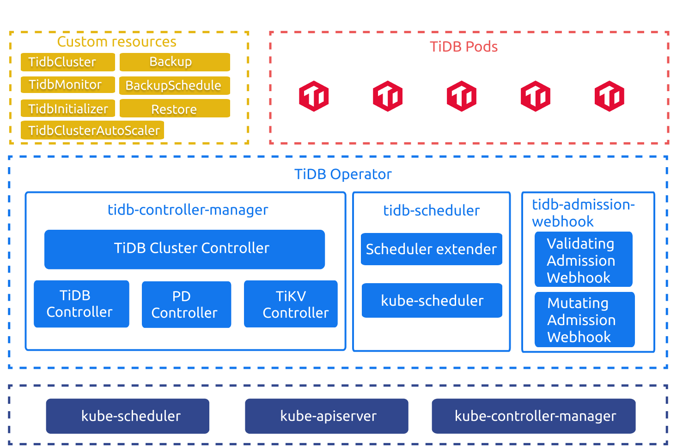

**Author:** [Yiwen Chen](https://github.com/handlerww) (Committer of TiDB Operator)

**Transcreator:** [Ran Huang](https://github.com/ran-huang); **Editor:** Tom Dewan

[TiDB Operator](https://docs.pingcap.com/tidb-in-kubernetes/stable) is an automatic operation system for TiDB in Kubernetes. As a Kubernetes Operator tailored for [TiDB](https://docs.pingcap.com/tidb/stable), it is widely used by TiDB users to manage their clusters throughout the entire lifecycle, and thus boasts of an active developer community.

However, both Kubernetes and TiDB Operator are rather complex, so contributing to its development requires some effort and preparation. To help our community grasp this essential knowledge, we're creating **a series of articles that walk you through the TiDB Operator source code**. This series will not only help newcomers get started with TiDB Operator but also serve as a reference for more experienced developers.

This first article introduces to you **TiDB Operator's architecture, its core components, and what it's used for**. This article is the foundation on which all the other articles are built. We hope you find the article helpful and that it inspires you to bring your own creative ideas into the community.

## An overview of TiDB Operator

In this section, I'll cover two questions: How TiDB Operator works, and what it helps you with. By figuring out these two questions, you'll better understand the dos and don'ts of TiDB Operator.

### How TiDB Operator works

When TiDB Operator maintains your TiDB clusters, its components work closely together with custom resources (CRs).

TiDB Operator v1.1 architecture

Defined by [CustomResourceDefinitions](https://kubernetes.io/docs/concepts/extend-kubernetes/api-extension/custom-resources/#customresourcedefinitions) (CRD), [custom resources](https://kubernetes.io/docs/concepts/extend-kubernetes/api-extension/custom-resources/#custom-resources) describe the desired states of your TiDB cluster:

* `TidbCluster` describes the desired state of the TiDB cluster.
* `TidbMonitor` describes the monitoring components of the TiDB cluster.
* `TidbInitializer` describes the desired initialization Job.
* `Backup` describes the desired backup Job.
* `Restore` describes the desired restore Job.
* `BackupSchedule` describes the scheduled backup Job.
* `TidbClusterAutoScaler` describes the automatic scaling rules.
* `DMCluster` describes the configuration related to [TiDB Data Migration](https://docs.pingcap.com/tidb-data-migration/stable).

TiDB Operator includes the following components:

* `tidb-controller-manager` is a set of custom controllers in Kubernetes. These controllers constantly compare the desired state recorded in the `TidbCluster` object with the actual state of the TiDB cluster. They adjust the resources in Kubernetes so the TiDB cluster meets your desired state and they complete the corresponding control logic according to other CRs.
* `tidb-scheduler` is a Kubernetes scheduler extension that injects the TiDB specific scheduling policies into the Kubernetes scheduler.
* `tidb-admission-webhook` is a dynamic admission controller in Kubernetes, which completes the modification, verification, operation, and maintenance of Pod, StatefulSet, and other related resources.

When TiDB runs in Kubernetes, TiDB Operator uses native resources (Deployment, StatefulSet, Service, PVC, ConfigMap, etc.) and coordinates them to maintain the TiDB cluster.

### How TiDB Operator helps you

In a nutshell, TiDB Operator relieves you of annoying maintenance routines. **Your only task is to create YAML statements that specify the desired state of the TiDB cluster**. TiDB Operator uses this information to schedule Kubernetes resources to drive the cluster towards the desired state and provide service externally.

Let me give you two examples of how TiDB Operator simplifies everything. Say you want three [Placement Driver](https://docs.pingcap.com/tidb/stable/tidb-architecture#placement-driver-pd-server) (PD) instances. You need to initialize the first instance, and then join the other two into the first one. To achieve that, you could do that manually by specifying `--initial-cluster` and two `--join` parameters, or you can just tell TiDB Operator to generate the configuration for you. The latter, obviously, is easier.

Another example is to perform a rolling upgrade of PD. When PD is running, upgrading it might affect online services. In a manual upgrade, you need to use the `UpdateStrategy.Partition` option of StatefulSets to control the rolling upgrade progress and upgrade PD instances one by one while monitoring PD services. But the story is different with TiDB Operator. It can use the PD API to automatically perform a rolling upgrade by transferring Leader and checking if the updated PD instances work as expected.

To achieve the functions described above, TiDB Operator needs to work alongside both Kubernetes and TiDB. On one hand, **it needs to interact with Kubernetes to align its resources and operations with TiDB's requirements**. On the other hand, **it interacts with TiDB components' API to get the cluster status from PD and feed into Kubernetes resource management**. In addition, it maintains the TiDB cluster based on your specifications.

If you want to integrate TiDB maintenance capabilities with your Kubernetes system, TiDB Operator will also equip you with the ability to interact with the two systems from the perspective of TiDB.

## What this series brings to you

The series of TiDB Operator source code reading articles will touch on the following topics:

* Getting started: TiDB Operator basics and the problems it tries to solve.
* Operator pattern: the entry point, the program logic, and the trigger for its reconcile loop.
* The reconcile loop design: the generic design and how it can be extended.
* Feature design: backup and restore, auto-scaling, webhook, advanced StatefulSet, tidb-scheduler, and monitoring.
* Quality management: how we ensure the code quality of TiDB Operator through unit tests, end-to-end tests, and stability tests.

**These in-depth articles will help you get the most out of using TiDB Operator**. If you decide to integrate it into your Kubernetes-based system, **you'll have our best practices to guide you**. What's more, these articles will give you the knowledge you need to **contribute to TiDB Operator** and make the product even better.

This blog series will also **benefit your Kubernetes learning**. When you study the Kubernetes' Operator pattern, TiDB Operator is a good role model. Now in the Kubernetes community, there are Operator frameworks such as [Kubebuilder](https://github.com/kubernetes-sigs/kubebuilder) and [Operator SDK](https://github.com/operator-framework/operator-sdk), and libraries like [controller-runtime](https://github.com/kubernetes-sigs/controller-runtime). They are various implementations that leverage Kubernetes modules to encapsulate complex program logic. By understanding TiDB Operator, you'll grasp how to design powerful and elegant resource management systems based on Kubernetes.

## Sum up

In this article, we discussed the basics of TiDB Operator and the problems it solves. As our series continues, we'll dive deep into TiDB Operator code and share our experience in developing this Kubernetes Operator. In the next article, I'll share [how we implement Kubernetes' Operator pattern in TiDB Operator](https://pingcap.com/blog/tidb-operator-source-code-reading-2-operator-pattern).

If you have any questions or would like to know more, feel free to join our Slack channel [#sig-k8s](https://slack.tidb.io/invite?team=tidb-community&channel=sig-k8s&ref=pingcap-blog) or open an issue at [pingcap/tidb-operator](https://github.com/pingcap/tidb-operator). Stay tuned!
