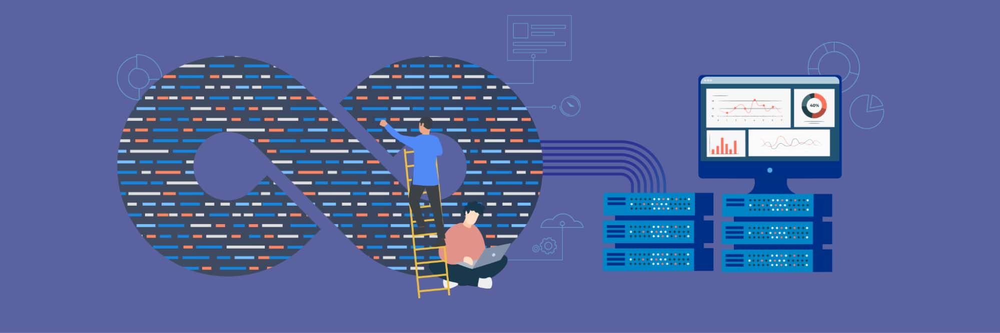

**Author:** [Yiwen Chen](https://github.com/handlerww) (Committer of TiDB Operator, Software Engineer at PingCAP)

**Transcreator:** [Ran Huang](https://github.com/ran-huang); **Editor:** Tom Dewan



> _Previous articles in this series:_
>
> * _[TiDB Operator Source Code Reading (I): Overview](https://pingcap.com/blog/tidb-operator-source-code-reading-1-overview)_
> * _[TiDB Operator Source Code Reading (II): Operator Pattern](https://pingcap.com/blog/tidb-operator-source-code-reading-2-operator-pattern)_

In my [last article](https://pingcap.com/blog/tidb-operator-source-code-reading-2-operator-pattern#controllers-internal-logic), I introduced how we design and implement `tidb-controller-manager` and the controllers' internal logic and how each controller receives and handles changes. **This time, I'll describe how we implement the component controllers.**

The `TidbCluster` controller manages the lifecycles of major components in TiDB. I'll take `TidbCluster` as an example to introduce the design of the component control loop. **You'll learn how the control loop events are orchestrated during TiDB cluster lifecycle management and how these events manage resources.**

This article is only a general introduction to the processes and definitions. The specific application of each component will be covered in the next article. Now, let's get started.

## Call the component control loop

In the section on the [controller's internal logic](https://pingcap.com/blog/tidb-operator-source-code-reading-2-operator-pattern#controllers-internal-logic), I mentioned the `updateTidbCluster` function of the `TidbCluster` controller, which is located in `pkg/controller/tidbcluster/tidb_cluster_control.go`. As the entrance of TiDB component lifecycle management, this function calls a sequence of lifecycle management functions:

* `c.reclaimPolicyManager.Sync(tc)`
* `c.orphanPodsCleaner.Clean(tc)`
* `c.discoveryManager.Reconcile(tc)`
* `c.ticdcMemberManager.Sync(tc)`
* `c.tiflashMemberManager.Sync(tc)`
* `c.pdMemberManager.Sync(tc)`
* `c.tikvMemberManager.Sync(tc)`
* `c.pumpMemberManager.Sync(tc)`
* `c.tidbMemberManager.Sync(tc)`
* `c.metaManager.Sync(tc)`
* `c.pvcCleaner.Clean(tc)`
* `c.pvcResizer.Resize(tc)`
* `c.tidbClusterStatusManager.Sync(tc)`

These functions are divided into two categories:

* **The implementation of control loops for TiDB components**, such as PD, TiDB, TiKV, TiFlash, TiCDC, Pump, and Discovery.
* **The management of Kubernetes resources used by TiDB components** and **the lifecycle management of other components**, such as maintaining PV's reclaim policy, cleaning up orphan Pods, maintaining the meta information of Kubernetes resources, cleaning and scaling out PVCs, and managing the status of the `TidbCluster` object.

## The lifecycle management process of TiDB components

The control loop code for TiDB's major components is located in the directory `pkg/manager/member` and in files that end with `_member_manager.go`, such as `pd_member_manager.go`. These files reference other files that implement scaling and upgrade features, such as `_scaler.go` and `_upgrader.go`.

From the `_member_manager.go` files of components, we can identify the generic implementation:

```go
// Sync Service
if err := m.syncServiceForTidbCluster(tc); err != nil {
    return err
}

// Sync Headless Service
if err := m.syncHeadlessServiceForTidbCluster(tc); err != nil {
    return err
}

// Sync StatefulSet
return syncStatefulSetForTidbCluster(tc)

func syncStatefulSetForTidbCluster(tc *v1alpha1.TidbCluster) error {
    if err := m.syncTidbClusterStatus(tc, oldSet); err != nil {
        klog.Errorf("failed to sync TidbCluster: [%s/%s]'s status, error: %v", ns, tcName, err)
    }

    if tc.Spec.Paused {
        klog.V(4).Infof("tidb cluster %s/%s is paused, skip syncing for statefulset", tc.GetNamespace(), tc.GetName())
        return nil
    }

    cm, err := m.syncConfigMap(tc, oldSet)

    newSet, err := getnewSetForTidbCluster(tc, cm)

    if err := m.scaler.Scale(tc, oldSet, newSet); err != nil {
        return err
    }

    if err := m.failover.Failover(tc); err != nil {
        return err
    }

    if err := m.upgrader.Upgrade(tc, oldSet, newSet); err != nil {
        return err
    }

    return UpdateStatefulSet(m.deps.StatefulSetControl, tc, newSet, oldSet)
}
```

The above code performs two major tasks:

* Sync Service: Creates or syncs the Service resources for TiDB components.
* Sync StatefulSet:
    * Syncs the component status.
    * Checks whether `TidbCluster` stops the synchronization.
    * Syncs ConfigMap.
    * Generates a new StatefulSet according to the configuration in `TidbCluster` and performs the related operations on the new StatefulSet, such as rolling update, scaling out, scaling in, and failover.
    * Creates or updates the StatefulSet.

The component control loop repeatedly performs the tasks above to make sure the component stays up to date.

The following sections introduce the specific jobs completed in the control loop.

### Sync Service

When component reconciliation starts, service reconciliation also kicks off. **This process creates and syncs the Services used by the components**, such as `cluster1-pd` and `cluster1-pd-peer`.

The control loop function calls the `getNewServiceForTidbCluster` function, which creates a new Service template according to the information recorded in the `TidbCluster` custom resource (CR). If the Service doesn't exist, the control loop function creates a Service; if the Service exists, it compares the old Service Spec with the new one and determines whether to update the Service object.

There are both Services and Headless Services to allow the components to be accessed by others.

* If the component doesn't need to know which instance it is talking to, and if the component supports load-balancing, such as when TiKV and TiDB access Placement Driver (PD), the component uses a Service.
* If the component needs to know which Pod is providing service, it uses a Headless Service to communicate via [Pod DNS](https://kubernetes.io/docs/concepts/workloads/controllers/statefulset/#stable-network-id). For example, when TiKV starts, it exposes its Pod DNS as the advertise address so that other Pods can access TiKV via the Pod DNS.

### Sync StatefulSet

After the Service is synced, the components are connected to the cluster network, so they can access the cluster and be accessed from within the cluster. The control loop enters the `syncStatefulSetForTidbCluster` function and starts reconciling the StatefulSet.

The first step in reconciling the StatefulSet is to sync the component status by running the `syncTidbClusterStatus` function. Then, according to the status information, other operations will be carried out such as upgrade, scaling in, scaling out, and failover.

#### Sync the component status

One of TiDB Operator's key operations is to sync the component status. The status information contains:

* Kubernetes's component information, including the number of replicas in the cluster, the update status, and the image version. TiDB Operator also checks whether the StatefulSet is in the update process.
* TiDB's internal cluster information. TiDB Operator syncs the information from PD, including information about PD members, TiKV storage, and TiDB members. TiDB Operator also performs health checks on TiDB.

#### Check whether the TiDB cluster pauses the synchronization

After syncing the status, TiDB Operator determines whether the cluster stops the synchronization by checking `tc.Spec.Paused`. If the sync is paused, TiDB Operator skips all the following operations that updates the StatefulSet.

#### Sync ConfigMap

After syncing the status, the `syncConfigMap` function updates the ConfigMap, which contains the component's configuration file and startup script.

The configuration file is extracted from the `Config` item in `Spec` of the YAML file. TiDB Operator supports directly using TOML configuration (recommended) or transforming the configuration from YAML.

The startup script contains the startup parameters required for the component and launches the component process using the parameters.

When a component needs to obtain the startup parameters from TiDB Operator, the information processing is performed in the Discovery component. For example, when PD needs to use parameters to determine whether it should initialize a node or join a node, it uses wget to access Discovery and get the parameters. By obtaining parameters from the startup script, TiDB Operator avoids unexpected rolling updates while StatefulSet is being updated. This may impact online services.

#### Generate a new StatefulSet

The `getNewPDSetForTidbCluster` function obtains a new StatefulSet template, which contains the references of the newly generated Service and ConfigMap. The function uses the latest status and spec to generate other items, such as `env`, `container`, and `volume`.

This new StatefulSet then goes through three processes: rolling update, scaling, and failover. Finally, the `UpdateStatefulSet` function compares the existing StatefulSet and the new one and determines whether to update the existing one.

##### Rolling update

The `m.upgraded.Upgrade` function performs operations related to rolling update, mainly updating `UpgradeStrategy.Type` and `UpgradeStrategy.Partition` in the StatefulSet.

The rolling update operation is performed using the rolling update strategy in the StatefulSet. When the component is being reconciled, it sets the update strategy of the StatefulSet to rolling update. In Kubernetes, you can control the rolling update progress by configuring `UpgradeStrategy.Partition`. The StatefulSet only updates the Pods that are not updated before and whose ID is greater than or equal to the value of `UpgradeStrategy.Partition`. TiDB Operator uses this mechanism to ensure  that each Pod is only rolling updated after it can provide service to the external application normally.

When the cluster is not being updated or is just in the starting phase of update, the component reconciliation sets `UpgradeStrategy.Partition` to the largest Pod ID in the StatefulSet. This prevents any Pod from being updated. After the update starts, when a Pod is updated and provides service after restart, the Pod is deemed successfully upgraded. TiDB Operator then decrements the `UpgradeStrategy.Partition` value and updates the next Pod.

##### Scaling in and scaling out

`m.scaler.Scale` scales components in and out. Its primary task is to update `Replicas` of components in the StatefulSet.

The `m.scaler.Scale` function scales components one by one, one step at a time. It compares the number of `Replicas` for a component in `TidbCluster` CR (for example `tc.Spec.PD.Replicas`) and with the current `Replicas`. Based on that, it determines whether to scale out or scale in the component and performs the scaling operation on one replica. It then enters the next round of component reconciliation. Through multiple rounds of reconciliation, `m.scaler.Scale` completes all scaling requirements.

During the scaling process, PD needs to transfer the Leader, and TiKV needs to delete stores. These operations use PD APIs. During reconciliation, the `m.scaler.Scale` function uses PD APIs to perform the operation and check whether the operation is successful. If so, it moves to the next scaling operation.

##### Failover

The `m.failover.Failover` function performs operations related to disaster recovery, including discovering failure, recording failure status, and recovering from failure.

If you enable `AutoFailover` when you deploy TiDB Operator, TiDB Operator monitors the component failure status. When it finds one, TiDB Operator records the failure information to `FailureStores` or `FailureMembers`. Next, it starts a new component Pod to take over the workload of the failed Pod. After the failed Pod recovers, TiDB Operator modifies the number of replicas in the StatefulSet to scale in the new Pod.

When TiDB Operator performs failover for TiKV and TiFlash, the newly-created Pod is not scaled in by default. You need to configure `spec.tikv.recoverFailover: true` to enable the auto scaling-in.

#### Update the existing StatefulSet

In the last phase, the new StatefulSet is created. The control loop now enters the `UpdateStatefulSet` function, which compares the new StatefulSet with the existing one. If the two StatefulSets are inconsistent, the function updates the existing StatefulSet.

The function also checks whether there are StatefulSets that are not managed by TiDB Operator. Because earlier versions of TiDB Operator used Helm Chart to deploy TiDB, TiDB Operator needs to add dependency marks to these old StatefulSets and include them in the lifecycle management.

After the operations above, the status of the `TidbCluster` CR is updated to the latest version. The related Service and ConfigMap is created. The new StatefulSet is generated, which performs rolling update, scaling, and failover. The component reconciliation rolls on, monitoring the component lifecycle and responding to lifecycle status change and user-specified change. The whole cluster runs normally.

### Other lifecycle management tasks

Apart from the reconciliation of major components in TiDB, other lifecycle management operations are performed by the following functions:

* Discovery configures PD startup parameters and TiDB Dashboard Proxy. It provides dynamic information for components to use, which avoids modifying ConfigMap that may result in Pod rolling update.
* Reclaim Policy Manager syncs the configuration of `tc.Spec.PVReclaimPolicy`. By default, the PV reclaim policy is set to `Retain` to reduce the risk of data loss.
* Orphan Pod Cleaner cleans up a Pod when the PVC fails to be created. Then the StatefulSet Controller tries again to create Pods and the corresponding PVCs.
* PVC Cleaner removes PVCs that are marked deletable.
* PVC Resizer scales out PVCs. When you run TiDB Operator on the cloud, you can change the size of PVCs by modifying the storage configuration in `TidbCluster`.
* Meta Manager syncs `StoreIDLabel`, `MemberIDLabel`, and `NamespaceLabel` to the labels of Pods, PVCs, and PVs.
* TiDBCluster Status Manager syncs information related to `TidbMonitor` and TiDB Dashboard.

## Summary

By now, you have learned the design of TiDB components' control loop, including:

* How the reconcile functions follow their corresponding procedures to check the component resources
* How the reconcile functions turn the user's desired state into the actual component state

Almost all control loops in TiDB Operator conform to the design logic described in this article. In future posts, I'll further explain [how this logic is applied to each component to manage the component lifecycle](https://pingcap.com/blog/tidb-operator-source-code-reading-4-implement-component-control-loop).

If you have any questions or ideas about TiDB Operator, feel free to [join our Slack channel](https://slack.tidb.io/invite?team=tidb-community&channel=sig-k8s&ref=pingcap-blog) or join our discussions at [pingcap/tidb-operator](https://github.com/pingcap/tidb-operator)!
