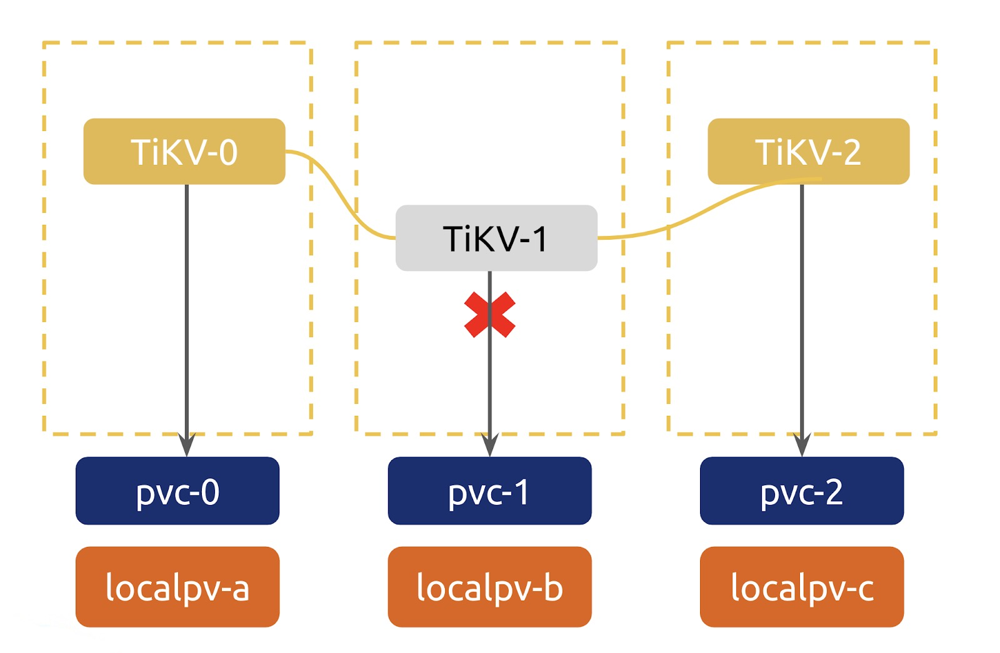
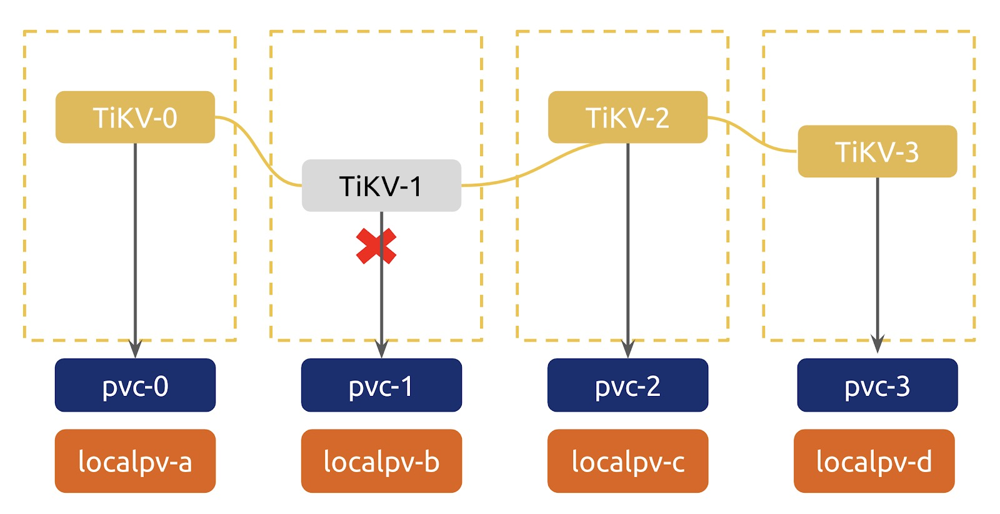
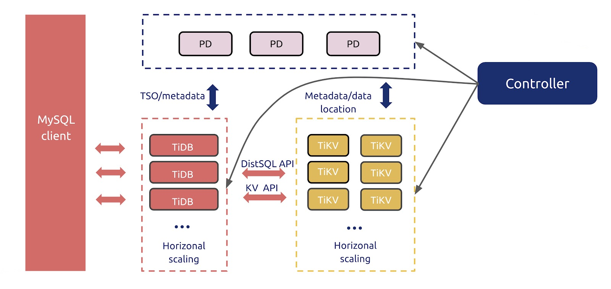

As [Kubernetes](https://github.com/kubernetes/kubernetes) reaches its full maturity, many organizations are building large scale Kubernetes-based infrastructures. However, considering the weakness of Kubernetes in orchestrating stateful applications, organizations hesitate to run their databases in it. Such concerns also affect users of [TiDB](https://docs.pingcap.com/tidb/stable), a cloud-native, distributed SQL database. But are these concerns valid, or are they just baseless worries?

In this post, I'll answer the question of whether or not to run TiDB in Kubernetes and introduce to you [TiDB Operator](https://docs.pingcap.com/tidb-in-kubernetes/stable), your database operations expert for Kubernetes. We'll explore how TiDB Operator can empower TiDB to run smoothly in Kubernetes and ensure your data safety. You'll also learn how companies are using TiDB Operator in their production environments and their best practices.

## TiDB in Kubernetes: to be or not to be?

Many of Kubernetes' features were designed for [stateless applications](https://www.redhat.com/en/topics/cloud-native-apps/stateful-vs-stateless), like [microservices](https://en.wikipedia.org/wiki/Microservices). As cloud-native technology gains traction, Kubernetes is applied in a wide range of technological fields, as if at some point everything should run in Kubernetes. No wonder people raise some concerns: is Kubernetes the right choice for all scenarios? and, do we really need Kubernetes in our technology stack?

Indeed, Kubernetes _is_ helpful in the areas it's good at. But there is a cost to migrating to Kubernetes and it introduces complexity to your system.

So how do we decide whether or not to run our databases (in this case, TiDB) in Kubernetes? The answer is simple: if most of your applications already run in Kubernetes, and if your engineers are comfortable using it, run your database there, too. It doesn't make economic sense to get an extra Site Reliability Engineering (SRE) team to maintain TiDB on virtual machines.

So what can we gain from deploying TiDB in Kubernetes? Just like microservices, we can achieve **declarative management, automatic operation and maintenance, and elastic resource configuration**.

Sounds cool, right? But people are still concerned about **the stability of running databases in Kubernetes**. In the highly dynamic Kubernetes environment, it's hard for traditional RDBMSs to maintain stability. If Kubernetes is down, so are our services, and we might even lose data. Therefore, traditional RDBMSs don't work well in Kubernetes.

But TiDB is no traditional RDBMS. It is a cloud-native, distributed SQL database, a born player for Kubernetes.

- **TiDB adapts to the dynamic Kubernetes environment**. It supports multi-replication fault tolerance. Even when a minority of the nodes goes down, the cluster runs as usual, without a glitch. With TiDB, engineers can also see all cluster metrics and take charge of the cluster state, even in a complicated containerized environment.
- **Kubernetes can better tap into TiDB's potential**. By using declarative APIs, Kubernetes simplifies TiDB's cluster management, which is more complicated for a distributed database than a stand-alone database. Kubernetes' elastic resource pool makes it easier to horizontally scale in and out TiDB clusters and perform failover.

However, though TiDB and Kubernetes work perfectly together, it's not easy for the SRE team to deploy and maintain TiDB in Kubernetes. Can we automate these operations and make it more efficient to maintain TiDB in Kubernetes? Thankfully, yes. Let me present to you TiDB Operator, your TiDB expert for Kubernetes.

## What is TiDB Operator?

[TiDB Operator](https://github.com/pingcap/tidb-operator) is an automatic operation system for TiDB clusters in Kubernetes. It provides a full management lifecycle for TiDB, including deployment, upgrades, scaling, backup, failover, and configuration changes.

Because Kubernetes is extensible, TiDB Operator can collect all relevant Kubernetes and TiDB information and apply it to the maintenance process, thereby automating management. It is an operations expert for running TiDB in Kubernetes.

TiDB Operator has both [custom resource definitions](https://kubernetes.io/docs/concepts/extend-kubernetes/api-extension/custom-resources/#customresourcedefinitions) (CRDs) and [custom controllers](https://kubernetes.io/docs/concepts/extend-kubernetes/api-extension/custom-resources/#custom-controllers).

* CRDs let you describe your desired TiDB cluster, such as the cluster version and the number of component instances.
* Custom controllers, as collections of the operations knowledge, apply their expertise and help you automatically maintain your TiDB cluster in Kubernetes.

The CRDs conform to Kubernetes' declarative definitions. After you define the desired state, the custom controller watches the state of your cluster, compares the desired state with the actual state, and tries to drive the current cluster state closer to the desired state.

## How TiDB Operator maintains the cluster

TiDB Operator integrates most—if not all—of the operations knowledge you need to maintain a TiDB cluster in Kubernetes. Here, I'd like to talk about how it helps you deploy, upgrade, fail over, and auto-scale the cluster, as well as its remarkable benefits.

### Deploy

When TiDB Operator deploys a TiDB cluster, it selects the most suitable Kubernetes object for each component. It automatically asks [Placement Driver](https://docs.pingcap.com/tidb/stable/tidb-architecture#placement-driver-pd-server) (PD) to do the peer discovery, without manual configuration.

Most importantly, TiDB Operator scatters TiKV pods and adds store labels to TiKV. This way, PD can schedule data [Regions](https://docs.pingcap.com/tidb/stable/glossary#regionpeerraft-group) on as many different physical nodes as possible to achieve a high availability topology at the Region level.

### Upgrade

When a TiKV instance is shut down during rolling upgrade, it does not transfer all Leaders out. Thus, when the TiKV instance is down, the Leader is down, and the Raft group has to reelect a Leader. When the database has a lot of traffic, the reelection timeout might increase latency.

Then, how does TiDB Operator avoid this issue? Before TiDB Operator upgrades a TiKV container, it calls an API of PD to transfer all Leaders out of the TiKV container that is going to be upgraded. When the TiKV container stops receiving read and write requests, TiDB Operator recreates the container and moves back Leaders. TiDB Operator repeats this  process on the next TiKV container until it has upgraded all TiKV containers. This is how TiDB Operator achieves a graceful rolling upgrade.

### Auto-failover

In the graphic below, TiKV-1 is down.

TiKV-1 is down

The custom controller combines the TiKV-1 state information in PD and the container state information in Kubernetes. Then, it determines whether the TiKV stores are in an abnormal state.

If the controller determines that TiKV-1 is abnormal and if the abnormality continues for a reasonable amount of time, TiDB Operator performs auto-failover. It adds a new TiKV store to guarantee that even if TiKV-2 is also down, the cluster is not affected.

TiDB Operator adds a new TiKV store

### Auto-scale

TiDB Operator can also automatically scale the TiDB cluster. When the cluster is running, based on the monitoring metrics of all components, TiDB Operator auto-scales the cluster. Depending on the amount of storage or computing capacity the cluster needs, TiDB Operator can automatically add or remove nodes. This way, the cluster can automatically adapt as your business needs change without manual intervention.

TiDB Operator auto-scales the cluster

You may still have some concerns: how much performance overhead does Kubernetes bring to the database? Will Kubernetes affect database stability? If Kubernetes is down, will my database go down as well? TiDB Operator can certainly give you all the answers.

### Zero performance overhead

Under the proper configuration, TiDB Operator can run your cluster with no performance overhead.

* With TiDB Operator, you can either deploy each component on a dedicated node, or deploy multiple components on a single node. You can make trade-offs between performance and cost all by yourself.
* TiDB Operator can automate deploying on local disks, which reduces the overhead of remote storage.
* It can also deploy the cluster through Kubernetes hostNetwork. This eliminates extra network overhead in Kubernetes.

### Strong stability

TiDB Operator is the solid cornerstone on which we can enhance the stability of databases.

* When the control plane fails, the nodes running TiDB are unaffected.
* When a Kubernetes node running TiDB fails, TiDB Operator performs auto-failover and moves TiDB to other nodes.
* When all nodes in the Kubernetes cluster fail, TiDB Operator by default retains all stores and makes sure that no data is lost.
* What if a disastrous failure happens, say, the data center is flooded? TiDB Operator regularly backs up your data, so you can restore your data to a recent time point.

## Best practices: PayPay and Mashang Consumer Finance

How is TiDB Operator doing in real production environments? Let's look at two cases: PayPay and Mashang Consumer Finance.

[PayPay](https://en.pingcap.com/case-studies/japan-largest-mobile-payment-company-migrates-from-aurora-to-a-scale-out-database) is the top mobile payment company in Japan. PayPay has deployed over 100 database nodes using TiDB Operator, including more than 30 nodes in the production environment managed by TiDB Operator. Back when PayPay conducted a [proof of concept](https://en.wikipedia.org/wiki/Proof_of_concept) (POC), they made a thorough disaster recovery drill, including various process failures, node failures, and AWS availability zone failures, as well as disaster recovery. They even simulated the whole AWS server going down to test if they could restore the cluster data through regular backups. To their relief, TiDB Operator passed all these tests, and PayPay gladly put their whole cluster on TiDB Operator and Kubernetes.

[Mashang Consumer Finance](https://www.crunchbase.com/organization/ms-finance), a Chinese financial services company, has put their system archive and batch processing services on TiDB, with over 60 physical nodes in the online cluster. After the company used TiDB Operator, their hybrid deployment hardware cost was reduced by 70%, compared to the previous physical machine deployment.

In summary, what is the best practice for running TiDB in Kubernetes? The answer is TiDB Operator. If you still have doubts, consider the companies that are already using TiDB Operator and having good success with it. Or just get started [here](https://docs.pingcap.com/tidb-in-kubernetes/stable/get-started) and let TiDB Operator, your operations expert, safeguard your TiDB clusters in Kubernetes.
