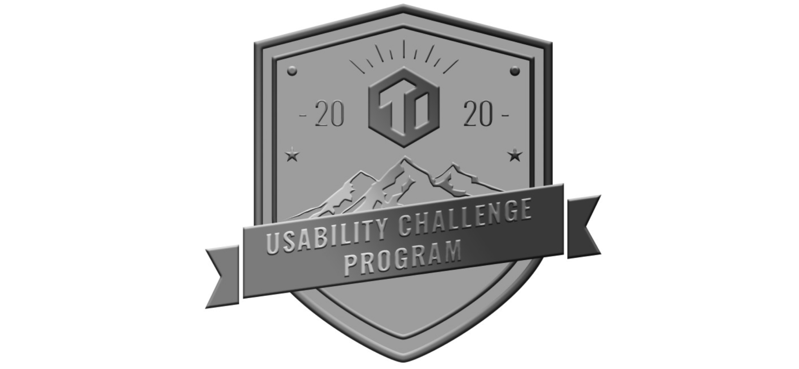

In community we trust! As the TiDB community expands and the TiDB project evolves, we're inspired to see contributors joining us and demonstrating their passion and pursuit of the open-source spirit. To get more people involved and included, we launched the TiDB Challenge Program, a series community program to bring TiDB to a new level in terms of stability, performance, and usability. With some amazing improvements in performance in season 1 last year, we are now pleased to announce that season 2 is ready for you.

## A preview of TiDB Challenge Program Season 2

Season 2 of the TiDB Challenge Program series focuses on the usability of TiDB and its related projects. It started on March 02, 2020 and will end on May 30, 2020, lasting 3 months.

Here's what's new in this season:

* **Usability is the keyword**

    Following the principle of "basing directions on users' requirements," we drew most of the requirements of this season from users' votes. These requirements are further refined and presented in the form of tasks in this season. **Successfully completing any of the top 3 requirements will get you extra points.** When all the sub-tasks under a Top 3 requirement are completed or the program ends for the season, the extra points will be distributed evenly among the subtasks.

* **From Easy to Hard**

    Tasks in season 2 are divided into three levels: Easy/Medium/Hard, Each task corresponds to a certain number of challenge points. This time we've also optimized the grading system: **Newcomers for this challenge can get on board by completing easy tasks. Experienced players with more than 200 points in the corresponding repository can directly challenge medium and hard tasks.** There will be more tasks released from different TiDB-related projects in this season. Participants can choose whichever projects they are interested in:

  * [TiDB](https://github.com/pingcap/tidb/projects/26)
  * [TiKV](https://github.com/tikv/tikv/projects/20)
  * [PD](https://github.com/pingcap/pd/projects/2)
  * [Chaos Mesh](https://github.com/pingcap/chaos-mesh/projects/14)
  * [Data Migration](https://github.com/pingcap/dm/projects/1)
  * [Backup & Restore](https://github.com/pingcap/br/projects/1)
  * [client-rust](https://github.com/tikv/client-rust/projects/3)
  * [TiDB Dashboard](https://github.com/pingcap-incubator/tidb-dashboard/projects/17)
  * [TiUP](https://github.com/pingcap-incubator/tiup/projects/1)
  * and more to come!

* **Bountiful prizes**

    Participants can earn challenge points by claiming tasks and redeem prizes at the end of the season. In this season, prizes are also upgraded! Of course, there will be PingCAP Contribution Prizes such as TiDB T-shirts, TiDB hoodies, North Face customized computer backpacks, and stationery sets. **This also is a great opportunity to win a one-year license for developer tools from JetBrains, the Honorary Seat at PingCAP DevCon, and a journey to Silicon Valley with plane tickets and hotel covered!** Besides, all participants will get a **Challenge Completed Badge** as long as you have completed one task or more.

 Usability Challenge Program badge 

We can't wait to see innovative ideas sparkled! Participants are welcomed to join [TiDB Community Slack Workspace](https://tidbcommunity.slack.com/join/shared_invite/enQtNzc0MzI4ODExMDc4LWYwYmIzMjZkYzJiNDUxMmZlN2FiMGJkZjAyMzQ5NGU0NGY0NzI3NTYwMjAyNGQ1N2I2ZjAxNzc1OGUwYWM0NzE) on the Slack. For any doubts or questions, don't hesitate to discuss with issue mentors or other contributors on the #tidb-challenge-program channel.

## Before the challenge

Before you start hacking on the challenge tasks, here are some preparations for you to facilitate the challenge process:

1. Create a GitHub account. See [Join GitHub](https://github.com/join) for more information.
2. [Install Git](https://git-scm.com/book/en/v2/Getting-Started-Installing-Git) in your local environment.
3. Configure your Git to access GitHub. See [Set up Git](https://help.github.com/en/github/getting-started-with-github/set-up-git) for more information.
4. Read through the [Challenge Process](https://github.com/pingcap/community/blob/master/challenge-programs/challenge-program-season-2.md) document.

## How to participate

You can participate as an individual or team up. However, in both two cases, you will sign up as a team. To sign up for the program, [open an issue](https://github.com/tidb-challenge-program/register/issues/new?assignees=&labels=&template=challenge-program-register.md&title=UCP%2FSignup) in the [tidb-challenge-program/register](https://github.com/tidb-challenge-program/register) repository, in the format as required in the issue template.

> **Note:**
>
> * Up to three members are allowed in a team.
> * Teams that include PingCAP employees will be marked with a star (*). Their challenge points will not be included in the final ranking, but are valid for gift redemption.
> * To change the signup information, you need to close the original signup issue and open a new one to sign up again. Editing on the original issue is now allowed.

## Learning materials

We have prepared some learning materials to help you quickly get familiar with our projects and get started with hacking:

* [TiDB documentation](https://pingcap.com/docs/) - concepts, user guide, and reference documents for TiDB.
* [TiKV documentation](https://tikv.org/docs/3.0/concepts/overview/) - concepts, user guide, and reference documents for TiKV.
* [Chaos Mesh documentation](https://github.com/pingcap/chaos-mesh/wiki) - user guide, and development guide for Chaos Mesh.
* [PingCAP Talent Plan](https://github.com/pingcap/talent-plan) - a series of training courses about writing distributed systems in Go and Rust with no previous experience of TiDB or TiKV required.
* [Awesome Database Learning](https://github.com/pingcap/awesome-database-learning) - a list of learning materials to help you understand databases internals, including but not limited to: papers, blogs, courses, and talks.

## FAQs

**Q1:** How do I change the registration information? How will the points change after the registration information is changed?

**Answer:** To change the registration information, you need to close the original registration issue and open another issue for registration. Editing on the original issue is not supported for the time being. There are three cases of changes in points after the registration information is changed:

* Increasing or decreasing of team members will not affect the total points of the team;
* The individual points of new members joining the team will be frozen to the state before joining the team, and the points earned after joining the team will be owned by the team;
* Participants who leave the team and rejoin as individuals do not inherit team points.

**Q2:** How do I discard/change the issue I have claimed?

**Answer:**

* To discard an issue: Reply to "give-up-challenge" under the issue.
* To change your claimed issue: Firstly discard the current issue as described above, and then claim a new issue.

**Q3:** Can I invite PingCAP's internal employees to team up?

**Answer:** Of course you can! We welcome our community members to participate with PingCAP employees. If you don't know any PingCAPers, shout out in the #tidb-challenge-program slack channel. However, please note that PingCAP members that participate in the program can only work on the challenge issues during non-working hours. In order to ensure the fairness of the event, when the number of PingCAP employees accounts for more than 2/3 in a team, the team can only claim issues that are above the **Hard** level, and they will be marked as a star team. A star team will not participate in the final points ranking but still retain the right to redeem their challenge points.

**Q4:** What if I don't remember in which repository I have earned 200 points?

**Answer:** You will receive an automatic response from sre-bot after registration. The response contains the points status of the participant in each repository.
