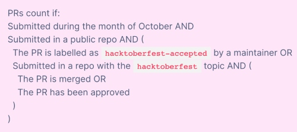

[Hacktoberfest](https://hacktoberfest.digitalocean.com) is a month-long open source challenge hosted by DigitalOcean, Intel, and DEV. It's a celebration open to everyone in our global community. Whether you're an experienced developer, open-source newbie learning to code, event host, or company of any size, you can help drive the growth of open source and make positive contributions to an ever-growing community. As long as you submit 4 PRs before Oct 31, you are eligible to claim a limit edition T-shirt (70,000 in total on a first-come-first-served basis)!  

## Open source is the spirit 

As a dedicated and firm advocate and practitioner of open source, [TiDB](https://github.com/pingcap/tidb) is proud to be a part of Hacktoberfest 2020, together with technology lovers and other cool projects all over the world. Five years in the development, the TiDB community has been well recognized in the open-source world with its increasingly mature projects, active community events, comprehensive ecosystem, and diversified community collaborations. As of October 2020, TiDB community has received contributions from over 1,100 contributors, with 25.3k stars. This could not have been possible without our shared commitment to the open-source community and spirit. We hereby invite you to be part of us, starting from our handpicked issues with proper mentoring and assistance along your journey.  

## How can you participate?

So we are all set up for you in Hacktoberfest - labeled [suitable issues ](https://github.com/pingcap/community/tree/master/Hacktoberfest)with "Hacktoberfest," classified the repositories with the Hacktoberfest keyword, and updated the [Contributing Guide](https://github.com/pingcap/community/blob/master/contributors/README.md).      

How can you participate? It could not be easier with the following steps: 

1. Sign up for [Hacktoberfest](https://hacktoberfest.digitalocean.com/login) using your GitHub account between Oct 1 and Oct 31.
2. Pick up an issue. Note that the issues are still being updated, but you don't have to be limited to issues with the Hacktoberfest label, which only serves as a starting point.  
3. Start coding and submit your PRs. Again the PR does not need to be corresponding to the labeled issue. 
4. Our maintainers review your PRs. Once you successfully merged, or have gained approval for 4 or more of them, the PRs will be automatically counted on the Hacktoberfest end, and you will be eligible to claim your SWAG.

    

    **Note:** If your PRs are merged or approved but you haven't seen the number reflected on Hacktoberfest, comment under your PR.

## Strive for quality, learning, and no spam 

In the spirit of open source and Hacktoberfest, we welcome all contributions big and small, and honor only valid PRs. However, we would not encourage or tolerate spammy contributions, which would not only cause waste to our maintainer's time but also hurt the feelings and the integrity of the entire open source community. Spammy PRs will be labeled as "invalid" or "spam," and will be closed as invalid.

Happy hacking! But don't hack alone. Join our [community Slack](https://slack.tidb.io/invite?team=tidb-community&channel=everyone&ref=pingcap) to share your experience, provide your feedback on your experience here or let us help with any problem you have. 
