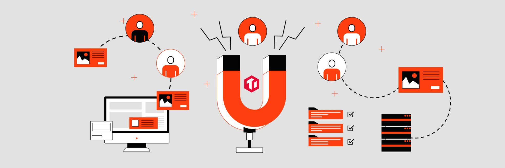
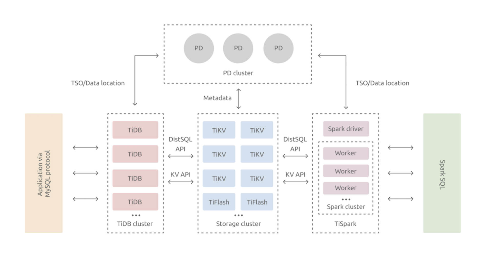
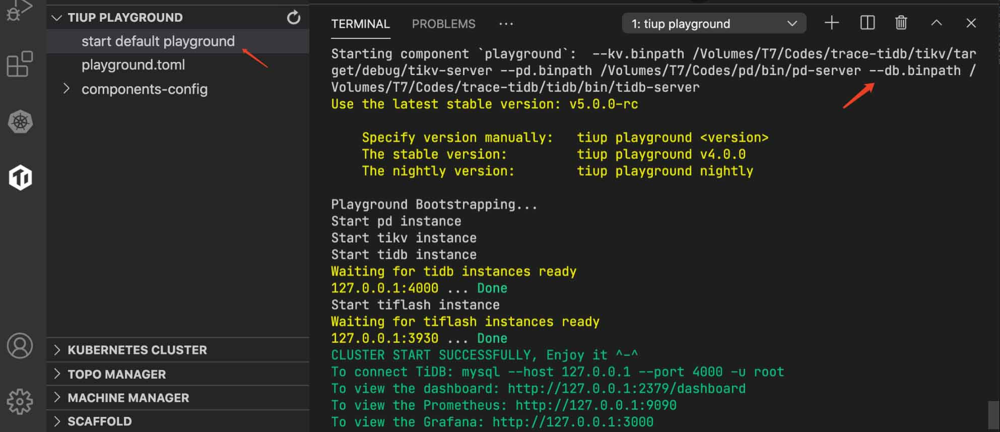
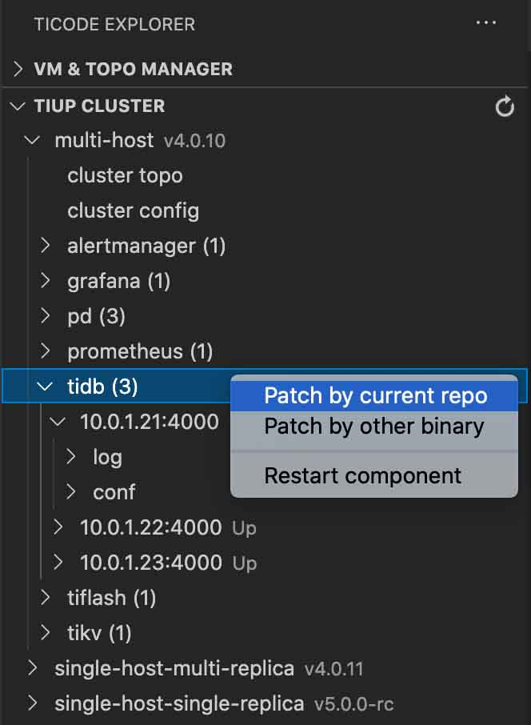
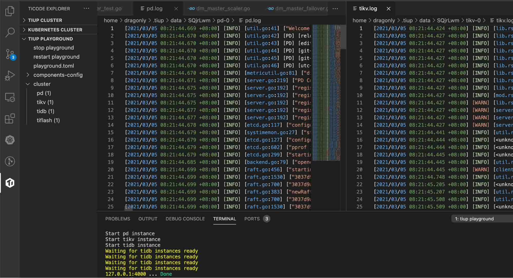
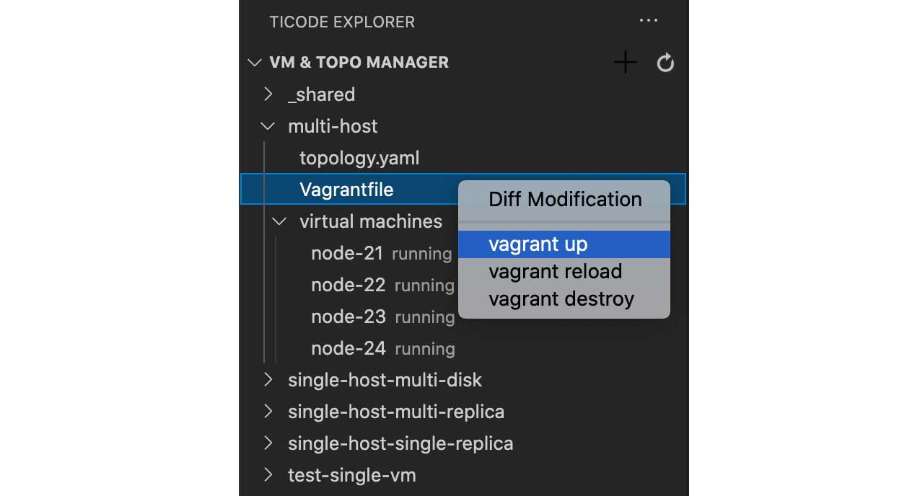
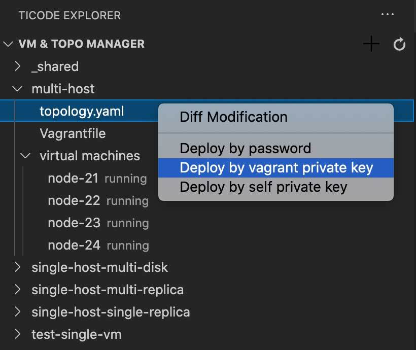

**Authors:** [Baurine Huang](https://github.com/baurine), [Yilong Li](https://github.com/dragonly), [Aylei Wu](https://github.com/aylei) (Software Engineers at PingCAP)

**Transcreator:** [Ran Huang](https://github.com/ran-huang); **Editor:** Tom Dewan

Contributing to [TiDB's codebase](https://github.com/pingcap/tidb) is not easy, especially for newbies. As a distributed database, TiDB has multiple components and numerous tools, written in multiple languages including Go and Rust. Getting started with such a complicated system takes quite an effort.

So, to welcome newcomers to TiDB and make it easier for them to contribute to our community, we've developed a TiDB integrated development environment: [TiDE](https://github.com/tidb-incubator/tide). Created during [TiDB Hackathon 2020](https://pingcap.com/community/events/hackathon2020/), **TiDE is a Visual Studio Code extension that makes developing TiDB a breeze**. With [this extension](https://marketplace.visualstudio.com/items?itemName=dragonly.ticode), developing a distributed system can be as easy as developing a local one.

In this post, **I'll show you the core features of TiDE and how it smoothes out the standard working process for TiDB developers**. Let's get started.

## How hard was it to develop TiDB?

As a complicated distributed SQL database system, [TiDB](https://github.com/pingcap/tidb) has three core components (TiDB, TiKV, and the Placement Driver, PD) and many ecosystem tools. TiDB and [PD](https://github.com/tikv/pd) are written in Go, whereas [TiKV](https://github.com/tikv/tikv) is written in Rust.

 TiDB architecture in a glance 

Imagine you want to get your hands dirty and compile TiDB all by yourself. You need to go through several painful steps:

1. Download the code of the three components. If you haven't done so already, install Go and Rust toolchains, and compile the binary files according to each component's documentation.
2. To easily run the compiled component, you need to install [TiUP](https://docs.pingcap.com/tidb/stable/tiup-overview), a package manager for TiDB. You'll then learn to write a basic configuration file and start the TiDB cluster.
3. After the cluster is up and running, you'll want to read the logs of each component and understand their details by searching the logs for keywords. However, TiDB is a multi-process (and multi-node) system, so you'll need to log in to different physical machines to view logs. You must know how to use `less` and `grep` commands.
4. When you come up with an idea and want to experiment with TiDB, you need to write your code, compile it, copy the binary files to the local or remote TiUP directory, restart the cluster, and repeat Step 3.

As you can see, the traditional workflow of developing TiDB is a lengthy and tediousdreary process, where most of the effort is wasted in repeated, unpleasant operations.

## What is TiDE, and why do we need it?

**[Confucious](https://en.wikipedia.org/wiki/Confucius) (a Chinese philosopher and politician) said: "A craftsman must sharpen his tools to do his job."** That applies to TiDB developers (You!) as well. To reduce tedious work and improve efficiency, automation is a must. TiDE, a VS Code extension, automates your TiDB coding experience inside VS Code.

When you enable TiDE, it creates a dedicated workspace for TiDB in VS Code, providing functionality that simplifies the development of TiDB.

### Simplified TiDB cluster deployment

One of TiDE's basic features is IDE. **Whether you want to develop on a local testing cluster or a production cluster, TiDE can spin up the environment you need in a few clicks.**

#### Local testing cluster

Previously, to get started, you needed to run `tiup playground` to initiate a testing cluster. Now, you simply create a workspace to add your code directory, and TiDE will take care of the rest.

To fix a bug or add a new feature, you no longer need to compile the code and update the binary files all by yourself, because TiDE will help you complete the process and restart the cluster. All you have to do is write your code—the same experience as developing programs in any IDE.

 Deploy a testing cluster in TiDE 

  <a href="/download" onclick="trackViews('TiDE: Developing a Distributed Database in a Breeze', 'download-tidb-btn-middle')"><button>Download TiDB</button></a>
  <a href="https://share.hsforms.com/1e2W03wLJQQKPd1d9rCbj_Q2npzm" onclick="trackViews('TiDE: Developing a Distributed Database in a Breeze', 'subscribe-blog-btn-middle')"><button>Subscribe to Blog</button></a>

#### In-production cluster

In a production environment, TiDB is deployed to multiple physical or virtual machines via `tiup cluster`. Previously, you needed to transfer binary files to remote machines via `scp` commands and restart the corresponding processes.

TiDE, without doubt, simplifies your workflow. After developers finish their code, TiDE compiles the code, distributes the binary files to remote machines via SSH key pairs generated by TiUP, and restarts all the processes. Developing a distributed system is as easy as developing a local system.

Patch the remote binary in TiDE

### Kubernetes integration (alpha)

TiDB is a cloud-native database, which, by definition, you should be able to [develop and deploy in Kubernetes](https://docs.pingcap.com/tidb-in-kubernetes/stable). Developers use `kubectl` to manage the resources in Kubernetes, but that's inconvenient.

We're now adding a feature for TiDE to develop and debug TiDB clusters in Kubernetes as easily as using TiUP. This is still in the alpha phase, and any contribution is welcome; but as a start, you can view your TiDB clusters in Kubernetes.

View TiDB clusters in Kubernetes

### Unified log access

Because TiDB has many components, if you want to query the system status, you often have to check multiple logs. For novice developers, finding the log addresses and searching or analyzing the logs could be a huge burden.

TiDE provides a unified log access solution. **By clicking on the component and process you need, you can instantly see all the logs in VS Code.** You can also search all the logs using VS Code's built-in search functions, including regular expression matching. Switching to another process? Just a few more clicks. This solution is so simple and intuitive that searching logs is no longer distressing.

The following is an example of viewing different logs in the split editor:

Analyzing TiDB logs in VS Code

### Debugging mode (alpha)

When a newbie lays their hands on TiDB's codebase, they would normally begin by reading the source code. But when there are complicated conditions and multiple goroutines-thread sync, understanding the code is much more difficult. The number of variables skyrockets to an extent that the human brain cannot handle.

This is where the debugging mode comes into play. **By setting breakpoints in the code and running a debugger, we can clearly see the value of variables on each stack of the current thread**, like a time freeze scene in the Matrix.

In TiDE's debugging mode, when the program processes a client request, you can debug each component, whether it's TiDB, TiKV, or PD, and written in Go or Rust. TiDE even supports debugging across components. For example, if the current breakpoint is set before TiDB sends an RPC request to TiKV, the debugger can jump to the next breakpoint in TiKV.

Running the debug mode in TiDE

### Virtual machine integration

In real world deployment, not everyone can afford multiple physical machines to deploy TiDB. Sometimes we need to deploy TiDB on VMs.

With the help of [Vagrant](https://www.vagrantup.com/), TiDE integrates the common process of deploying a TiDB cluster on VMs. You only need to set the number of replicas for each component, and TiDE will manage the VMs.

Deploy a cluster to virtual machines

## Try TiDE out!

Distributed systems and databases are both advanced fields in computer science. Participation in the related open source projects, though full of obstacles, can bring enormous benefits in the long term. Hopefully, **TiDE can make your journey towards TiDB more enjoyable.**

By building TiDE, a dedicated IDE, we hope to improve the TiDB development experience and make it easier for database lovers to become TiDB contributors. By bringing more programmers into our community, we hope to build an even better distributed database.

In this article, I only covered TiDE's core features; there are many more to learn about. If you're interested in trying TiDE, you can follow this [Step-by-Step Guide](https://github.com/tidb-incubator/tide/blob/master/doc/guide.md), or [join our Slack channel](https://slack.tidb.io/invite?team=tidb-community&channel=tide&ref=pingcap-blog) for discussion. Also, since TiDE is an open source project itself, any contribution is greatly appreciated. You can check out [our roadmap](https://github.com/tidb-incubator/tide#todo) and pick up a feature. Let's sharpen the tool together!

_At TiDB Hackathon 2020, many excellent, interesting projects were born. We'll be telling you about them in future [blog posts](https://pingcap.com/blog/tag/Hackathon). Stay tuned._
