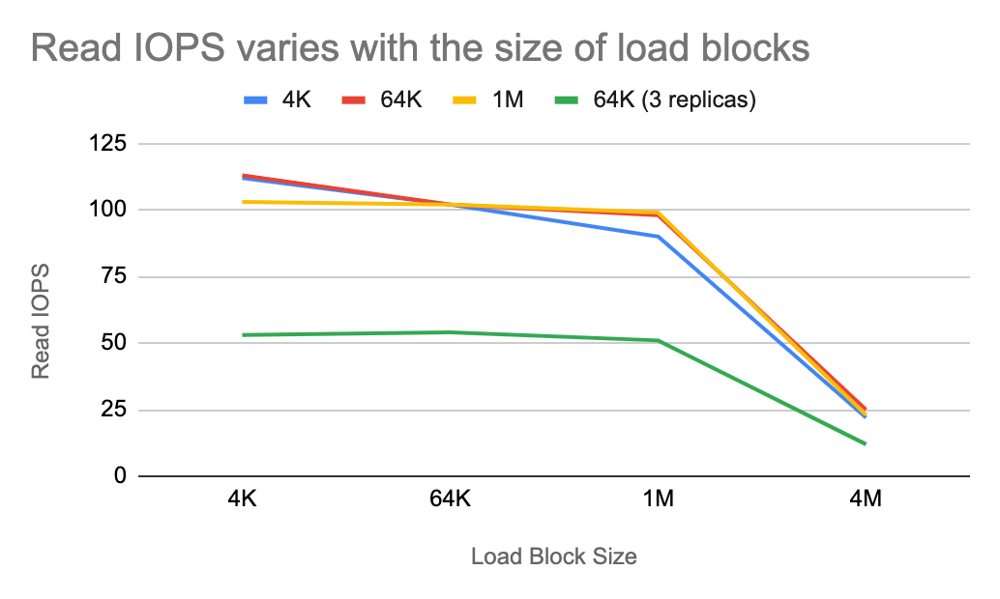
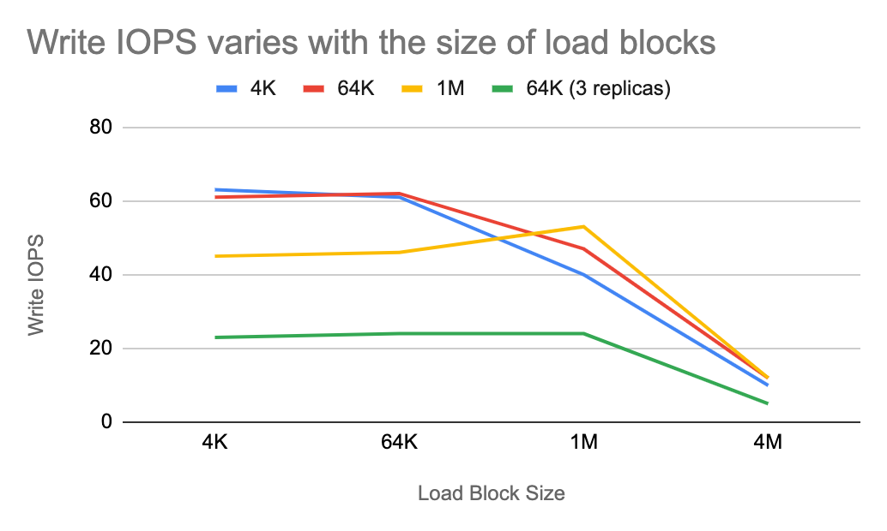
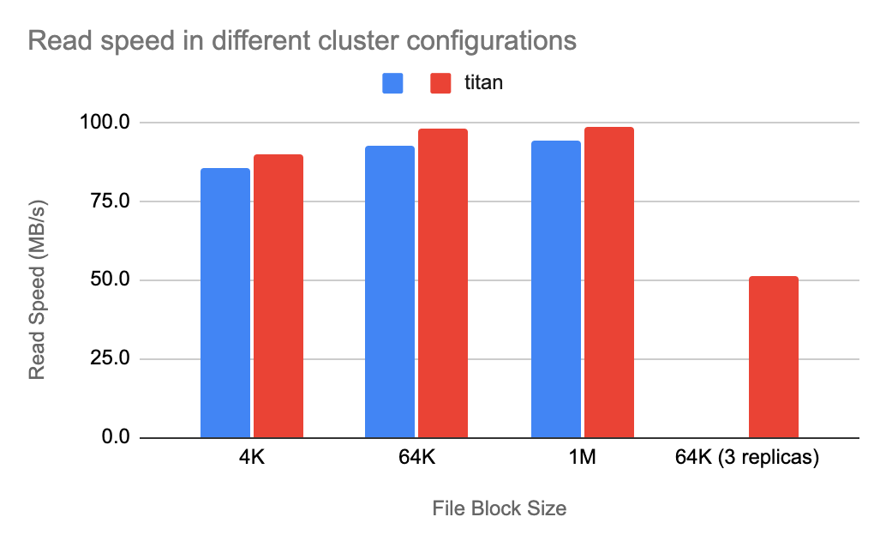
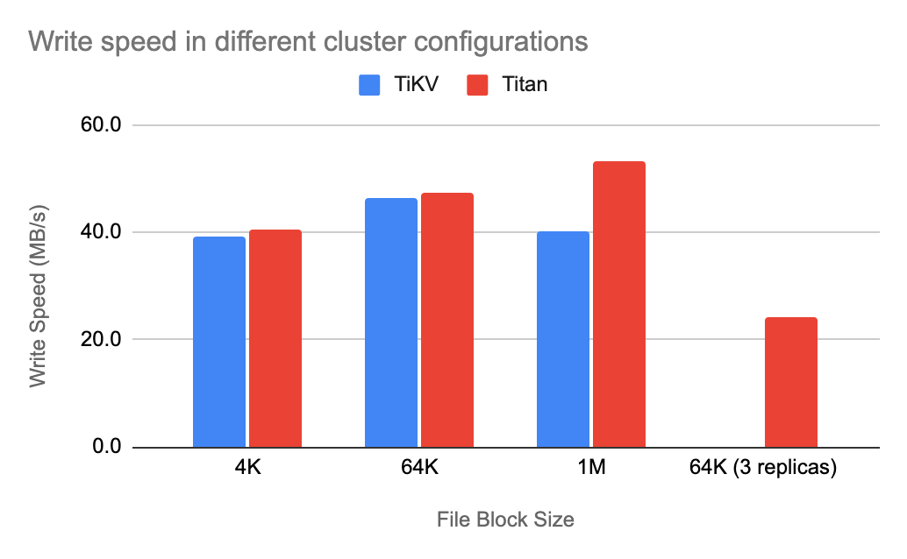

**Author:** [Hexi Lee](https://github.com/Hexilee) (Software Engineer Intern at PingCAP)

**Transcreator:** [Ran Huang](https://github.com/ran-huang); **Editor:** Tom Dewan


TiKV is a distributed key-value storage engine, featuring strong consistency and partition tolerance. It can act either as the storage engine for TiDB or as an independent transactional key-value database. Do you know what else it is capable of?

At [TiDB Hackathon 2020](https://pingcap.com/community/events/hackathon2020/), **our team built a TiKV-based distributed POSIX file system, [TiFS](https://github.com/Hexilee/tifs)**, which inherits the powerful features of TiKV and also taps into TiKV's possibilities beyond data storage.

In this post, I'll walk you through every detail of TiFS: **how we came up with the idea, how we implemented the file system, and** **its benchmarking results**. Let the hacking begin!

## Why build a file system based on TiKV?

A “distributed” system has multiple processes cooperating across machines; TiKV has that as well. Being a distributed database means it easily scales out and is fault tolerant by nature.

A friend of mine once wanted to try out TiDB but had only one server. I told him that he could run a TiKV instance on each disk, achieving data disaster tolerance, and wouldn't need RAID anymore!

However, TiKV stores only data—not files—so you still need RAID to recover your files from a disaster. But it sparked an idea in me: **if TiKV could store the file system data, then it could achieve disaster recovery for the file system**. So we spent several days building TiFS. It was a POSIX file system and in the first version was bug-ridden and prone to deadlocks—but hey, the idea worked.

Why did we go to all this effort? Three reasons:

* Unlike the common storage backend for distributed file systems, **TiKV supports ACID-compliant distributed transactions**. Therefore, we can **guarantee strict consistency of the file system**.
* A POSIX file system not only covers the requirements of a local file system, but also **supports file collaboration across machines** and **stores files for other distributed applications**.
* What's even cooler, **if we run a standalone application that supports multi-instance collaboration on TiFS, it becomes a distributed application**.

Therefore, we started this project to build TiFS, a file system that is as strong as Titanium.

## How we implement TiFS

TiKV only provides a simple key-value store, where keys and values are byte arrays with unfixed length. Therefore, before implementing the file system, we need to divide the logical area for keys and construct the data structure for values.

### Values

**TiFS stores seven types of values in TiKV: system metadata, file metadata, file block, file handler, symbolic link, directory, and file index.** The file block is transparent data written by the user. The symbolic link only stores the target path. The other five values are structured data.

#### System metadata

The whole file system has only one **system metadata** (`Meta`), which is updated only during the `mknod` and `mkdir` operations. System metadata contains only one integer used to generate the file inode number:

```rust
struct Meta {
    inode_next: u64,
}
```

#### File metadata

Each file has a corresponding **file metadata** (`Inode`). In this data structure:

* `file_attr` stores the metadata required for a POSIX file system, such as the file inode number, the file size, and the number of blocks. See [Rust File Attributes](https://docs.rs/fuser/0.7.0/fuser/struct.FileAttr.html) for details.
* `lock_state` tracks the current lock state and the lock holder, which are used to implement `flock`.
* `inline_data` stores a small amount of file content to improve the read/write performance of tiny files.
* `next_fn` is an auto-increment integer used to generate the file handler.
* `opened_fn` records the number of opened file handlers.

```rust
struct Inode {
    file_attr: FileAttr,
    lock_state: LockState,
    inline_data: Option<Vec<u8>>,
    next_fh: u64,
    opened_fh: u64,
}
```

#### File handler

Every time the user calls `open`, the file system generates a corresponding **file handler** (`FileHandler`) to store the read/write limits of the handler:

```rust
struct FileHandler {
    flags: i32,
}
```

#### Directory

Each **directory** stores a list of subfiles so that it can implement `readdir`. In the list, each `DirItem` item stores the inode number, name, and type of file:

```rust
type Directory = Vec<DirItem>;

struct DirItem {
    ino: u64,
    name: String,
    typ: FileType,
}
```

#### File index

When we query a file, the file system can traverse the whole file directory; but to query files more efficiently, we create an **index** (`Index`) for each file. The file index only contains the inode number of the target file:

```rust
struct Index {
    ino: u64,
}
```

### Key

TiFS has five types of keys: system metadata, file metadata, file block, file handler, and file index. Among them, the file block key stores the file block data, symbolic link, and directory, while the other four keys store their corresponding values.

**The first byte of the block, also known as the scope, identifies the type of key.** The key's byte arrays usually follows this pattern:

```
+ 1 byte +<--------------------------------+ dynamic size +--------------------------------------->+
|        |                                                                                         |
|        |                                                                                         |
|        |                                                                                         |
|        |                                                                                         |
|        |                                                                                         |
|        |                                                                                         |
|        v                                                                                         v
+--------------------------------------------------------------------------------------------------+
|        |                                                                                         |
|  scope |                                         key                                             |
|        |                                                                                         |
+--------+-----------------------------------------------------------------------------------------+
```

The **system metadata scope** has only one key-value pair:

```
+ 1 byte +
|        |
|        |
|        |
|        |
|        |
|        |
|        v
+--------+
|        |
|    0   |
|        |
+--------+
```

The **file metadata** key only contains the inode number in big-endian ordering so that all the file metadata are sequentially stored in TiKV. Thus, for the [`statfs`](https://man7.org/linux/man-pages/man2/statfs.2.html) operation, we can get all the file metadata using TiKV's `scan` interface.

The file metadata key is as follows:

```
+ 1 byte +<----------------------------------+ 8 bytes +------------------------------------------>+
|        |                                                                                         |
|        |                                                                                         |
|        |                                                                                         |
|        |                                                                                         |
|        |                                                                                         |
|        |                                                                                         |
|        v                                                                                         v
+--------------------------------------------------------------------------------------------------+
|        |                                                                                         |
|    1   |                                     inode number                                        |
|        |                                                                                         |
+--------+-----------------------------------------------------------------------------------------+
```

The **file block** key is composed of the file inode number and the block index in big-endian ordering. All file blocks for a single file are sequentially stored in TiKV. When we need to read large chunks of data, we can get the desired file blocks by one `scan`.

The key's array is listed below:

```
+ 1 byte +<---------------- 8 bytes --------------->+<------------------ 8 bytes ----------------->+
|        |                                          |                                              |
|        |                                          |                                              |
|        |                                          |                                              |
|        |                                          |                                              |
|        |                                          |                                              |
|        |                                          |                                              |
|        v                                          v                                              v
+--------------------------------------------------------------------------------------------------+
|        |                                          |                                              |
|    2   |              inode number                |                   block index                |
|        |                                          |                                              |
+--------+------------------------------------------+----------------------------------------------+
```

The **file handler** key consists of the file inode number and the file handler number in big-endian ordering:

```
+ 1 byte +<---------------- 8 bytes --------------->+<------------------ 8 bytes ----------------->+
|        |                                          |                                              |
|        |                                          |                                              |
|        |                                          |                                              |
|        |                                          |                                              |
|        |                                          |                                              |
|        |                                          |                                              |
|        v                                          v                                              v
+--------------------------------------------------------------------------------------------------+
|        |                                          |                                              |
|    3   |              inode number                |                  file handler                |
|        |                                          |                                              |
+--------+------------------------------------------+----------------------------------------------+
```

The **file index** key includes the inode number of its parent directory in big-endian ordering and the file name in UTF-8 encoding:

```
+ 1 byte +<---------------- 8 bytes --------------->+<------------------ 8 bytes ----------------->+
|        |                                          |                                              |
|        |                                          |                                              |
|        |                                          |                                              |
|        |                                          |                                              |
|        |                                          |                                              |
|        |                                          |                                              |
|        v                                          v                                              v
+--------------------------------------------------------------------------------------------------+
|        |                                          |                                              |
|    4   |     inode number of parent directory     |         file name in utf-8 encoding          |
|        |                                          |                                              |
+--------+------------------------------------------+----------------------------------------------+
```


### Consistency

TiKV supports both optimistic and pessimistic transactions. However, since the Rust client only supports pessimistic transactions experimentally, and pessimistic transactions may reduce performance when transactions don't conflict, **we implement TiFS by optimistic  transactions only**.


## Various scenarios

**TiFS is most efficient for reading and writing small files or other complicated file system operations.** Although TiFS can handle large files, compared to other large file storage solutions it is not as powerful or efficient.

Here are a few uses of TiFS that you may find interesting:

* A Git remote repository can directly use TiFS to store the project and run Git tasks, such as `rebase` or `cherry-pick`, without transferring the files to the local file system.
* When multiple nodes of an application read or write the same file in TiFS, you can use `flock` to resolve any conflicts.
* There's no complicated SDK or API for space management. You simply call the file system API or run a shell script.
* TiFS lets you take a standalone application that supports multi-instance collaboration and turn it into a distributed application. For example, **SQLite + TiFS = yet another distributed relational database**. Admittedly, to use TiFS this way, the application cannot rely on page cache or other caching mechanisms to avoid writes being invisible.


<div class="caption-center">TiFS makes SQLite another distributed relational database</div>

## Tests and benchmark

During the Hackathon, we used [pjdfstest](https://github.com/pjd/pjdfstest) to test TiFS's correctness. But because pjdfstest doesn't cover read/write correctness or concurrency correctness, we will need to add other tests.

Theoretically, there are three major factors that influence the read/write performance of TiFS: the size of file system blocks, the network latency, and the size of load blocks. Here we'll show the [benchmarking results](https://github.com/Hexilee/tifs.benchmark) of the read/write IOPS and speed.

### IOPS

> Note: TiKV is a sophisticated system, in which there are logical duration, disk I/O duration, and network duration. In this article, we simplify TiKV to a single replica for demonstration purposes.

Let's first take a look at IOPS. Because sequential reads and writes perform I/O operations linearly, each I/O operation is a transaction in TiKV. If we ignore the minor differences between each operation, the duration of an I/O operation, **_T_**, is the reciprocal of **_IOPS_**. In addition, if we don't count stream processing, we can consider **_T_** as the linear addition of the following four variables:

* **_T<sub>f</sub> _**: the I/O duration of [FUSE](https://en.wikipedia.org/wiki/Filesystem_in_Userspace).
* **_T<sub>c</sub> _**: the logical duration of TiFS.
* **_T<sub>n</sub>_** : the network transmission time.
* **_T<sub>s</sub>_** : the logical duration of TiKV.

Accordingly, we have this equation:


#### Read IOPS

For read operations, **_T<sub>f</sub>_** is positively correlated to the size of load blocks. The size of data read or written by TiFS per I/O operation must be an integer multiple of the size of file system blocks. Therefore, **_T<sub>n</sub>_** and **_T<sub>s</sub>_** are positively correlated to the larger value between load blocks and file system blocks; however, with larger traffic, network and disk I/O may take longer. **_T<sub>c</sub>_** is unknown.

**The following diagram shows how the sequential read IOPS varies with the size of load blocks.** The four lines represent different filesystem block sizes and data replicas.



Before the benchmarking, we had the following projections:

* When both the file block and load block are 4 KB, if the load block increases, **_T<sub>f</sub>_**, **_T<sub>n</sub>_**, and **_T<sub>s</sub>_** increase; therefore, **_IOPS_** decreases.
* When the file block is 64 KB or 1 MB:
    * If the load block is smaller than the file block, **_T<sub>n</sub>_** and **_T<sub>s </sub>_**barely change, but **_T<sub>f</sub>_** increases; therefore, **_IOPS_** decreases.
    * If the load block is larger than the file block, **_T<sub>f</sub>_**, **_T<sub>n</sub>_**, and **_T<sub>s</sub>_** all increase; therefore, **_IOPS_** decreases.

As you can see in the diagram, the variation is almost identical to our projections.

#### Write IOPS

When TiFS sequentially writes data, if the load block is smaller than the file block, TiFS needs to read a dirty block, which causes extra **_T<sub>c</sub>_** and **_T<sub>n</sub>_**. When the file block is large, that extra overhead is noticeable.

**The following line chart shows how the sequential write IOPS varies with the size of the load blocks.** When the file blocks are 1 MB (see the yellow line), the **_IOPS_** is largest while the file block and load block are equivalent.



Moreover, we can see that the red line almost overlaps the blue line on the first two data points. This means when the load block and file block are 4 KB or 64 KB, their **_IOPS_** values are nearly the same. Under such circumstances, the minimum traffic per second is 4 KB * 110 = 440 KB, and the maximum is 64 KB * 100 = 6.25 MB, both putting little pressure on the network and disks. When the traffic is small enough, it is safe to say that **_IOPS_** reaches its upper limit, so the major factor of **_T<sub>n</sub>_** becomes network latency. (In local testing, **_T<sub>n</sub>_** is considered 0 ms.)

In the chart above, when file blocks and load blocks change between 4 KB and 64 KB, **_IOPS_** is almost unaffected. Under such configurations, **_T_** is determined by **_T<sub>c</sub>_** and **_T<sub>s</sub>_**, so we call it the **fixed system operation latency** of TiFS. The fixed system operation latency is caused by TiFS and TiKV's logical duration. If the latency is high enough, it leads to terrible read/write performance for small files. We are still working on this optimization.

### Speed

Because the read and write speeds are the product of **_IOPS_** multiplied by load blocks, and **_IOPS_** changes very little when the load block increases from 4 KB to 1 MB, read and write speeds reach the maximum value when the load block is 1 MB.

The following two bar charts compare the read and write speeds in different cluster configurations when the load block is 1 MB. The blue bar represents ordinary TiKV, while the red bar represents TiKV with Titan enabled.

> [Titan](https://github.com/tikv/titan) is a RocksDB Plugin for key-value separation, inspired by [WiscKey](https://www.usenix.org/system/files/conference/fast16/fast16-papers-lu.pdf), to reduce write amplification.





From the charts, we can see that **the write speed is mostly affected by the file block size and whether Titan is enabled**, and that the read speed is only slightly fluctuating. This is because the smaller the file block is, the more key-value pairs TiKV writes into, which takes more time. But RocksDB performs poorly with large file blocks, so enabling Titan can reduce unnecessary value copy and thus improve performance.

## Our next step

In TiFS, storing file blocks is very costly because TiKV implements redundancy by using multiple replicas (three by default). The redundancy ratio (occupied space divided by written data volume) is usually three or more.

However, the redundancy ratio is as low as 1.2~1.5 in other distributed file systems that support redundancy by erasure coding (EC), such as HDFS, CephFS, and JuiceFS. EC redundancy requires encoding and decoding during data write and reconstruction, which consumes extra computing resources. **However, the EC redundancy strategy sacrifices part of the read performance in exchange for lower network overhead and storage cost.**

Currently, it is somewhat difficult for TiKV to support EC, but **we plan to support EC-redundancy object storage for file blocks to reduce storage cost**.

Apart from that, **we'll focus on verifying correctness and tuning performance:**

* For correctness, we'll research how other file systems are tested and use that knowledge to build our own tests.
* For performance, we'll cover both TiFS and TiKV to reduce the innate latency.

If you are interested in TiFS, feel free to [try it out](https://github.com/Hexilee/tifs) or [join our discussion](https://github.com/Hexilee/tifs/issues)!

_At TiDB Hackathon 2020, many excellent, interesting projects were born. We'll be telling you about them in future [blog posts](https://pingcap.com/blog/tag/Hackathon). Stay tuned._
