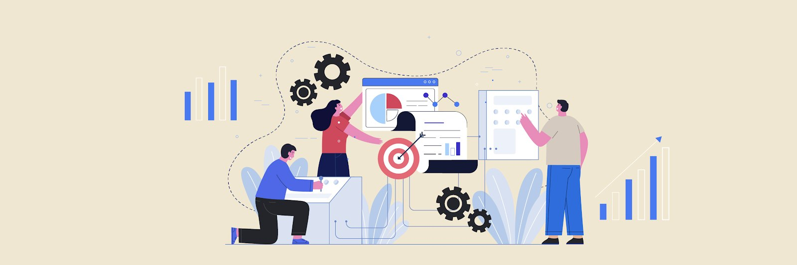
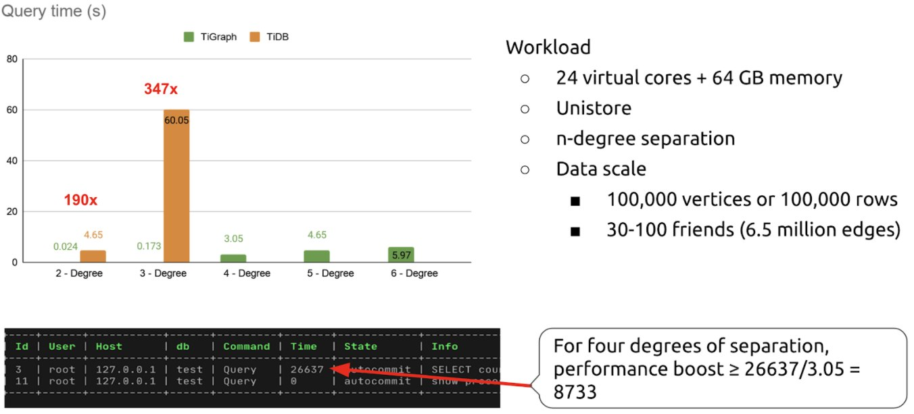

**Authors:** [Heng Long](https://github.com/lonng), [Shuang Chen](https://github.com/crazycs520), [Wenjun Huang](https://github.com/wjhuang2016) (Software Engineers at PingCAP)

**Transcreator:** [Caitin Chen](https://github.com/CaitinChen); **Editor:** Tom Dewan



A graph database is a database that uses graph data structures to store and query data. [Gartner](https://www.gartner.com/en/documents/3899263/an-introduction-to-graph-data-stores-and-applicable-use-) believes that graph data stores can efficiently model, explore, and query data with complex interrelationships across data silos. Graph analytics will grow in the next few years. They also think **it's impossible to use SQL queries to analyze graph data in relational database management systems (RDBMSs)**.

But today, we want to say **No**!

Our [TiGraph](https://github.com/tigraph) project implemented a new set of key-value encoding formats to add a graph mode to [TiDB](https://docs.pingcap.com/tidb/stable), a relational, distributed SQL database. **TiGraph can analyze graphical data that is difficult for relational databases to process,** and **it improves TiDB's computing performance by 8,700+ times** in four [degrees of separation](https://en.wikipedia.org/wiki/Six_degrees_of_separation). At [TiDB Hackathon 2020](https://pingcap.com/community/events/hackathon2020/), our team won the second prize.

In this post, we'll share TiGraph's architecture, its benchmarks, our project innovations, potential uses for TiGraph, and our future plans.

## TiGraph's architecture

Hackathon was short, so we didn't have time to develop a complete graph database. Instead, we tried to seamlessly integrate a graph mode in TiDB:

* We extended a graph traversal syntax in SQL statements that a DBA can quickly learn.
* We enabled TiDB to manipulate graph data and relational data in the same transaction.
* We let table query statements include graph traversal as a subquery, and we let table queries be subqueries in graph traversal.
* We compared the performance of TiDB with and without TiGraph for different degrees of separation.

TiGraph's technology stack is consistent with TiDB's from the upper layer to the lower layer. Its main work includes:

* Writes

    We added graph schema types `TAG` and `EDGE` to metadata management, which represent a graph's vertex and edge, respectively. When data is written to the system, the system detects the written object's schema. If the schema is `TAG` or `EDGE`, data is encoded in the graph data's key-value format and is committed via the two-phase commit protocol. TiDB also uses this approach.

* Reads

    We added two execution operators:

    * `GraphTagReader`. It reads the graph data's vertex data.
    * `Traverse`. It traverses the graph based on specified edges.

    Graph calculation contains three parts: graph traversal, subgraph matching, and graph aggregation. Our Hackathon demo focused on graph traversal. Later, when we continue to develop this project, we'll design subgraph matching and graph aggregation operators.

## Impressive benchmark metrics

Because time was limited at Hackathon, TiGraph only implemented the key-value logic in TiDB. In [TiKV](https://docs.pingcap.com/tidb/stable/tikv-overview), TiDB's distributed storage engine, we had no time to re-implement TiGraph in Rust. For testing we used Unistore, TiDB's built-in storage engine.

Regarding the data size, at the beginning, we planned to generate 1 million vertices and 40 million edges. At four degrees of separation, we found that TiGraph could return a result while TiDB could not. This was because:

* We chose Unistore, which is for unit tests, instead of TiKV, which we use in production.
* In this scenario, there is no advantage to using a relational database, so TiDB couldn't return results.


<div class="caption-center"> TiGraph's benchmarks </div>

Therefore, we tested a smaller amount of data: 100 thousand rows of data and 6.5 million edges. At this data scale, we compared performance between TiDB + Unistore and TiGraph in n-degree separation scenarios. The figure above shows that:

* TiGraph could run a six-degree separation test. In contrast, TiDB + Unistore could only run a three-degree separation test, and, after seven hours of processing, it still hadn't completed its four-degree separation test.
* As the degrees of separation increased, TiGraph's performance advantage significantly improved:

    * **In the two-degree separation test, TiGraph's performance was 190x as fast as that of TiDB + Unistore**.
    * **In the three-degree separation test, TiGraph's performance was 347x as fast as that of TiDB + Unistore.**
    * In the four-degree separation test, TiGraph finished the test in 3.05 s, while TiDB already used 26,637 s, and it needed more time to complete its test. So we can see that TiGraph's performance was at least 8,700x as fast as that of TiDB + Unistore.

Later, when TiGraph adopts TiKV, it will flexibly scale under the massive scale of graph data. In addition, when it combines with TiKV Coprocessor to push down graph data calculations, TiGraph's query performance will improve further.

## Project difficulties: integrating a relational database with a graph database

If an application uses a relational database and a graph database simultaneously, it's almost impossible to achieve transactions and strong consistency between the two databases. However, TiGraph can do it well. In this section, we'll explain how we made it possible by overcoming development difficulties.

First, we designed a set of clauses that is highly extensible and highly compatible with the SQL syntax. The following examples show two popular graph query clauses, Gremlin and openCypher, for two degrees of separation:

```
-- Gremlin
g.V().has("name","John").     -- Get the vertex with the name "John."
  out("knows").               -- Traverse the people that John knows (John'sfirst-degree connections).
  out("knows").               -- Traverse the people that John's acquaintances know (John's second-degree connections).
  values("name")              -- Get these people's names.
```

```
-- openCypher
MATCH (john {name: 'John'})-[:FRIEND]->()-[:FRIEND]->(fof)
RETURN john.name, fof.name
```

However, if we use two sets of query syntax in a single system, it would increase our users' learning costs. After some discussion, we finally determined our graph traversal clause like this:

```
SELECT * FROM people WHERE name="John"
    TRAVERSE OUT(friend).OUT(friend).TAG(people);
```

This clause includes two parts:

* The query result of the `SELECT... FROM ...` statement is the starting point for graph traversal (the `TRAVERSE` clause).
* The `TRAVERSE` clause specifies the `EDGE` we want to traverse and uses graph traversal to query the starting point's second-degree connection.

By contrast, if we used TiDB's existing SQL syntax without extending it, the statement would be:

```
SELECT dst
     FROM follow
     WHERE src IN
         (SELECT dst
          FROM follow
          WHERE src IN
              (SELECT dst
               FROM follow
               WHERE src = 1234 )
            AND dst NOT IN
              (SELECT dst
               FROM follow
               WHERE src = 1234 )
            AND src != 1234
```

Comparing the two examples above, we can see that:

* TiGraph's syntax is SQL styled and very expressive.

* TiGraph introduces the `TRAVERSE` clause to express graph traversal. This clause can seamlessly interact with TiDB relational queries' other clauses in combination. Therefore, **we can reuse TiDB's existing execution operators and expressions, and the learning cost for users is very low**.

    For example, we can reuse the `WHERE`, `ORDER BY`, and `LIMIT` by adding filter conditions to the edge and input the result of graph traversal (the `TRAVERSE` clause) to the `ORDER BY LIMIT` clause:

    ```
    SELECT * FROM people
        WHERE name="John"               -- Transverse from the vertex with the name "John."
        TRAVERSE
            OUT(friend WHERE age>10).   -- The first degree of separation (age greater than 10).
            OUT(friend).                -- The second degree of separation.
            TAG(people)                 -- Output these friends' people property.
        ORDER BY name                   -- Sort the people of the second-degree separation by name.
        LIMIT 10;                       -- Take the top 10 of the people of the second-degree separation.
    ```

    Because TiDB operators rely on a strong schema design, to reuse these operators, TiGraph's `TAG` and `EDGE` must also have a strong schema. Therefore, the schema output by the graph calculation related operators can be highly compatible with relational operators' schema. TiDB's upper-layer operators don't need to know whether the bottom-layer is graph data or relational data. As long as the previous `TableScan` operator is replaced with `GraphScan` at the bottom layer, all capabilities can be reused for the upper layer.

<div class="trackable-btns">
  <a href="/download" onclick="trackViews('TiGraph: 8,700x Computing Performance Achieved by Combining Graphs + the RDBMS Syntax', 'download-tidb-btn-middle')"><button>Download TiDB</button></a>
  <a href="https://share.hsforms.com/1e2W03wLJQQKPd1d9rCbj_Q2npzm" onclick="trackViews('TiGraph: 8,700x Computing Performance Achieved by Combining Graphs + the RDBMS Syntax', 'subscribe-blog-btn-middle')"><button>Subscribe to Blog</button></a>
</div>

## TiGraph's three innovations

[Researchers](https://arxiv.org/abs/1905.12133) affiliated with Cornell University also tried to combine graphs and the RDBMS syntax at the SQL level. They tried to use SQL statements to combine `Stream` and `Batch`. However, no one in the academic community has combined graphs and the RDBMS syntax the way TiGraph does. The TiGraph project has achieved three innovations.

* Innovation #1: **we designed a set of SQL-style graph traversal clauses**.
* Innovation #2: **we can manipulate graph data and relational data in the same transaction while guaranteeing strong consistency**. Sometimes, to solve a problem, users must use both a graph database and a relational database. But it's almost impossible to achieve strong consistency between the two databases. Now, TiGraph has this ability. In the future, for subqueries, we only need to improve their performance and make them easier to use.
* Innovation #3: **we implemented two different encoding models in TiKV**. One model encodes relational tables, and the other encodes graphs. To avoid conflicts caused by mixed storage in a single key-value engine, we add a _g_ prefix to isolate key-value engines at the base layer so they don't affect each other.

## TiGraph's application scenarios

TiGraph has many potential uses. For example, it may play an important role in financial anti-fraud, social networks, and knowledge graph scenarios.

### Financial anti-fraud

Through the user's relationship network to detect their association with the risk node, we can identify their risk degree, which can be a reference indicator. For example, it might be difficult to detect whether a user within three degrees of separation touches a risky node. It's hard to find the problem by looking at a single node and a single transaction. But TiGraph can detect and analyze correlation:

* It can detect whether the user's multi-layer social relationship conforms to normal graph characteristics. If it's an isolated subgraph, it may be a fake relationship network, and the user is at high risk. For example, they may be on a block list or associated with a high-risk node.
* It can spot whether there are high-risk nodes in the multi-layer relationship network, such as risky nodes in the second degree of separation.
* It can use the Google Personal Rank and PageRank algorithms to calculate nodes' risk degrees in a relational network.

For organized and large-scale digital financial frauds, TiGraph could quickly analyze a criminal gang in a complex and help staff reach timely decisions about fraud blocking.

### Social networks

LinkedIn includes first-degree, second-degree, and third-degree connections. It analyzes your social network relationships to help you expand your circle of connections.

TiGraph's reach is even more comprehensive. It can calculate [degrees of separation](https://en.wikipedia.org/wiki/Six_degrees_of_separation) in social networks. In addition, to obtain some in-depth information, you can combine social network data with your consumption records and other information. This helps the social platform's recommendation system increase [conversion rate](https://www.wordstream.com/conversion-rate). TiGraph can break data silos and establish a connection between isolated data. This results in a 1 + 1 > 2 effect.

### Knowledge graph

In 2012, Google introduced the concept of the [knowledge graph](https://en.wikipedia.org/wiki/Google_Knowledge_Graph). Through certain methods, knowledge can be extracted and organized into a structure similar to a mind map, and then it can be queried in a graph database. The search engine can only tell users which pages the query results are related to, and users need to find answers on the pages themselves. But the knowledge graph can directly tell users the answers.

For example, TiGraph can directly tell you, in Game of Thrones, who Elia Targaryen's husband's brothers and sisters are. Isn't that cool?

## Our future plans with TiGraph

In the future, we want to write a paper about TiGraph's implementation, including:

* How we integrated the graph mode in the existing relational database (TiDB).
* TiGraph's syntax. We'll implement graph calculation's three operators.

We'll also continue to develop and implement the TiGraph project. Our main tasks are to implement key-value encoding in TiKV and implement graph calculation pushdown in the TiKV Coprocessor. Therefore, graph queries can directly reuse TiDB's execution operators and expressions, and we can seamlessly combine graph queries and relational queries.

## The team behind TiGraph

The three hackers on the TiGraph team are all [top developers in the TiDB community](https://github.com/pingcap/tidb/graphs/contributors):

* [Heng Long](https://github.com/lonng) is the TiGraph team leader.
* [Shuang Chen](https://github.com/crazycs520) ranks in the top 5 on the TiDB Contributors list.
* [Wenjun Huang](https://github.com/wjhuang2016) is an experienced developer.

If you have any questions or want more details about TiGraph, join the [TiDB community on Slack](https://slack.tidb.io/invite?team=tidb-community&channel=everyone&ref=pingcap-blog).

_At TiDB Hackathon 2020, many excellent, interesting projects were born. We'll be telling you about them in future [blog posts](https://pingcap.com/blog/tag/Hackathon). Stay tuned._
