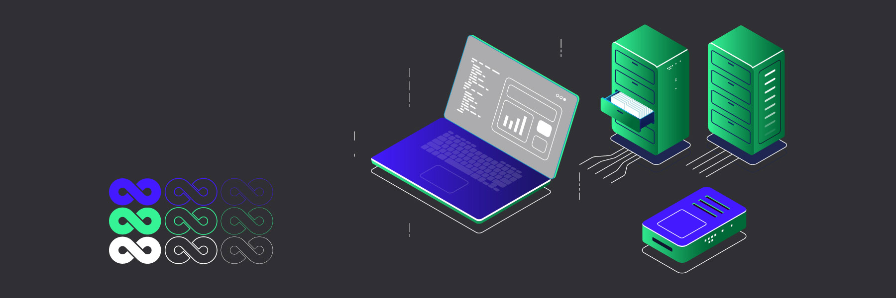
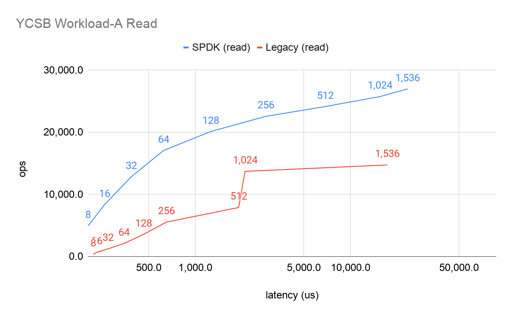
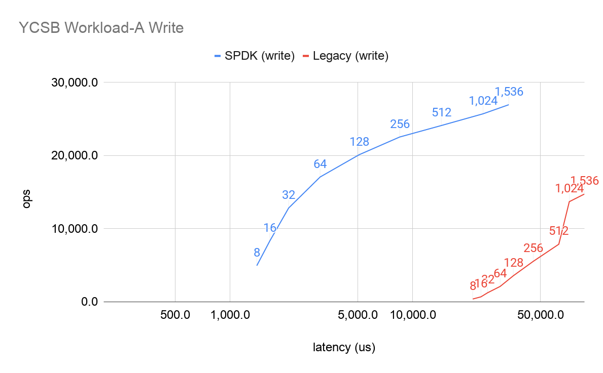

**Author:** [Ke'ao Yang](https://github.com/YangKeao) (Software Engineer at PingCAP)

**Transcreator:** [Ran Huang](https://github.com/ran-huang); **Editor:** Tom Dewan

At the heart of modern software is layered abstraction. In abstraction, each layer hides details that are not relevant to other layers and provides a simple, functioning interface.

However, because abstraction brings the extra overhead of system calls, its simplicity comes at the cost of performance. Thus, **for performance-sensitive software such as databases, abstraction might bring unwanted consequences**. How can we boost performance for these applications?

In this article, I'll talk about **the pitfalls of abstraction in the modern storage structure** and how we tackled the problem at [TiDB Hackathon 2020](https://pingcap.com/community/events/hackathon2020/) by **introducing the Storage Performance Development Kit (SPDK) in TiKV**.

## The pitfalls of abstraction

In the magic world of abstraction, everything is neatly organized. The application doesn't make its execution plan; it lets the database decide. The database doesn't write data to disks; it leaves that to the operating system's discretion. The OS, of course, never operates directly on memory cells; instead, it asks the disk's control chip to do it. More often than not, the concrete tasks are handed over to the party with more knowledge so that everyone is happy and content.

When a database reads and writes data, it takes advantage of abstraction in the file system. Via the file system, the database creates, writes, and reads files without directly operating on the hard disks. When the database starts a system call, it takes several steps before the data is finally persisted to the disks:

1. The OS receives the system call.
2. The OS operates on the virtual file system (VFS) and the page caching mechanism.
3. The file system implements specific behaviors.
4. Data is read from and written into the block device, where the I/O schedulers and device mappers take effect.
5. The system sends instructions to storage devices via hardware drivers.
6. The disk controller processes the instructions and operates on the storage medium.

This process may have four underlying problems:

* **The system calls have high overhead**. For complicated system calls like I/O operations, the system switches from user mode to kernel mode, saves the process state, and then restores the process state. Nowadays, as storage devices' performance greatly improves, that overhead is taking up a larger proportion of resource consumption.
* **The file system implementation has an out-of-control impact on high-level applications**. Different file systems use different data structures to manage their files and thus are suitable for different scenarios. [XFS](https://en.wikipedia.org/wiki/XFS), for example, doesn't do well with lots of small files. The high-level applications might not respond well to the variation of file systems.
* As a generic OS, **Linux prioritizes its universality**, which means its page caching algorithm and hardware support are designed to work for all applications and all hardware. That means it doesn't fully optimize the mechanism for specific software applications (such as databases) and hardware (such as [NVMe](https://en.wikipedia.org/wiki/NVM_Express) drives).
* **Repetitive logging is also a concern**. Every level of abstraction tries to maintain its stability by logging. NVMe controllers, the file system, and RocksDB all have logs. In the current mechanism, these repetitive logs are essential for the robustness of the system. But if we could redesign the system from a global perspective, we might be able to remove some logging.

The solution to all these problems is to **push the application towards the lower level to reduce abstraction**. The more chores the application does by itself, the greater performance boost it gets.

## How we reduce abstraction in TiKV

[TiKV](https://tikv.org/) is a distributed transactional key-value database. At TiDB Hackathon 2020, we tried to reduce abstraction in TiKV by pushing TiKV to step 5 mentioned above, that is, sending instructions to NVMe disks directly. This way, we eliminated the overhead of several abstractions.

### SPDK and BlobFS

How many levels of abstraction should be reduced is a matter of trade-off. Because of NVMe's popularity and its new features (4 KB atomic writes, low latency, and high concurrency queues), we believe that redesigning TiKV for NVMe disks is worth the effort.

Luckily, the open-source community thinks so, too. Intel provides **[SPDK](https://spdk.io/), a set of open-source toolkits and libraries for writing high-performance storage applications**, which includes user-mode drivers and packages for NVMe. Via methods like Virtual Function I/O (VFIO), user-mode drivers map the hardware I/O to memory accessible by the user mode so that the application can access the hardware without taking a detour to the OS. VFIO is widely used in virtual machines to allow them to directly access the graphics card or network card.

Beyond that, **SPDK implements a file system called BlobFS, which provides function interfaces similar to the [POSIX](https://en.wikipedia.org/wiki/POSIX#:~:text=The%20Portable%20Operating%20System%20Interface,maintaining%20compatibility%20between%20operating%20systems.) file system**. With BlobFS, the application performs I/O operations in three steps:

1. The application calls functions such as `blobfs_create` and `blobfs_read`.
2. The filesystem operations are mapped to storage device operations.
3. BlobFS sends the instructions to NVMe disks. (Strictly speaking, the instructions are written into the corresponding memory space in NVMe devices.)

Compared with the Linux I/O process, the SPDK I/O processes are much simpler and more efficient:

* The function calls have a lower overhead than syscalls.
* BlobFS uses NVMe's atomic write feature and thus simplifies the management of file system metadata.
* Its optimized page caching strategy is suitable for contiguous reads and writes. For RocksDB, the optimization is significant for LSM compaction, but unfortunately it also removes extra caching for point queries.

This solution solves the four problems we mentioned earlier: **it removes the syscall overhead, uses data structures and caching algorithms more suitable for databases and NVMe disks, and simplifies file system logging**. If we integrate SPDK BlobFS into TiKV, we can expect to see a huge performance increase.

### Measuring TiKV improvements

To benchmark our experiment, we use [YCSB Workload A](https://github.com/brianfrankcooper/YCSB/wiki/Core-Workloads) (update heavy workload) to test the final I/O. As shown in the figures below, the results are beyond our expectations. The labels on data points refer to the number of client threads. Clearly, under the same latency, SPDK-based TiKV processes higher operations per second (OPS):

YCSB Workload A read performance

YCSB Workload A write performance

## Going forward

How far could this Hackathon project go? The answer depends. As NVMe disks become more popular and TiKV keeps striving for higher performance, our project is sure to deliver concrete results.

Moreover, as [TiDB Cloud](https://pingcap.com/products/tidbcloud/), the fully managed TiDB service, becomes publicly available, TiDB users can start a cluster in a few clicks. They can enjoy the benefits of SPDK without enduring the pain of configuring it by themselves.

In the industry, people have been exploring related topics for years:

* Some researchers push the software down further to step 6—letting the software complete the tasks of NVMe controllers, such as the Open-Channel SSD technology. There is a [paper](https://dl.acm.org/doi/10.1145/3126545) on the commonality between SST file read-only mode in LSM tree and block read-only mode in SSD (erase before rewrite). This can reduce the performance downgrade caused by unexpected erasing.
* There are also projects working on how to read and write on Linux block devices. For example, Ceph's [BlueFS](https://github.com/ceph/ceph/blob/master/src/os/bluestore/BlueFS.cc) has higher performance than direct file system read and write, and shows better hardware compatibility and lower risks than SPDK.

These approaches are promising in their own ways. One day, we may see one or more of them integrated into TiKV, creating a database with ever higher storage performance.

_At TiDB Hackathon 2020, many excellent, interesting projects were born. We'll be telling you about them in future [blog posts](https://pingcap.com/blog/tag/Hackathon). Stay tuned._
