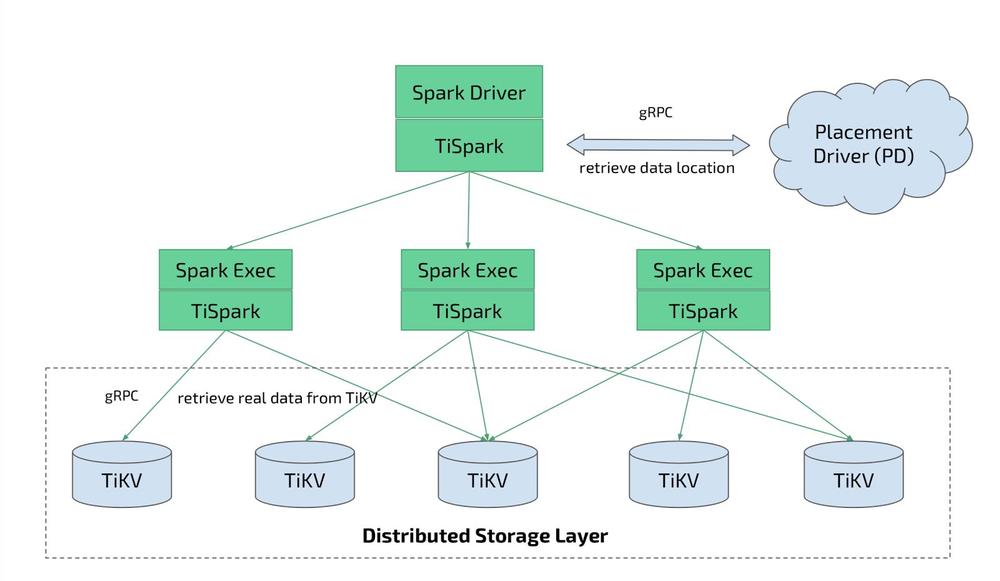
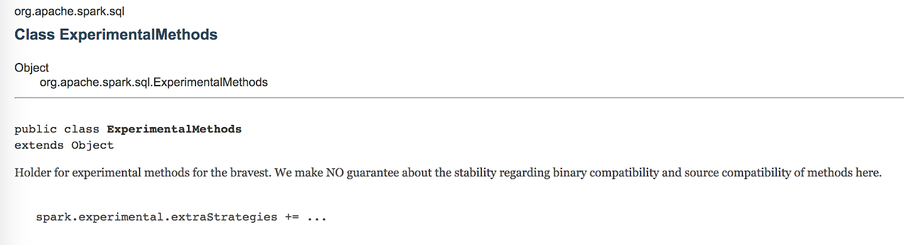
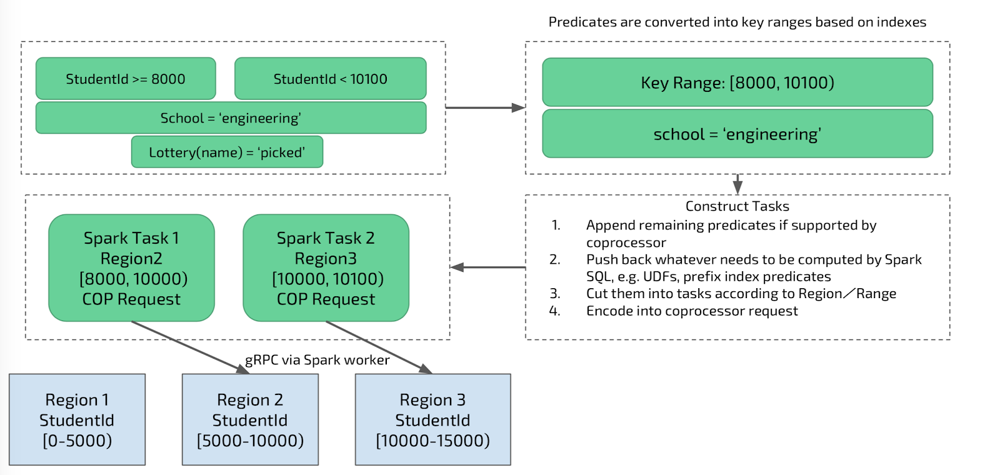
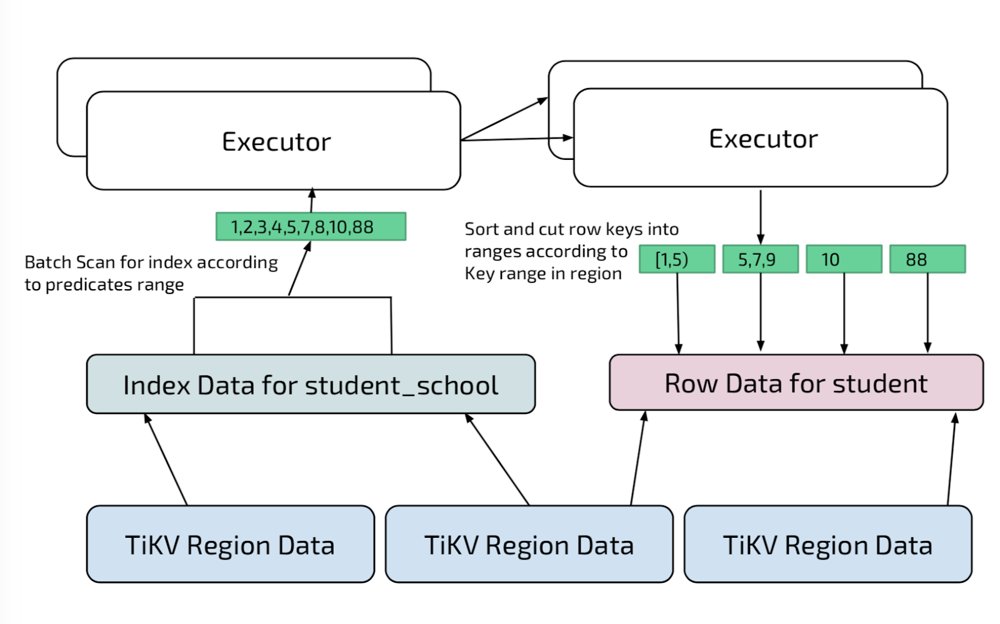
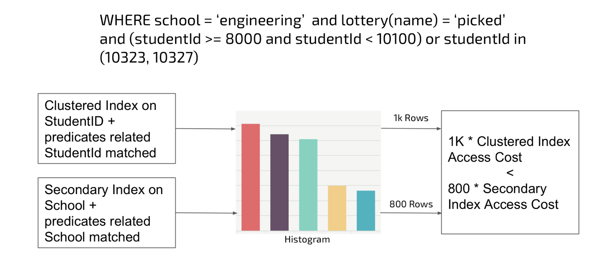
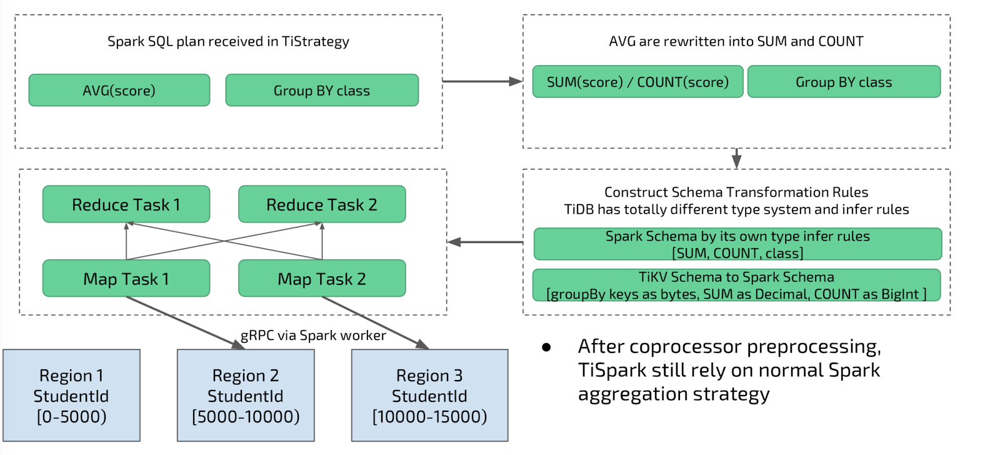

**Author**: Shawn Ma is a Tech Lead at PingCAP in the OLAP team. Previously, he was Tech Lead at Netease and Quantcast. He received his Masters in Computer Science from University of California--Irvine.

When we released [TiDB 2.0](http://bit.ly/tidb_2_0) in April, part of that announcement also included the release of [TiSpark](https://github.com/pingcap/tispark) 1.0--an integral part of the TiDB platform that makes complex analytics on "fresh" transactional data possible. Since then, many people in the TiDB community have been asking for more information about TiSpark. In this post, I will explain the motivation, inner workings, and future roadmap of this project.

## Motivation

The motivation behind building TiSpark was to enable real-time analytics on TiDB without the delay and challenges of ETL. [Extract, transform, and load (ETL)](https://en.wikipedia.org/wiki/Extract,_transform,_load)--a process to extract data from operational databases, transform that data, then load it into a database designed to supporting analytics--has been one of the most complex, tedious, error-prone, and therefore disliked tasks for many data engineers. However, it was a necessary evil to make data useful, because there hasn’t been good solutions on the market to render ETL obsolete--until now.

With the emergence of open-source database solutions like TiDB, the promise of a hybrid transactional and analytical processing (HTAP) architecture, a term first coined by [Gartner](https://www.gartner.com/doc/3599217/market-guide-htapenabling-inmemory-computing), is fast becoming a reality. Whether you subscribe to HTAP or other similar terms, like hybrid operational and analytical workloads (HOAP) (by [451 Research](https://451research.com/report-short?entityId=93844)) or "Translytical" (by [Forrester](https://www.forrester.com/report/The+Forrester+Wave+Translytical+Data+Platforms+Q4+2017/-/E-RES134282)), it's clear that the industry is calling for an end to the separation of the online transactional processing (OLTP) and online analytical processing (OLAP). No one wants to deal with ETL anymore.

To make this possible, PingCAP and its open source contributors built [TiDB](https://github.com/pingcap/tidb) and [TiSpark](https://github.com/pingcap/tispark), which was recognized in a recent report from [451 Research](https://451research.com/report-short?entityId=95082) as an open source, modular NewSQL database that can be deployed to handle both operational and analytical workloads. TiSpark, which tightly integrates Apache Spark with [TiKV](https://github.com/pingcap/tikv), a distributed transactional key-value store on the TiDB platform, allows our customers to access operational data that was just recorded inside TiKV and run complex analytical queries on it right away.

(If you are interested in experiencing an HTAP database on your laptop with TiDB + TiSpark, check out this [5-minute tutorial](https://pingcap.com/blog/how_to_spin_up_an_htap_database_in_5_minutes_with_tidb_tispark/) to spin up a cluster using Docker-Compose!)

## So How Does TiSpark Work? 

TiSpark leverages the power and popularity of Apache [Spark](https://en.wikipedia.org/wiki/Apache_Spark) with TiKV to enhance TiDB's OLAP capabilities. Spark is a unified analytics engine that supports many big data use cases with a nice SQL interface (aka Spark SQL). TiDB from its very first day was built to be a relational SQL database with horizontal scalability; currently it's compatible with MySQL. While TiDB has a complex and powerful optimizer and coprocessor architecture to support ad-hoc OLAP queries using MySQL, it's even better to leverage a feature-rich engine like Spark to complete the missing piece in the HTAP puzzle. Thus, TiSpark was born.

TiSpark is a connector that supports the following features:

- Complex calculation pushdown: this feature produces better performance by pushing down complex calculations to TiKV
- Key-range pruning: examines the sorted keys in TiKV and only returns the results we need
- Index support for:
    - Clustered index/non-clustered index
    - Index only query optimization
- Cost-based optimization for:
    - Histogram support
    - Index selection

Here's high-level overview of TiSpark's architecture:



As you can see from the architecture diagram, TiSpark works with [Placement Driver](https://github.com/pingcap/pd) (PD), the metadata cluster of TiDB to retrieve snapshots of data location, drives the query plans into the coprocessor layer, and retrieves the data directly from TiKV, where data is actually stored and persisted.

Before we go further, let's have a better understanding of TiKV first. TiKV has a computing module called coprocessor, which can process most of the expression evaluations inside of  TiKV itself. And as your TiKV cluster grows, coprocessors expand as well. This is one of the most important reasons why TiDB as a whole scales so well both in terms of capacity and performance.

For TiSpark to leverage these features inside TiKV, it makes use of Spark's extension point called 'ExperimentalMethods,' because the current Spark data source API doesn't give users the ability to execute complex calculations pushdown.



These extension points expose SQL compiler's optimization and planning details, thus allowing developers to configure the internal behaviors of almost every aspect of SQL compilation. They are at the core of TiSpark's power. Now, we can inject our own rules and do extra work to push down more computations, such as predicates, aggregation pushdown, and Top-N pushdown (LIMIT clause with ORDER BY).

## TiSpark in Action

Let's use an example to illustrate how TiSpark works in action.

Suppose we have a `student` table, and there are two indices associated with it: primary index (clustered index) on column `studentId` and a secondary index on `school` column. We want to run the following query on this table:

```
select class, avg(score) from student
WHERE school = 'engineering' and lottery(name) = 'picked'
and studentId >= 8000 and studentId < 10100
group by class;
```

The above query contains two predicates, each of which matches an index. TiSpark will first analyze the predicates combination and "approximate" how many rows will be returned if a specific index is applied. The goal here is to find a way to access the table with minimum cost. The process of finding an access path will be explained later. For now, let's first look at how predicates are processed.

### Path 1: Primary Index
  
Assume we pick the `studentID` index, the primary index, to access the table. The process is as follows:

1. Transform the predicates "studentId >= 8000 and studentId < 10100" into a close-open interval on studentID: [8000, 10100);

2. Prune the irrelevant '[regions](https://pingcap.com/blog/2017-07-11-tidbinternal1/#region)' according to the above interval and the internal data distribution information in TiKV. For the clustered index column, TiKV uses the column to split and distribute data among different TiKV nodes. If we have a value interval on 'studentId,' we can directly prune all the 'regions' that are outside of the interval.

3. Convert the interval into coprocessor requests [8000, 10000), [10000, 10100), respectively, for both region 2 and 3 (and ignore region 1, as illustrated below) and get the data via a sequential scan.



### Path 2: Secondary Index

So what if we choose a different path by using the 'school' column index instead of the primary index? TiSpark will then go through a different procedure for secondary index. A secondary index in TiKV is encoded like main table data. (For more detailed info on how TiKV encodes data, please see this [post](https://pingcap.com/blog/2017-07-11-tidbinternal2/).) The difference is the split / sort key is not on primary key but on the index keys, and primary key is attached at the end for each index entry.

TiSpark reads all index entries per value range "school = 'engineering'" to retrieve all primary keys in the similar way illustrated above. We don’t directly search the main table via primary keys retrieved. Instead, we do a shuffle by regionID for each primary key, and then in each of the executor, TiSpark tries to merges all the keys into continuous range. By doing so, TiSpark transforms point queries into range queries and improves performance. If there are cases where primary keys are sparse and scattered, then for that specific region, the system automatically adapts by downgrading point queries to a single region scan to avoid performance hit.



### So Which Path Does TiSpark Choose?

TiSpark relies on a histogram built within TiDB to estimate cost and pick which path is the best way forward. Histogram is a common technique supported and applied in many relational databases. Consider TiDB's histogram bar chart on column values below. The width of the bar is the value ranges for a specific column and height is the row count for that range. For predicates that matches an index, TiSpark estimates the total row to be returned if we apply it, but row count is not the cost. We introduced two different approaches to access a table, primary index or secondary index, and in this case the former one is far cheaper since it reads the table just once and always via sequential scan. In this scenario, even if 'studentId' predicates return 200 more rows than 'school' column predicate, TiSpark would pick primary index as the better path.



### Aggregation Pushdown

Another optimization we've implemented is aggregation pushdown. TiSpark will rewrite the aggregation plan and push down the partial aggregation to the coprocessor, if possible. This only happens if the underlying predicates and enclosed expression are all computable by the coprocessor. Coprocessor then calculates the aggregations for each of the region involved and typically returns less row to TiSpark as results, thus reducing the cost of serialization.



## Why Use TiSpark?

Because TiDB as a whole is a distributed NewSQL database, storing data sizes that are far larger than what can be stored in a single machine, it's natural to layer a distributed compute engine like Spark on top of it. Without TiSpark, you would need do things the old way: do a daily dump of all your data into a Hadoop/Hive cluster or another data warehouse before you can analyze it--a situation many of our customers like [Mobike](https://www.pingcap.com/blog/Use-Case-TiDB-in-Mobike/) avoided by adopting TiDB with TiSpark. If you want to run queries on “fresh” data, not stale ones that are at least one day old, then TiSpark shines. Plus, you no longer need to manage and maintain any ETL pipelines, saving your team lots of time, resources, and headaches.

## What's Next?

Although we released TiSpark 1.0 not that long ago, we are already busy working on new features. Here is a list of the important features we'd like to build in 2018:

- Compatibility with Spark 2.3 (right now TiSpark supports 2.1)
- Batch Write Support (writing directly in TiKV native format)
- JSON Type support (since TiDB already supports JSON as well)
- Partition Table support (both Range and Hash)
- Join optimization based on range and partition table

If you are interested in helping us build any of these features, please [contribute](https://github.com/pingcap/tispark)! TiSpark is open-sourced.

## Try it Out!

Lastly, seeing is believing. You can easily try out the TiDB + TiSpark combo by following a [5-minute tutorial](https://www.pingcap.com/blog/how_to_spin_up_an_htap_database_in_5_minutes_with_tidb_tispark/) our team recently put together, to spin up a cluster on your laptop using Docker-Compose. If you want to deploy this HTAP solution in a production environment, please [contact us](https://pingcap.com/contact-us/), and our team would be happy to help you!
