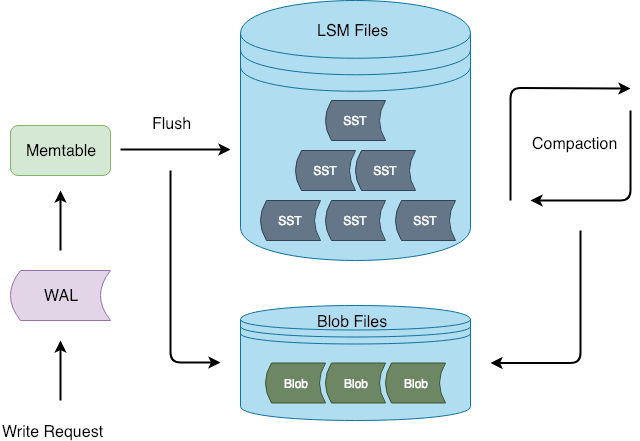
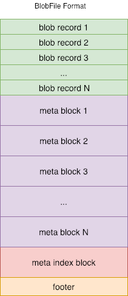
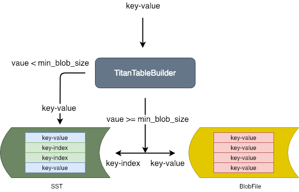
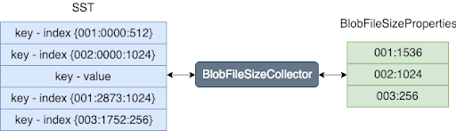
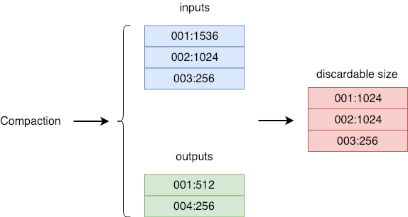
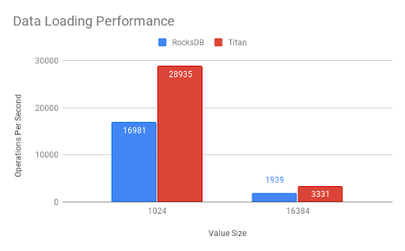
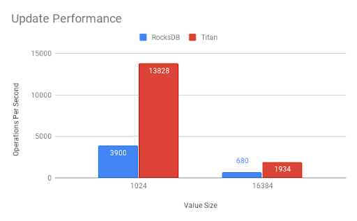
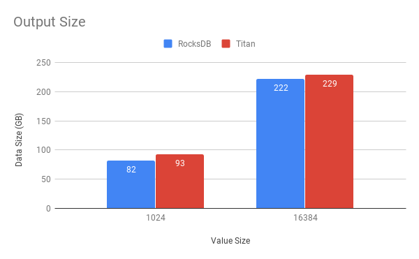
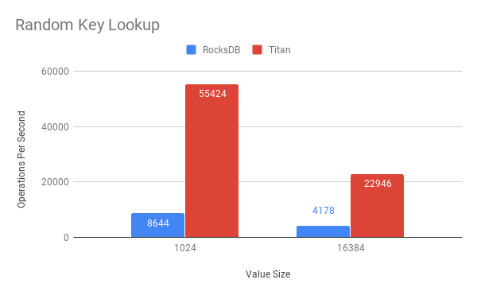
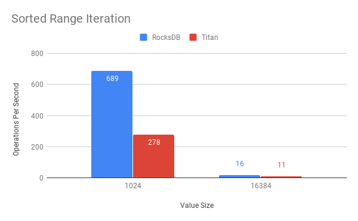

## Introduction

[Titan](https://github.com/pingcap/rocksdb/tree/titan-5.15) is a RocksDB plugin for key-value separation, inspired by [WiscKey](https://www.usenix.org/system/files/conference/fast16/fast16-papers-lu.pdf), a paper issued in USENIX FAST 2016. It's available for preview in TiDB 3.0. The goal of Titan is to reduce write amplification in RocksDB when using large values.

WiscKey is specifically designed for solid-state drives (SSDs). WiscKey separates keys from values, which generates random I/O that is not well suited for hard drives. Our internal testing indicates that when the value size in Key-Value pairs is large, Titan performs better than RocksDB in write, update, and point read scenarios. However, according to [RUM Conjecture](http://daslab.seas.harvard.edu/rum-conjecture/), improvements achieved in one are usually at the cost of another. The same is true with Titan -- it gets a higher write performance by sacrificing storage space and range query performance. As the price of SSDs continues to decrease, we believe this trade-off will be more and more meaningful.

## Design goals

As a child project of TiKV, Titan's first design goal is to be compatible with RocksDB. As the bottom-layer storage engine for TiKV and a mature project itself, RocksDB already has a large user base. These users should be able to seamlessly upgrade their RocksDB-based TiKV to a Titan-based TiKV. Therefore, we have developed the following design goals:

- Reduce write amplification by separating values from the log-structured merge-tree (LSM tree) and storing them independently.
- Seamlessly upgrade RocksDB instances to Titan. The upgrade will not require human intervention and will not impact online services.
- Achieve 100% compatibility with all RocksDB features used by the current TiKV.
- Minimize invasive changes to RocksDB to ensure an easier RocksDB upgrade to Titan.

## Architecture and implementation

The following figure shows the basic Titan architecture:



Figure 1. During flush and compaction operations, Titan separates values from the LSM tree. The advantage of this approach is that the write process is consistent with RocksDB, which reduces the chance of invasive changes to RocksDB.

Titan core components include BlobFile, TitanTableBuilder, Version, and Garbage Collection (GC). We will dive into each of these components in the following sections.

### BlobFile

When Titan separates the value file from the LSM tree, it stores the value file in the BlobFile. The following figure shows the BlobFile format:



Figure 2. A blob file is mainly comprised of blob records, meta blocks, a meta index block, and a footer. Each block record stores a Key-Value pair. The meta blocks are used for scalability, and store properties related to the blob file. The meta index block is used for meta block searching.

**Notes:**

- The Key-Value pairs in the blob file are stored in order, so that when the Iterator is implemented, we can use prefetching to improve sequential reading performance.
- Each blob record keeps a copy of the user key corresponding to the value. This way, when Titan performs Garbage Collection (GC), it can query the user key and identify whether the corresponding value is outdated. However, this process introduces some write amplification.
- BlobFile supports compression at the blob record level. Titan supports multiple compression algorithms, such as [Snappy](https://github.com/google/snappy), [LZ4](https://github.com/lz4/lz4), and [Zstd](https://github.com/facebook/zstd). Currently, the default compression algorithm Titan uses is LZ4.

### TitanTableBuilder

TitanTableBuilder is the key to achieving Key-Value separation. As you may know, RocksDB supports custom table builders for creating a Sorted String Table (SST). This feature let's us separate values from the SST without making any invasive changes to the existing table building process. Now, let's look at the TitanTableBuilder main workflow:



Figure 3. TitanTableBuilder determines the Key-Pair value size, and based on that, decides whether to separate the value from the Key-Value pair and store it in the blob file.

- If the value size is greater than or equal to min_blob_size, TitanTableBuilder separates the value and stores it in the blob file. TitanTableBuilder also generates an index and writes it into the SST.
- If the value size is less than min_blob_size, TitanTableBuilder writes the value directly into the SST.

Titan's design differs greatly from [Badger](https://github.com/dgraph-io/badger), which converts the Write-Ahead Log (WAL) into a Vlog to save overhead for a single flush. There are two main reasons why Titan takes a different approach:

- Assume that the maximum level for LSM tree is 5, and the amplification factor is 10. The overall write amplification for the LSM tree is 1+1+10+10+10+10=42, among which the write amplification for the flush is 1, with a proportion of 1:42. Compared to the overall write amplification for the LSM tree, the write amplification for the flush can be ignored.
- Because we can ignore the write amplification for the flush, keeping the WAL could significantly reduce invasive changes to RocksDB, which is one of our design goals.

### Version

Titan uses Version to refer to a valid blob file at a specific point of time. We draw this data management method from LevelDB. The core concept behind this method is Multi-version Concurrency Control ([MVCC](https://en.wikipedia.org/wiki/Multiversion_concurrency_control)). The advantage of this approach is that it allows concurrent reads with no locking required when a file is added or deleted. Each time a file is added or deleted, Titan generates a new version. Before each read, Titan gets the latest version.


Figure 4. New and old versions form a head-to-tail bidirectional linked list. VersionSet manages all versions, with a **current** pointer that points to the latest version.

### Garbage Collection

Titan uses Garbage Collection (GC) to reclaim space. When weighing write amplification and space amplification, an efficient GC algorithm should recover the maximum space with the fewest cycles. When designing GC, there are two major problems to consider:

- When to perform GC
- On which files to perform GC

Titan addresses these problems using two features of RocksDB: the Table Properties Collector and the Event Listener. Next, we will elaborate on how these two features assist GC.

#### BlobFileSizeCollector

RocksDB let's us use BlobFileSizeCollector, a custom table property collector, to collect properties from the SST which are written into corresponding SST files. The collected properties are named BlobFileSizeProperties. The following figure shows the BlobFileSizeCollector workflow and data formats.



Figure 5. On the left is the SST index format. The first column is the blob file ID; the second column is the offset for the blob record in the blob file; the third column is the blob record size.

On the right is the BlobFileSizeProperties format. Each line represents a blob file and how much data is saved in this blob file. The first column is the blob file ID; the second column is the size of the data.

#### EventListener

As we know, RocksDB uses compaction to discard old data and reclaim space. After each compaction, some blob files in Titan may contain partly or entirely outdated data. Therefore, we could trigger GC by listening to compaction events. During compaction, we could collect and compare the input/output blob file size properties of SST to determine which blob files require GC. The following figure shows the general process:



Figure 6. Event Listener Process

- *inputs* stands for the blob file size properties for all SSTs that participate in the compaction.
- *outputs* stands for the blob file size properties for all SSTs generated in the compaction.
- *discardable size* is the size of the file to be discarded for each blob file, calculated based on inputs and outputs. The first column is the blob file ID. The second column is the size of the file to be discarded.

For each valid blob file, Titan maintains a discardable size variable in memory. After each compaction, this variable is accumulated for the corresponding blob file. Each time when GC starts, it picks the blob file with the greatest discardable size as the candidate file for GC.

#### Sample

Before each compaction, we pick a set of blob files as our candidates as described in the previous section. To reduce write amplification, we allow a certain level of space amplification, which means GC can be started on a blob file only when the discardable file has reached a specific proportion in size. We use the Sample algorithm to get an approximate proportion of the discardable data for each candidate file. The main logic with this algorithm is:

1. Get a random section of data A from the blob file, with size a.
2. Traverse all keys in A, and accumulate sizes of blob records with outdated keys as *d*.
3. *r= d/a.* If r>= discardable_ratio, perform GC on this blob file, or else do not perform GC on it.

As mentioned in the previous section, there is a discardable size maintained in memory for each blob file. If the proportion of this value to the size of the blob file is greater than or equal to discardable_ratio, no Sample calculation is needed for this blob file.

## Benchmark test

We used [go-ycsb](https://github.com/pingcap/go-ycsb), a GO port of [YCSB](https://github.com/brianfrankcooper/YCSB), to test TiKV's performance in Transaction mode respectively on RocksDB and Titan. In this section, I will briefly describe our test methods and results. Because the length of this article is limited, we can only pick two typical value sizes for elaboration. Our next article will include a more detailed test analysis and report.

### Test environment

- CPU: Intel(R) Xeon(R) CPU E5-2630 v4 @ 2.20GHz (40 cores)
- Memory: 128 GB (TiKV memory usage is limited under 32 GB via Cgroup)
- Disk: SATA SSD 1.5 TB ([fio](https://linux.die.net/man/1/fio) test: read IOPS and write IOPS for 4 KB block size hybrid random read/write are respectively 43.8 KB and 18.7 KB)

### Test plan

The ground rule for data set selection is that the original data size (write amplification ignored) must be larger than the memory available, so that we can prevent all data from being cached in memory and weaken the impact of cache. In our case, the size of the dataset we select is 64 GB, and the memory usage limit is 32 GB.

| Value size | Number of keys (each key = 16 bytes) | Raw data size |
| :------ | :------ | :------ |
| 1 KB | 64 million | 64 GB |
| 16 KB | 4 million | 64 GB |

The test focused on the following common scenarios:

- Data Loading Performance: Concurrent write at a specified speed, using a pre-calculated number of keys and a fixed value size.
- Update Performance: Because Titan does not require GC in pure write scenarios (there is no discardable data in the blob file), we need to test GC's impact on performance through updating.
- Output Size: This step examines the disk space used by the engine after the update scenario is completed, thereby showing the space reclaiming result of GC.
- Random Key Lookup Performance: This step focuses on point query performance. The number of point queries must be far greater than the number of keys.
- Sorted Range Iteration Performance: This step focuses on range query performance. Query 2 million sequential keys each time.

### Test results



Figure 7. Data Loading Performance: Titan's performance is 70% higher than RocksDB in write scenarios. The gap becomes more evident as the value size increases. It's worth noting that data is first written into the Raft Log before the KV Engine, which dilutes Titan's performance. If we use both Titan's API and RocksDB API nakedly for the test instead of first going through TiKV's API, the performance gap is even bigger.



Figure 8. Update Performance: Titan's performance in update scenarios is 180% higher than RocksDB. This is mainly attributable to Titan's excellent read performance and optimal GC algorithm.



Figure 9. Output Size: Titan has a slightly higher space amplification than RocksDB. This is mostly a result of the write amplification caused by storage overhead for keys in the blob file. As the number of keys is reduced, this gap drops a little.



Figure 10. Random Key Lookup: Titan outperforms RocksDB in point query scenarios. This is due mainly to the design that separates values from the LSM tree to make the latter smaller. Using the same amount of memory as RocksDB, Titan allows more indexes, filters, and data blocks in block cache. Accordingly, most point queries require only one I/O (mainly for reading data from the blob file).



Figure 11. Sorted Range Iteration: Currently, Titan underperforms RocksDB in range query scenarios. In future optimizations, one of our goals is to improve this performance.

During this test, we compared performance differences for two typical value sizes in four different scenarios. Our next article will discuss testing for value sizes of different granularities and will include a more detailed performance report. We will also analyze the difference between Titan and RocksDB from more angles such as CPU and memory usage. From the current test, we can conclude that, for workloads with large value sizes, Titan outperforms RocksDB in read, write, update, and point query operations. However, Titan has a lower range query performance and more space amplification than RocksDB.

## Compatibility

Since day one, our primary design goal has been compatibility with RocksDB. Therefore, we have retained most of the RocksDB APIs. Currently, there are only two APIs that we do not explicitly support:

- Merge
- SingleDelete

All other APIs except the Open interface share consistent parameters and return values with RocksDB. Existing projects only require minor changes to upgrade RocksDB instances smoothly to Titan. However, it is noteworthy that Titan does not support rollback to RocksDB.

<div class="trackable-btns">
    <a href="/download" onclick="trackViews('Titan: A RocksDB Plugin to Reduce Write Amplification', 'download-tidb-btn-middle')"><button>Download TiDB</button></a>
    <a href="https://share.hsforms.com/1e2W03wLJQQKPd1d9rCbj_Q2npzm" onclick="trackViews('Titan: A RocksDB Plugin to Reduce Write Amplification', 'subscribe-blog-btn-middle')"><button>Subscribe to Blog</button></a>
</div>

## How to use Titan

### Create a database

To create a database, use one of the following methods:

```
#include <assert>
#include "rocksdb/utilities/titandb/db.h"

// Open the DB
rocksdb::titandb::TitanDB* db;
rocksdb::titandb::TitanOptions options;
options.create_if_missing = true;
rocksdb::Status status =
rocksdb::titandb::TitanDB::Open(options, "/tmp/testdb", &db);
 (status.ok());
 ...
```

or

```
#include <assert>
#include "rocksdb/utilities/titandb/db.h"

// Open the DB with two column families
rocksdb::titandb::TitanDB* db;
std::vector<rocksdb::titandb::TitanCFDescriptor> column_families;
// Have to open default column family
column_families.push_back(rocksdb::titandb::TitanCFDescriptor(
    kDefaultColumnFamilyName, rocksdb::titandb::TitanCFOptions()));
// Open the new one, too
column_families.push_back(rocksdb::titandb::TitanCFDescriptor(
 "new_cf", rocksdb::titandb::TitanCFOptions()));
std::vector<ColumnFamilyHandle*> handles;
s = rocksdb::titandb::TitanDB::Open(rocksdb::titandb::TitanDBOptions(), kDBPath, column_families, &handles, &db);
assert(s.ok());
```

### Status

Like RocksDB, Titan uses `rocksdb::Status` as the default return value for most APIs. You can verify the execution result or print the error message using the following command:

```
rocksdb::Status s = ...;
if (!s.ok()) cerr << s.ToString() << endl;
```

### Destroy a database

To destroy a database, use the following command:

```
/* Open the DB as described above */
/* Do something with the DB */
delete db;
```

### Use Titan in TiKV

Currently, Titan is disabled by default in TiKV. We use the TiKV configuration file to determine whether to enable and configure Titan. The related configuration options include [[rocksdb.titan]](https://github.com/tikv/tikv/blob/12a1ea8d13b6478c8a4d07f0bb7411f3367dc8f9/etc/config-template.toml#L375) and [[rocksdb.defaultcf.titan]](https://github.com/tikv/tikv/blob/12a1ea8d13b6478c8a4d07f0bb7411f3367dc8f9/etc/config-template.toml#L531). To enable Titan, configure it as follows:

```
[rocksdb.titan]
enabled = true
```

Note: After you enable Titan, you cannot roll back to RocksDB.

## Future work

### Optimize Iterator

Our test indicates a low I/O utilization when performing range queries with Titan, which explains the performance gap compared to RocksDB. This is why we believe that there is great room for optimization on Titan's Iterator. The simplest method is to choose a more radical prefetch technique or use parallel prefetching for better Iterator performance.

### GC speed control and auto-adjustment

Generally, an overly low GC speed can lead to severe space amplification, while an overly fast GC speed has a negative effect on queries per second (QPS) and service latency. Titan currently supports automatic GC, which aims to limit GC speed to a certain extent by reducing concurrency and batch size. However, due to an unstable amount of blob records in each blob file, if blob records become overly crowded, the write requests of the business may still be congested when the corresponding valid keys are updated back to the LSM tree. To achieve fine-grained control over the GC speed, we intend to use the [Token Bucket](https://en.wikipedia.org/wiki/Token_bucket) algorithm to limit the number of keys that GC can update within a specified period of time. This decreases GC's impact on QPS and latency and ensures a more stable service.

On the other hand, we are investigating algorithms that could adjust GC speed automatically. This could lower GC speed during service rush hours to provide more quality services, and speed up GC during non-rush hours to reclaim space faster.

### API to identify key's existence

In certain scenarios, TiKV only needs to identify whether a key exists or not instead of reading its value. We learned that after we separate values from the LSM tree, the latter becomes much smaller, and we can cache more indexes, filters, and datablocks in memory. Retrieving a key requires little or no I/O. By providing such an API, we could greatly improve performance.
