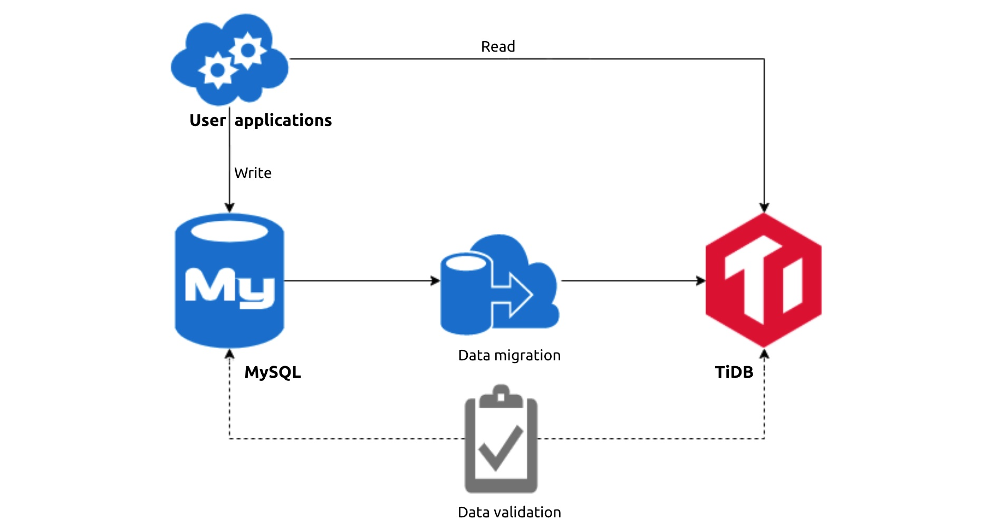
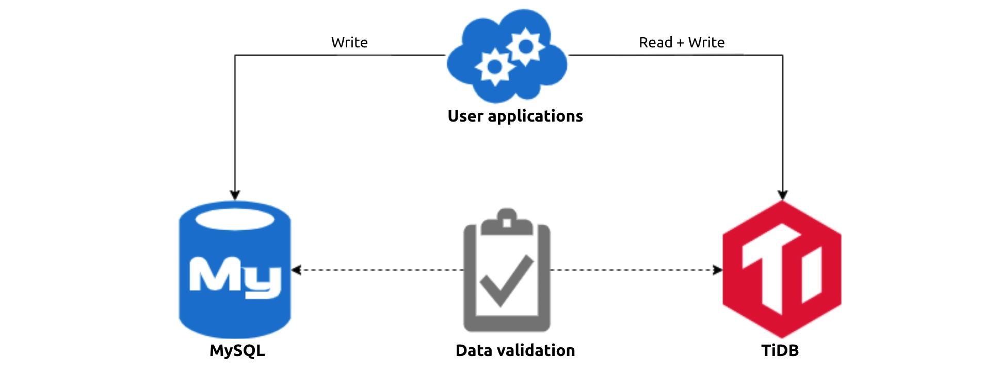
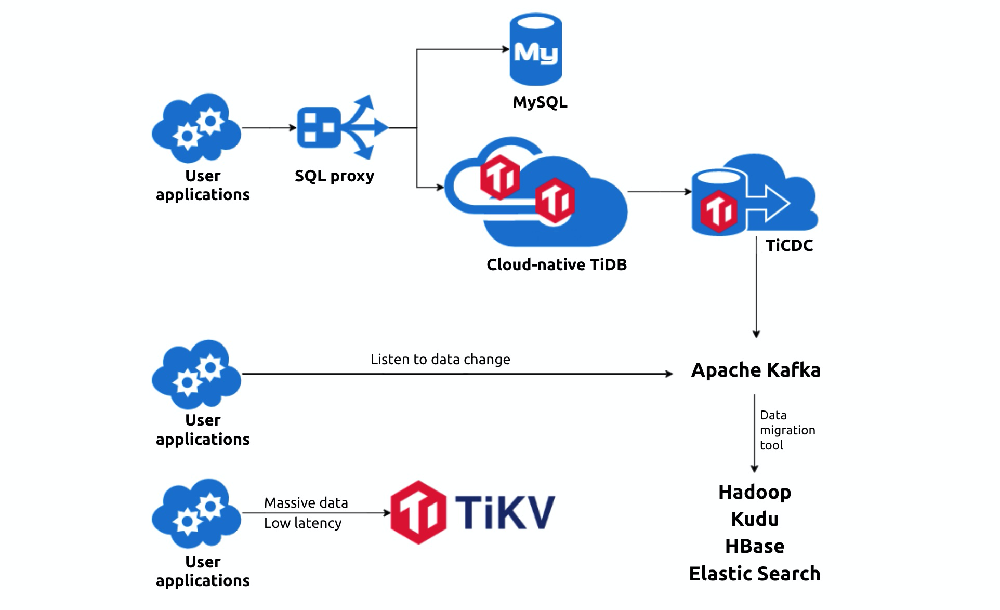

**Industry:** Automobile

**Author:** Kevin Ge, Jiansheng Han, and Sheyang Wang (TiDB virtual team at Chehaoduo)

[Chehaoduo](https://www.crunchbase.com/organization/guazi-com) is an online trading platform for both new cars and personal used cars. Founded in 2015, it is now the largest auto trading platform in China, valued at $9 billion in its series D round of funding last year.

In the early stages of Chehaoduo, to quickly adapt to our application development, we chose MySQL as our major database. However, as our business evolved, we were greatly troubled by the complication of MySQL sharding and schema changes. In face of this dilemma, we found an alternative database to MySQL: [TiDB](https://docs.pingcap.com/tidb/stable), an open-source, MySQL compatible database that scales out to hold massive data.

In this post, I’ll share with you why we chose TiDB and how it empowers our application to provide better service for our customers.

## How MySQL fell short

MySQL is a stand-alone database that doesn’t provide horizontal scalability. After our data volume exceeded a certain threshold, MySQL could no longer deliver satisfactory performance.

### Single MySQL instance has limits

As our data accumulated, single instances often hit Queries per Second (QPS) limits and ran out of storage capacity. To squeeze data into single instances, we had to split large tables to smaller ones and split the change data capture (CDC) layer and data warehouse (DW) layer.

Whenever we had to split tables, the application team had to work with the CDC team and the DW team. If the application at issue was sharing a database or table with other applications, the people in charge of other applications also had to be involved in the process. In addition, small scripting programs might be neglected during the migration, which might impact application data.

Depending on the data volume of the application, each split could take 2 to 4 weeks. This was a huge waste of time and energy.

### MySQL sharding is intrusive to applications

As the user base grows, some tables might have tens of millions of data records, which slows down reads and writes. The usual approach is to shard the data, but this has some problems:

- The distributed transactions are hard to handle.
- MySQL can’t create secondary indexes.
- The shards might not be able to further scale out.
- There’s no way to perform cross-shard joins.
- It’s hard to perform a sort-merge join on the result set.

### It’s hard to change schemas for big tables

At Chehaoduo, our business model changes rapidly. To adapt to the business requirements, we have to frequently change table schemas.

When a table has millions of records, we need a third-party tool to execute data definition language (DDL) commands, such as [pt-online-schema-change](https://www.percona.com/doc/percona-toolkit/3.0/pt-online-schema-change.html) (pt-osc). During the schema change process, we must make a temporary copy of the table and then apply the changes. This is time-consuming and may impact storage, I/O, and the application.

## Why we chose TiDB to replace MySQL

To address these pain points, we considered reforming and upgrading our existing database architecture. We analyzed the requirements from the application side and compared them to some common database solutions.

### Comparing various solutions

<table>
  <tr>
   <td><strong>Solution</strong>
   </td>
   <td><strong>Advantages</strong>
   </td>
   <td><strong>Disadvantages</strong>
   </td>
  </tr>

  <tr>
   <td>MySQL sharding
   </td>
   <td>
<ul>
<li>It’s easy to query by ID.
<li>In the short term, the cost of implementation is low.
</li>
</ul>
   </td>
   <td>
<ul>
<li>As the tables grow linearly, maintenance is increasingly hard. If each table contains millions of rows of data, at least 30 new tables are added each year.
<li>Data sharding requires code changes.
<li>If we introduce middleware for sharding, we need to hire new employees to maintain the middleware.
</li>
</ul>
   </td>
  </tr>

  <tr>
   <td>MongoDB
   </td>
   <td>
<ul>
<li>Mature technology.
<li>When the data volume is large, it can scale out via sharding.
</li>
</ul>
   </td>
   <td>
<ul>
<li>We need to refactor the whole application, which is impossible in a short period.
<li>It’s a document database, so the application needs to build its own data validation logic.
</li>
</ul>
   </td>
  </tr>

  <tr>
   <td>Elasticsearch (ES)
   </td>
   <td>
<ul>
<li>Powerful searchability (with secondary indexes).
</li>
</ul>
   </td>
   <td>
<ul>
<li>When encountering a large number of updates, ES may have high latency. Meanwhile, it can also experience incremental capacity and segment increase, which triggers merging and thus affects the search performance.
<li>Schemaless. Long-term maintenance is expensive.
</li>
</ul>
   </td>
  </tr>

  <tr>
   <td>HBase
   </td>
   <td>
<ul>
<li>Mature technology.
<li>Rowkey-based query without extra workload.
<li>It scales out horizontally.
</li>
</ul>
   </td>
   <td>
<ul>
<li>Special development required when data can’t be queried by rowkey. Its interface is not universal.
<li>No support for a secondary index.
<li>The protocol is incompatible with our current read/write programs.
</li>
</ul>
   </td>
  </tr>

  <tr>
   <td>HBase + Phoenix
   </td>
   <td>
<ul>
<li>Uses HBase as the bottom-layer KV storage. Strong stability.
<li>Scales out horizontally.
</li>
</ul>
   </td>
   <td>
<ul>
<li>SQL syntax is not universal. It has only `upsert` but no `insert` or `update`.
<li>Phoenix depends on Percolator to implement transactions, which might not be reliable.
</li>
</ul>
   </td>
  </tr>

  <tr>
   <td>HBase + ES
   </td>
   <td>
<ul>
<li>Uses HBase as the OLTP storage and ES as the secondary index.
<li>Draws on the advantages of both.
</li>
</ul>
   </td>
   <td>
<ul>
<li>No support for transactions.
<li>It’s difficult to keep data consistent between HBase and ES.
</li>
</ul>
   </td>
  </tr>

  <tr>
   <td>TiDB
   </td>
   <td>
<ul>
<li>It’s completely compatible with the MySQL protocol and requires hardly any changes to the application.
<li>Distributed storage, infinite scalability, and high availability.
<li>A perfect alternative to MySQL sharding.
<li>DDL schema changes don’t affect the application.
<li>Transaction support with the snapshot level of isolation.
<li>Compatible with CDC.
</li>
</ul>
   </td>
   <td>
<ul>
<li>It requires high-end hardware resources.
<li>No triggers. No stored procedure. Not compatible with some syntaxes.
</li>
</ul>
   </td>
  </tr>
</table>

To sum up, **TiDB is horizontally scalable and MySQL compatible. It supports online DDL schema changes and distributed transactions.** These features combined are suitable for Chehaoduo’s use case: large data volumes, frequent schema changes, and long-term data storage.

### Analyzing our use scenarios

After we studied TiDB’s advantages, we also analyzed Chehaoduo’s specific use scenarios and summarized the application side’s concerns:

- One application has nearly 300 million rows of data, with 1.7 million rows of new data added each day and 50 million each month. Even if only the hot data within 2 months are stored in MySQL, a single table could be crammed with more than 100 million rows of data.
- Cars have a longer sales cycle than other products. During the long sales cycle, once-cold data may become hot again. Therefore, the application might need to update cold data. And since the application serves online users, the database needs to read and write in real time.
- Multiple applications may read from the same dataset, each with different query conditions.
- When data changes, the application needs corresponding logic to process the changes. The database must provide a CDC data flow so that the application can monitor the data changes.

Based on these requirements. we decided to migrate several applications to TiDB, including ticket distribution and transferring, the telephone sales system, the business central hub, and the accounting system. These applications have large amounts of accumulated data. Some of them must frequently add new fields, while others need transactions. TiDB can certainly help them out.

## Our migration process

Facing a new database, the core application team couldn’t help but feel concerned about its stability and reliability. To boost their confidence, we decided to pilot the system on some less critical services. The entire testing process had three stages.

The first stage was to use TiDB as a MySQL replica cluster and sync data using [TiDB Data Migration](https://docs.pingcap.com/tidb-data-migration/stable) (DM). The application side examined whether TiDB’s data consistency, stability, and performance met their requirements. After that, we routed a small proportion of online requests to read from TiDB and observed the data. As everything went smoothly, we gradually increased the proportion until TiDB completely took over all read requests. The data validation didn’t fail. By then, the application side had faith in TiDB and was ready to move on to the next stage.

The first stage of migration: using TiDB as a replica cluster

In the second stage, the application wrote into MySQL and TiDB simultaneously without DM. It read from TiDB and wrote into TiDB directly. We still wrote data separately into MySQL to provide for contingencies. This stage lasted for two quarters, during which TiDB ran normally and passed our everyday data validation.

The second stage of migration: writing into MySQL and TiDB simultaneously

By the last stage, TiDB had earned our total trust. We put away MySQL and launched TiDB into our production environment as an independent database.

The last stage of migration: using TiDB as an independent database in production

With TiDB, our service quality has greatly improved:

- The time range an application can query has expanded from the most recent three months to all historical data.
- Even with nearly 1 billion data records and 1,000 QPS, our 99.9th percentile latency is still lower than 128 ms.

## Lessons learned

While running TiDB in our production environment, we’ve encountered a few problems. Here, I’d like to share some lessons we learned.

### Choose the right version

For the production environment, we suggest choosing a release that has run normally for some time.

TiDB is an on-going technology. Bug fixes and new features are continuously added to new releases. Since our first research, TiDB has matured from version 2.0 to 4.0. When we upgraded from v2.1.x to 3.0.x, we didn’t notice the SQL mode change, which resulted in an unexpected impact caused by the `ONLY_FULL_GROUP_BY` rule. Now, we only choose stable releases and usually don’t upgrade our clusters unless we encounter critical bugs or need new features.

### Bind your SQL

Because TiDB uses cost-based optimization, when the statistics change, the optimizer might select an incorrect index. One time, we saw full CPU utilization, rising I/O, and lots of queries timing out in our system. After we consulted [PingCAP](https://pingcap.com/), the team behind TiDB, we resolved the issue via [SQL binding](http://docs.pingcap.com/tidb/stable/sql-plan-management).

### Isolate resources

As we gained more confidence in TiDB, we hoped to migrate more applications to it. However, due to limited hardware resources, we couldn’t immediately get several independent TiDB clusters online. Therefore, our DBA team explored the possibility of deploying multiple clusters on the same set of physical servers.

To achieve hybrid deployment, we must isolate the resources from each other. TiDB has three key components: [PD](https://docs.pingcap.com/tidb/stable/tidb-scheduling) (the scheduler), [TiKV](https://docs.pingcap.com/tidb/stable/tidb-storage) (the storage), and [TiDB](https://docs.pingcap.com/tidb/stable/tidb-computing) (the computing layer).

- PD has low resource requirements.
- TiKV supports configuring the maximum CPU and memory at the software layer. We also mount multiple SSDs in the same machine to isolate I/O.
- TiDB also supports limiting CPU and memory usage at the software layer, but it can’t stop skyrocketing memory access in a short period of time. Fortunately, we can configure `memory_limit` in systemd and let [cgroups](https://en.wikipedia.org/wiki/Cgroups) cap the memory usage. This also inspires us to try fully controlling resources using Kubernetes and Docker.

After we verified that the abnormal SQL statements on one cluster didn’t affect other clusters on the same physical machine, we connected our other applications, one by one, with TiDB.

## Our future plans with TiDB

Our current infrastructure is deeply interconnected with TiDB, and we still want to achieve more with it.

### Deploy on the Cloud

TiDB is a cloud-native distributed database. Our existing clusters are mostly deployed on-premises. Going forward, we plan to deploy TiDB on the cloud. With [TiDB Operator](https://docs.pingcap.com/tidb-in-kubernetes/stable), the Kubernetes operator for TiDB, TiDB will be able to automatically allocate resources and improve the resource utilization rate. This will greatly save on maintenance costs.

### Explore TiKV

Our advertising application is sensitive to service latency. It offers targeted advertising based on user data. With our data accumulating in the past five years, we needed a persistable key-value store to provide service for the advertising application.

[TiKV](https://tikv.org/), TiDB’s storage component, drew our attention. TiKV was originally created to complement TiDB, but we can also deploy it independent of TiDB as low-latency, persistable storage. We have already implemented this project, and plan to extend the use of TiKV to more applications.

### Apply TiCDC

Before we migrated to TiDB, we built our data flow service based on the MySQL binary log. Now that TiDB runs as our primary database, we use Pump and Drainer to replicate binlog.

TiDB 4.0 introduces a new feature, [TiCDC](https://docs.pingcap.com/tidb/stable/ticdc-overview), which is easier to deploy and supports output in multiple formats. We will gradually integrate TiCDC into our current system.

### Integrate with an internal platform

At Chehaoduo, our DBA team develops and maintains an internal platform for MySQL management. Both DBAs and developers can perform daily routines on this platform. To unify the system, we will integrate TiDB into the platform and achieve automatic operations and maintenance.

### Simplify the migration process

Currently, our migration process has two major parts: migrate data using DM and then migrate the application. We hope to make the migration easier for the application side, for example, by introducing a SQL proxy to the architecture. The applications will only connect to the proxy layer and not be concerned about whether the backend is MySQL or TiDB.

Our future plans with TiDB

The above plans won’t be brought to reality if it hadn’t been for TiDB. With TiDB as one of the core components in our architecture, we will build a powerful system to support our business in the long run.
