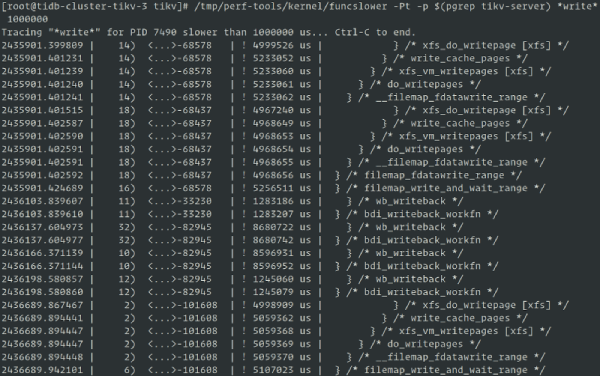
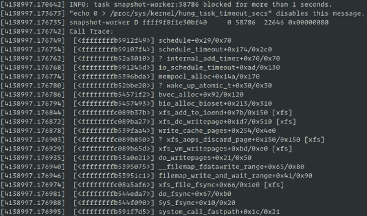

**Author:** Wenbo Zhang (Linux Kernel Engineer of the EE team at PingCAP)

[Kubernetes](https://en.wikipedia.org/wiki/Kubernetes) (K8s) is an open-source container orchestration system that automates application deployment, scaling, and management. It's the operating system of the cloud-native world. Any defects in K8s or the operation system might put the application in the upper layer at risk.

As the EE (Efficiency Engineering) team at [PingCAP](https://pingcap.com/), we optimize our office infrastructure and improve office automation and teamwork effectiveness. When we tested [TiDB Operator](https://github.com/pingcap/tidb-operator) (which creates and manages [TiDB](https://github.com/pingcap/tidb) clusters) in K8s, we found two Linux kernel bugs. These bugs have plagued our PingCAP K8s environment for quite a while and aren't  thoroughly fixed in the K8s community as a whole.

After extensive investigation and diagnosis, we've identified ways to handle these bugs. In this post, I'll share with you how we tackled these problems. However, as useful as these solutions are, we consider them workarounds, and we believe that more elegant solutions are possible. The goal of this post is to inspire the K8s community, [RHEL](https://en.wikipedia.org/wiki/Red_Hat_Enterprise_Linux), and [CentOS](https://en.wikipedia.org/wiki/CentOS) so that they can help fix these bugs thoroughly in the near future.

## Bug #1: Unstable kmem accounting

**Keyword:** SLUB: Unable to allocate memory on node -1

**Related issues in the community:**

- <https://github.com/kubernetes/kubernetes/issues/61937>
- <https://github.com/opencontainers/runc/issues/1725>

### Issue description

When we tested [TiKV](https://github.com/tikv/tikv)'s online transaction processing ([OLTP](https://en.wikipedia.org/wiki/Online_transaction_processing)) performance in K8s, I/O performance occasionally jittered. However, following items appeared normal:

- TiKV and [RocksDB](https://en.wikipedia.org/wiki/RocksDB) log files; RocksDB is TiKV's underlying storage engine
- CPU (no bottleneck)
- Memory and disk statistics from the load information

The only negative indicator was the message, "SLUB: Unable to allocate memory on node -1" in the output of the `dmesg` command.

### Issue analysis

We used [funcslower](https://github.com/brendangregg/perf-tools/blob/master/bin/funcslower) in [perf-tools](http://github.com/brendangregg/perf-tools) to trace kernel functions that were executed slowly and adjusted the threshold value of the `hung_task_timeout_secs` kernel parameter. When we performed the write operations in TiKV, we found the following kernel path information:





Based on the information above, we could see that the I/O jitter was related to the file system executing `writepage`. At the same time, before and after the performance jitter was captured, the `dmesg` output contained a large amount of information about "SLUB: Unable to allocate memory on node -1". This message occurred even when the node had sufficient memory.

We analyzed the call stack information output from `hung_task` and the kernel code. We found that the kernel tried to allocate the `bio_vec` object via `kmem_cache_alloc` when executing the `bvec_alloc` function to allocate the `bio_vec` object.

If this operation failed, the kernel fell back to allocate the `bio_vec` object from the mempool. However, inside the mempool, the system first tried to execute the `pool->alloc` callback for allocation. If this allocation failed, the kernel set the process to an uninterruptible state and put the process in a wait queue. After other processes returned memory resources to the mempool or the timer timed out (after 5 seconds), the process scheduler invoked the process for retry. The wait time of the wait queue was consistent with the jitter delay of our application monitoring.

When we created the Docker container, we didn't set `memory.kmem.limit_in_bytes`. But why was kmem insufficient? To determine whether `memory.kmem.limit_in_bytes` was set, we went to the cgroup memory controller to check the container's kmem information. The kmem statistics were enabled, and the kemem limit was set to a very large value.

Because we knew that the kmem accounting was unstable in the RHEL 3.10 kernel, we suspected that a kernel bug caused the SLUB allocation failure. We searched for kernel patch information, and found that it was a kernel bug, and that it had been fixed in Linux kernel version 4.x: [slub: make dead caches discard free slabs immediately](https://github.com/torvalds/linux/commit/d6e0b7fa11862433773d986b5f995ffdf47ce672). There was also a namespace leak issue associated with kmem accounting: [mm: memcontrol: fix cgroup creation failure after many small jobs](https://github.com/torvalds/linux/commit/73f576c04b9410ed19660f74f97521bee6e1c546).

So how was kmem accounting enabled? We used the [opensnoop](https://github.com/iovisor/bcc/blob/master/tools/opensnoop.py) tool in [bcc](http://github.com/iovisor/bcc) to monitor the kmem configuration file and captured [runc](https://github.com/opencontainers/runc) as the file modifier. From the K8s code, we found that kmem accounting was enabled by default in the K8s-dependent `runc` project.

### Solution

Based on our issue analysis, we can fix the bug in either of the following ways:

- Upgrade the existing kernel to a later version.
- Disable the kmem accounting feature when starting the container.

Now `runc` includes the conditional compilation option, and you can disable kmem accounting via [Build Tags](https://github.com/opencontainers/runc#build-tags). After we disabled this feature, our test result showed that the jitter disappeared, and so did the namespace leak and SLUB allocation failure problems.

#### Operation steps

We need to disable the kmem accounting feature on both kubelet and Docker.

1. Recompile kubelet according to the corresponding kubelet version:

    - For kubelet v1.14 or later, add [Build Tags](https://github.com/kubernetes/kubernetes/blob/release-1.14/vendor/github.com/opencontainers/runc/libcontainer/cgroups/fs/kmem_disabled.go#L1) when you compile kubelet to disable kmem accounting:

    ```
    make BUILDTAGS="nokmem"
    ```

    - For kubelet v1.13 or earlier, we cannot add Build Tags when compiling kubelet. Instead, manually replace the [two functions](https://github.com/kubernetes/kubernetes/blob/release-1.12/vendor/github.com/opencontainers/runc/libcontainer/cgroups/fs/memory.go#L70-L106) that enable kmem accounting with [the following code](https://github.com/kubernetes/kubernetes/blob/release-1.14/vendor/github.com/opencontainers/runc/libcontainer/cgroups/fs/kmem_disabled.go#L5-L11):

    ```
    func EnableKernelMemoryAccounting(path string) error {
     return nil
    }
    ```

    ```
    func setKernelMemory(path string, kernelMemoryLimit int64) error {
     return nil
    }
    ```

    Then recompile kubelet.

2. Upgrade `docker-ce` to v18.09.1 or later. In these versions, kmem accounting of `runc` is disabled in Docker.

3. Reboot the system.

4. To verify whether the kmem accounting feature of all the containers is disabled in the newly created pod, run the following command:

    ```
    cat /sys/fs/cgroup/memory/kubepods/burstable/pod<pod-uid>/<container-id>/memory.kmem.slabinfo
    ```

    If the returned result is as follows, it means that the kmem accounting feature is disabled successfully:

    ```
    > cat: memory.kmem.slabinfo: Input/output error
    ```

## Bug #2: Network device reference count leak

**Keyword:** kernel:unregister_netdevice: waiting for eth0 to become free. Usage count = 1

**Related issues in the community:**

- <https://github.com/kubernetes/kubernetes/issues/64743>
- <https://github.com/projectcalico/calico/issues/1109>
- <https://github.com/moby/moby/issues/5618>

<div class="trackable-btns">
    <a href="/download" onclick="trackViews('Try to Fix Two Linux Kernel Bugs While Testing TiDB Operator in K8s', 'download-tidb-btn-middle')"><button>Download TiDB</button></a>
    <a href="https://share.hsforms.com/1e2W03wLJQQKPd1d9rCbj_Q2npzm" onclick="trackViews('Try to Fix Two Linux Kernel Bugs While Testing TiDB Operator in K8s', 'subscribe-blog-btn-middle')"><button>Subscribe to Blog</button></a>
</div>

<!-- markdownlint-disable MD024 -->
### Issue description

After the K8s platform ran for a time, the following message was displayed: "Kernel:unregister_netdevice: waiting for eth0 to become free. Usage count = 1". In addition, multiple processes would be in an uninterruptible state. The only workaround for this problem was to restart the server.

### Issue analysis

We used the crash tool to analyze vmcore. We found that the `netdev_wait_allrefs` function blocked the kernel thread, and that the function was in an infinite loop waiting for `dev->refcnt` to drop to 0. Because the pod had been released, we suspected that this issue was due to a reference count leak. After analyzing K8s issues, we found that the kernel was the crux of the issue, but there was no simple, stable, and reliable method to reproduce the issue. Also, this issue still occurred in the later community version of the kernel.

To avoid restarting the server every time this issue occurred, we developed a kernel module. When the `net_device` reference count was found to leak, this kernel module would be removed after the reference count was dropped to 0 (to avoid accidentally deleting other NICs that weren't referenced by the leak). Besides, to avoid manual cleanup, we wrote a monitoring script that periodically automated this operation.

However, this solution had the following defects:

- A delay existed between the starting time of the reference count leak and our discovering the leak via the monitoring system. In this delay, other problems might appear in the K8s system.

- It was difficult to judge whether a reference count leak issue existed in the kernel module. `netdev_wait_allrefs` would continually retry releasing the `NETDEV_UNREGISTER` and `NETDEV_UNREGISTER_FINAL` messages to all message subscribers via notification chains. We traced this issue and found there were up to 22 subscribers. It was difficult to access the processing logic of all the callback functions registered by these subscribers and therefore difficult to decide whether we had a way to avoid misjudgement.

### Solution

As we prepared to drill down into the callback function logic registered by each subscriber, we also followed up on the progress of kernel patches and RHEL. We found that [solutions:3659011](https://access.redhat.com/solutions/3659011) of RHEL had an update that mentioned a patch submitted by the upstream link: [route: set the deleted fnhe fnhe_daddr to 0 in ip_del_fnhe to fix a race](https://github.com/torvalds/linux/commit/ee60ad219f5c7c4fb2f047f88037770063ef785f).

We applied this patch to the kernel as a hotfix and tested for a week. The issue didn't reappear. We reported our test information to RHEL, and they told us they'd started backporting the patch.

#### Operation steps

We recommend that you use CentOS 7.6 kernel-3.10.0-957 or later.

1. Install [kpatch](https://github.com/dynup/kpatch) and kpatch-build dependencies:

    ```
    UNAME=$(uname -r)
    sudo yum install gcc kernel-devel-${UNAME%.*} elfutils elfutils-devel
    sudo yum install pesign yum-utils zlib-devel \
      binutils-devel newt-devel python-devel perl-ExtUtils-Embed \
      audit-libs audit-libs-devel numactl-devel pciutils-devel bison

    # enable CentOS 7 debug repo
    sudo yum-config-manager --enable debug

    sudo yum-builddep kernel-${UNAME%.*}
    sudo debuginfo-install kernel-${UNAME%.*}

    # optional, but highly recommended - enable EPEL 7
    sudo yum install ccache
    ccache --max-size=5G
    ```

2. Install [kpatch](https://github.com/dynup/kpatch) and kpatch-build:

    ```
    git clone https://github.com/dynup/kpatch && cd kpatch
    make
    sudo make install
    systemctl enable kpatch
    ```

3. Download and construct the hotfix kernel module:

    ```
    curl -SOL https://raw.githubusercontent.com/pingcap/kdt/master/kpatchs/route.patch
    kpatch-build -t vmlinux route.patch (Compiles and generates the kernel module)
    mkdir -p /var/lib/kpatch/${UNAME}
    cp -a livepatch-route.ko /var/lib/kpatch/${UNAME}
    systemctl restart kpatch (Loads the kernel module)
    kpatch list (Checks the loaded module)
    ```

## Conclusion

We've fixed these kernel bugs expediently. However, there are more effective long-term solutions. For Bug #1, we hope that the K8s community can provide an argument for kubelet to allow users to disable or enable the kmem accounting feature.

For Bug #2, the optimal solution is for RHEL and CentOS to fix the kernel bug. After TiDB users upgrade to a new version of CentOS, they won't have to worry about this problem.
