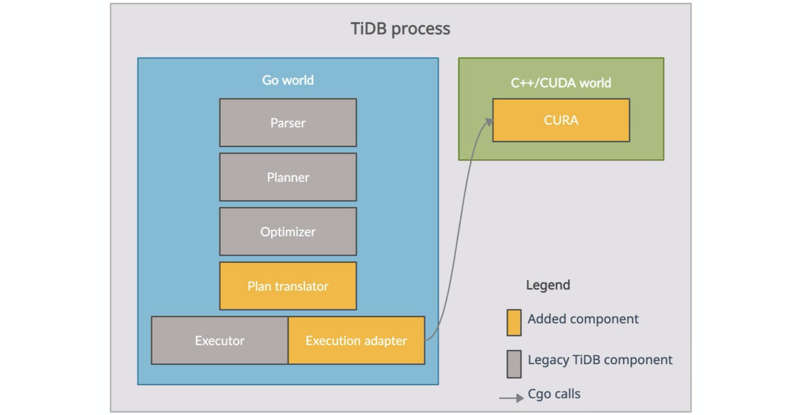
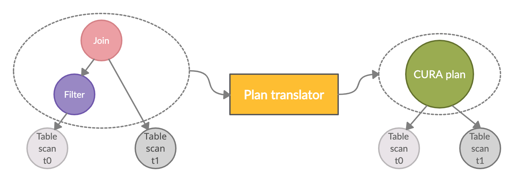
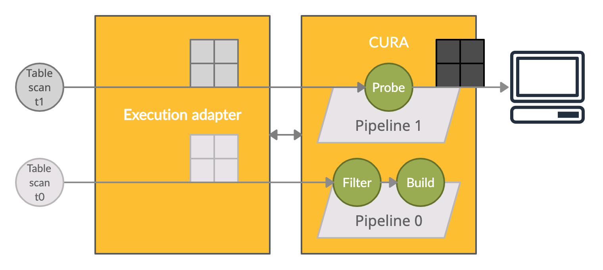
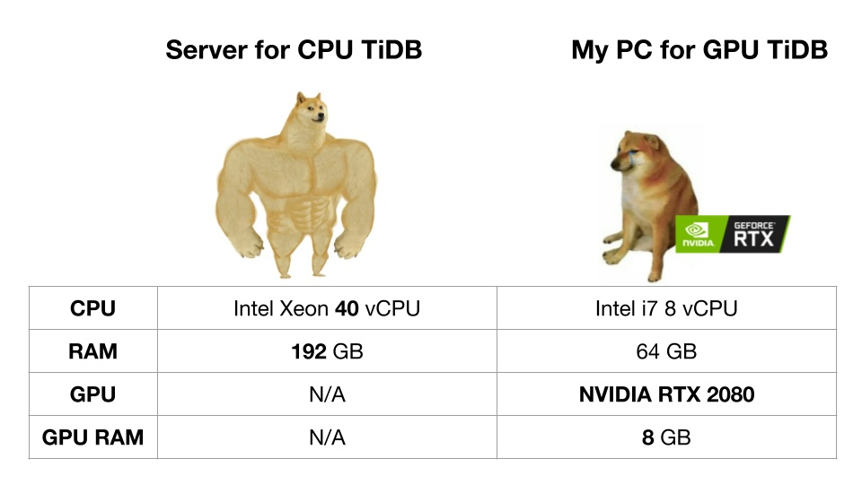
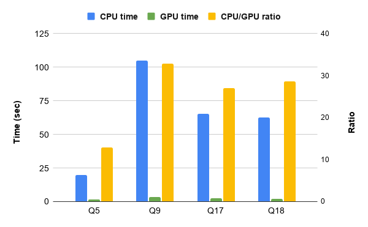
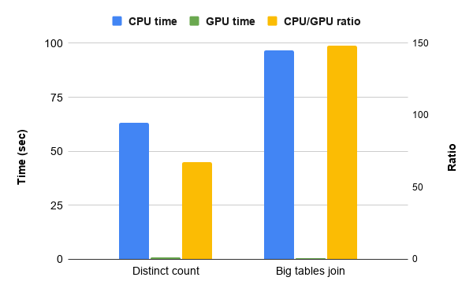

**Authors:**

* [Ruoxi Sun](https://github.com/zanmato1984) (Tech Lead of Analytical Computing Team at PingCAP)
* [Fei Xu](https://github.com/windtalker) (Software Engineer at PingCAP)

**Editors:** Tom Dewan; [Caitin Chen](https://github.com/CaitinChen)


[TiDB](https://docs.pingcap.com/tidb/stable/) is a Hybrid Transaction/Analytical Processing (HTAP) database that can efficiently process analytical queries. However, when large amounts of data are involved, the CPU becomes the bottleneck for processing queries that include `JOIN` statements and/or aggregation functions.

At the same time, the GPU is rapidly gaining popularity in areas of scientific computing, AI, data processing, and so on. It outperforms the CPU by orders of magnitude in such areas. GPU-accelerated databases are also emerging and getting lots of attention in the database market.

We thought that it might be possible to empower TiDB using GPU acceleration techniques to improve the performance of CPU-intensive analytical query processing. This idea later became our [TiDB Hackathon 2020](https://pingcap.com/community/events/hackathon2020) project, in which we achieved 10x~150x performance improvement and won two medals (3rd prize and Yunqi partner's Best Market Potential).

In this post, we'll share some technical details about our project and analyze our benchmark results.

## Rationale

Our goal is to GPU-accelerate the most CPU-intensive part of query processing, namely, the relational operators that process in-memory data, such as join and aggregation. Therefore, we'll need to reimplement those operators using GPU programming techniques. Although the idea is straightforward, one major challenge is that TiDB is implemented in Golang, while the GPU is most commonly programmed in C/C++-like languages. This challenge directly leads to the following design decisions:

- We will use Compute Unified Device Architecture (CUDA) as our GPU programming language. It's programmer friendly and has extensive documentation.
- The GPU operators will be implemented in C++/CUDA rather than Golang.
- TiDB (Golang) and the GPU operators (C++/CUDA) will use intra-process communication. This way, we won't introduce remote procedure calls (RPCs), serialization/deserialization, and network transmission overhead. Thus, Cgo is our only language option.
- We need a lightweight protocol to simplify crossing the programming boundary between TiDB and the GPU operators. This will ease the programming burden introduced by Cgo.

These design decisions are the driving force behind our architecture, which is described below.

## Architecture

The following figure shows our architecture. As you can see, the TiDB process can be divided into components written in Golang (the blue box) and those written in C++/CUDA (the green box). 


<div class="caption-center"> Architecture of GPU-accelerated TiDB </div>

All TiDB legacy structures, including the parser, planner, optimizer, and executor are in the Golang world. We also added two other components: the plan translator and the execution adapter. The first component translates a TiDB query plan into a CUDA Relational Algebra or "CURA" plan, and the other adapts the TiDB execution model to the execution of the CURA plan with the actual data properly fed. CURA is a library implemented in C++/CUDA, containing our GPU operators, as well as some auxiliary components to organize and execute the GPU operators. 

The architecture also includes a protocol that defines the interaction between CURA and the execution adapter. It is exposed as several CURA C APIs. The execution adapter uses Cgo to call this protocol. (See the gray arrow.)

You can find our source code here:

- [CURA](https://github.com/zanmato1984/cura) 
- [Customized TiDB](https://github.com/windtalker/tidb/tree/tidb_cura) 
- [Customized TiKV](https://github.com/windtalker/tikv/tree/tikv_cura) 

## Query processing

The query processing steps of parsing, planning, and optimization are basically the same as before. Our work focuses on the orange boxes in the architectural figure.

### Plan translation

As the following figure shows, given an optimized TiDB query plan—one that has optimal join orders and columns properly pruned—the plan translator cherry-picks all the operators other than `Table Scan`s (the gray circles) from the operator tree and packs them into a single CURA plan (the green circle).


<div class="caption-center"> Query plan translation </div>

The original operator tree is subsequently transformed into a new one, with a single CURA plan node as root, and all the original `Table Scan`s as leaves. `Table Scan`s are mainly I/O-bound, and thus remain unchanged. The CURA plan indicates which portion of the query the GPU executes. It is important to pack the CURA plan with multiple nodes from the original operator tree. That way, we can avoid unnecessary memory copies back and forth between the host and device.

The figure above shows the plan translation for the following query:

```
SELECT * FROM t0 JOIN t1 ON t0.id = t1.id WHERE t0.value = 42
```

The translated CURA plan is a JSON-formatted representation of the subtree enclosed by the left gray dashed circle, with one placeholder, `InputSource`, for each `Table Scan` node. Each `InputSource` is later anchored by the actual `Table Scan` during CURA execution, which is described in the next section. The following snippet is the actual JSON text of this CURA plan. If you are not interested in what a CURA plan looks like, you can skip to the next section.

```
{"rels":[
  {"rel_op":"InputSource","source_id":0,"schema":[{"type":"INT32","nullable":false},{"type":"INT32","nullable":false}]},
  {"rel_op":"Filter","condition":{"binary_op":"EQUAL","operands":[{"col_ref":1},{"type":"INT32","literal":42}],"type":{"type":"BOOL8","nullable":false}}},
  {"rel_op":"InputSource","source_id":1,"schema":[{"type":"INT32","nullable":false}]},
  {"rel_op":"HashJoin","type":"INNER","build_side":"LEFT","condition":{"binary_op":"EQUAL","operands":[{"col_ref":0},{"col_ref":2}],"type":{"type":"BOOL8","nullable":false}}}
]}
```

### CURA execution


<div class="caption-center"> CURA execution </div>

During execution, the execution adapter first passes the CURA plan to CURA to compile it into an internal physical plan. The figure above shows the physical plan and the dataflow of the CURA plan discussed earlier. We introduce "pipelines," each one containing a subset of the GPU operators reconstructed from the CURA plan, to organize the GPU operators and manage CPU parallelism (multiple CPU threads). Data are formed as "fragments" (shown in the figure as window icons), and each is a horizontal split of one table.

For example, due to the intrinsic property of hash join, `Probe` can only be started after `Build` finishes; thus, the whole execution breaks into two pipelines. `Filter` doesn't have this limitation, so it can be "pipelined" with `Build` within the same pipeline. The fragments from `Table Scan t0` (the light gray window icon) flow through `Filter` and go into `Build` right after. Meanwhile, in pipeline 1 (the final pipeline), fragments from `Table Scan t1` (the middle gray window icon) flow through `Probe` and leave CURA as the final result (the dark gray window icon) emitted to the client. Each pipeline accepts fragments in arbitrary CPU parallelism. The need for synchronization is rare and trivial, and the GPU operators take care of it when necessary.

The execution adapter and CURA interact with each other via the protocol (the bidirectional arrow), and:

- Anchor each `Table Scan` to the corresponding pipeline.
- Iterate all pipelines in the specified order.
- For each pipeline, drain fragments from the anchored `Table Scan`s and feed the pipeline with them, in configurable CPU parallelism.
- Emit data output by the final pipeline to the client.

This protocol also brings us another benefit: CURA becomes a general GPU query runtime which you can adapt to any other database by properly following the protocol.

### GPU operators

Thanks to the [RAPIDS](https://rapids.ai/) project's core component [cuDF](https://github.com/rapidsai/cudf), we can use it as a solid primitive and build our own GPU operators on top of it. cuDF supplies mature dataframe APIs running on the GPU. It requires data to be in columnar format and use the [Arrow](https://github.com/apache/arrow) layout. Luckily, our fragments match both, so other than host-to-device memory copies for input and device-to-host memory copies for output (final pipeline only), we don't need to reformat any CPU-side data. We won't go into much detail about cuDF in this post. If you'd like more information on cuDF, see its [GitHub repo](https://github.com/rapidsai/cudf).

## Benchmarking

We choose TPC-H 50G as our benchmark data set. Rather than use all 22 queries, we picked the four most CPU-intensive ones:  [Q5](https://github.com/pingcap/tidb-bench/blob/master/tpch/queries/5.sql), [Q9](https://github.com/pingcap/tidb-bench/blob/master/tpch/queries/9.sql), [Q17](https://github.com/pingcap/tidb-bench/blob/master/tpch/queries/17.sql), and [Q18](https://github.com/pingcap/tidb-bench/blob/master/tpch/queries/18.sql). These queries are run on a powerful server running legacy TiDB (using CPU) and on a commodity PC running our GPU-accelerated TiDB (We don't have a GPU server.) The hardware specs are shown in the figure below:

 
<div class="caption-center"> Hardware comparison between CPU TiDB and GPU TiDB </div>

To avoid I/O operations amortizing the overall performance improvement, we used the [Coprocessor Cache](https://docs.pingcap.com/tidb/stable/coprocessor-cache) to buffer all the intermediate results of the `Table Scan`s. It effectively makes TiDB a "hypothetical" in-memory database.

The final results of these TPC-H queries are listed below. We achieved 12x, 32x, 27x, and 28x performance improvements for Q5, Q9, Q17, and Q18, respectively.


<div class="caption-center"> TPC-H benchmark </div>

TPC-H queries are complex. We also perform several hand-written simple queries as our microbenchmark. The first query is a typical "distinct count." We count distinct values of column `l_returnflag` from table `lineitem`:

```
SELECT COUNT(DISTINCT l_returnflag) FROM lineitem
```

The second query is a typical "big tables join." We choose to join the two largest tables `lineitem` and `orders` on column `orderkey`:

```
SELECT COUNT(1) FROM lineitem JOIN orders ON l_orderkey = o_orderkey
```

The final results of these two queries are displayed below. We achieve 67x and 148x performance improvements for "distinct count" and "big tables join," respectively.


<div class="caption-center"> Simple queries benchmark </div> 

The following sections discuss the insights we've gained from these performance improvements.

### Hash table on the GPU

In many of the database operations, such as hash join and hash aggregation, the hash table is the most critical data structure. It dominates the execution of most CPU-intensive queries. The [concurrent hash table](https://github.com/rapidsai/cudf/blob/main/cpp/src/hash/concurrent_unordered_multimap.cuh) in cuDF is a performant one on GPU. It couples open addressing with the highly parallel nature of the GPU. It outperforms the CPU implementation of the hash table in legacy TiDB by several hundred times. Actually, most performance improvement throughout our benchmark is the result of the GPU accelerating hash table operations. The GPU does not accelerate other database operations as significantly as the hash table; thus, the overall acceleration is 10x to 150x faster.

### Kernel/memcpy efficiency

Kernel/memcpy efficiency is the ratio of the amount of time performing compute and memory copy by the GPU. It is a major indicator of how suitable the GPU is to accelerate this workload. On average, we see a 1:1 ratio for our queries, which is not very high, and the ratio goes down as the query emits more final results. For example, the ratio goes down when you join two big tables without an aggregation on top of it, because it brings much more device-to-host memory copies.

### GPU memory allocator

`cudaMalloc` and `cudaFree` are the standard CUDA APIs to manage GPU memory. However, they have the side effect of forcing the GPU to synchronize the whole device by draining all the pending jobs; that is, the asynchronous memory copies and kernels that have been submitted to the GPU. This easily becomes a bottleneck in our pipeline model, because:

- The CPU cannot submit any subsequent GPU jobs until the GPU finishes the device synchronization required by `cudaMalloc` and `cudaFree`. Our pipeline model tends to have a long sequence of GPU jobs, so, due to this synchronization, the potential parallelism between the CPU and the GPU is reduced.
- There are chances for the GPU to overlap multiple jobs, and frequent synchronizations kill these chances.
- As mentioned before, the pipeline accepts arbitrary CPU parallelism. The number of synchronizations multiplies by the number of CPU threads.

Fortunately, cuDF supplies an [arena allocator](https://github.com/rapidsai/rmm/blob/main/include/rmm/mr/device/arena_memory_resource.hpp), which reserves a huge amount of GPU memory in advance and manages the subsequent allocation/deallocation internally. It is concurrency friendly as well. The allocator effectively addresses our problems and doubles the overall performance.

### CUDA stream

[CUDA stream](https://developer.nvidia.com/blog/gpu-pro-tip-cuda-7-streams-simplify-concurrency/) is a way to achieve higher GPU utilization by overlapping the GPU jobs submitted by multiple independent CPU threads. We didn't realize this is an issue until we used the [nvvp](https://developer.nvidia.com/nvidia-visual-profiler) to profile our queries, and we saw no overlap among different GPU jobs. All GPU jobs seem to go into the default stream.

By enabling [per-thread default stream](https://github.com/rapidsai/cudf/blob/850548d9b705b999c7010ded1e2d7573820228e6/cpp/CMakeLists.txt#L48) at compile time, we see each CPU thread is assigned an individual stream. This improves GPU utilization by 10%~20% in terms of both kernel concurrency and memcpy/kernel overlap.

### GPU utilization

After we cleaned up the obstacles of memory management overhead and the CUDA stream, we were finally able to face GPU utilization directly. Honestly, it's not a happy ending. After a lot of effort, we achieved:

- Less than 3 GB/s host-to-device memory copy throughput, which is far less than the PCI Express (PCIe) 3.0 bandwidth of 16 GB/s.
- Less than 10% of kernel concurrency and memcpy/kernel overlap.

The first issue is most likely because our data fragments are not big enough—they're typically several tens of megabytes—and they do not fully occupy the PCIe bandwidth. 

The reason for the second issue is still unclear. Given that we conquered the "obstacles" mentioned earlier, we assumed that our pipeline model could improve GPU utilization by increasing CPU parallelism. This is because there would be more opportunities for the GPU jobs to overlap as more CPU threads submit the GPU jobs concurrently. However, the peak performance comes at two to three CPU threads. Neither kernel concurrency nor memcpy/kernel overlap increase at higher CPU parallelism, and the overall performance even goes down.

Is it because the hardware units are exhausted? Or are some other unidentified CUDA APIs causing unintended implicit overhead as `cudaMalloc` and `cudaFree` do? Or did we hit some kind of Cgo threading problem? To answer these questions, we must do more fine-grained profilings. We hope there is still some room for further improvement.

## Takeaways

- By running on new generation hardware like a GPU, TiDB can process CPU-intensive analytical queries 10x~150x faster.
- We built a general GPU query runtime [CURA](https://github.com/zanmato1984/cura) on top of [cuDF](https://github.com/rapidsai/cudf). It is adapted to [TiDB](https://github.com/windtalker/tidb/tree/tidb_cura) in this project, and it can be adapted to any other database (especially an in-memory database) to accelerate its query engine using the GPU.
- We could potentially improve GPU utilization even further. But that will have to wait until we have more time, and my friend returns my RTX 2080 after he finishes the game "Cyberpunk 2077."
