**Industry:** Logistics

**Author:** Youzhi Zhu (Big Data Architect at ZTO Express)

**Transcreator:** [Caitin Chen](https://github.com/CaitinChen); **Editor:** Tom Dewan

[ZTO Express](https://www.crunchbase.com/organization/zto-express) is a leading express delivery company in China and one of the largest express delivery companies in the world. We provide express delivery service and other value-added logistics services. In 2020, we delivered 17 billion+ parcels, a 20.4% market share. We've been recognized with multiple awards, such as "Top Ten Influential Brands of Chinese Express Delivery Industry."

Our [previous post](https://pingcap.com/case-studies/3x-it-efficiency-boost-use-a-scale-out-htap-database-for-near-real-time-analytics) described why we migrated from Oracle Exadata to TiDB. As our business quickly grew, so did our data volume. To scale out our database and perform multi-dimensional analytics in real time, we migrated to [TiDB](https://docs.pingcap.com/tidb/stable/overview), an open-source, distributed, Hybrid Transactional and Analytical Processing (HTAP) database. TiDB increased our IT efficiency by 300%, and in the second quarter of 2020, we reduced our cost per order by 17.1% year-on-year.

Today, I'd like to share our updates: we introduced [TiFlash](https://docs.pingcap.com/tidb/stable/tiflash-overview), TiDB's analytical engine, and we're using TiDB in the HTAP scenario. **We improved our data freshness and can execute some analytical queries in minutes.**

In this post, I'll first recap why we chose TiDB, how we use it in our mission-critical system, and how it helps build our large, wide table and then describe how we use it in the HTAP scenario.

## Why we chose TiDB, a NewSQL database

Our application team had these database requirements:

* It should handle large amounts of data and frequent updates. We have a very large data volume, and each of our customers' orders gets updated five to six times. Our new database must be robust and flexible.
* It should support multi-dimensional queries. Solutions like HBase had very limited support for this feature.
* The data analytical period should be long.
* For data analytics, the data should be fresh.
* We should avoid standalone machine performance bottlenecks, including single-node failures and high risks.
* The new database should support high queries per second (QPS) and query response times in milliseconds.

From a technical perspective, we wanted a database that:

* Offered multiple application metrics for multiple application scenarios.
* Supported distributed transactions with strong consistency.
* Was reasonably inexpensive to switch to.
* Had an engineering system for analytics and calculation, and it wouldn't use the original stored procedure.
* Supported high-concurrent reads, writes, and updates.
* Supported online maintenance, and a single-node failure wouldn't impact the application.
* Would integrate with our existing technology and could analyze data in minutes.
* Supported building a large, wide table with 100+ columns and multi-dimensional query analytics based on this table.

After we evaluated several products, we chose [TiDB](https://docs.pingcap.com/tidb/stable/overview), an open-source, distributed SQL database. It is MySQL compatible and features horizontal scalability, strong consistency, and high availability. It's a one-stop solution for both Online Transactional Processing (OLTP) and Online Analytical Processing (OLAP) workloads. You can learn more about TiDB's architecture [here](https://docs.pingcap.com/tidb/v4.0/architecture).

## How we use TiDB

### Using TiDB in our mission-critical system

We designed our original mission-critical system's storage and computing layers based on Oracle. The computing layer relied on stored procedures.

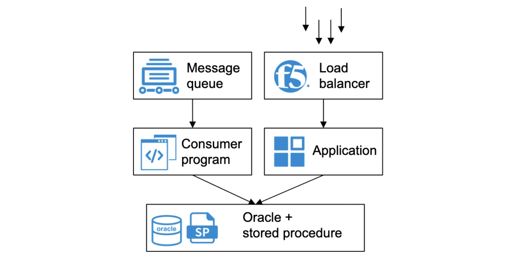

 Our original Oracle-based architecture 

As our business quickly developed, this architecture's performance became a bottleneck. When we upgraded this system's architecture, we migrated the storage system to TiDB and the computing system to [TiSpark](https://docs.pingcap.com/tidb/stable/tispark-overview) (a thin layer on top of TiDB to answer the complex OLAP queries).

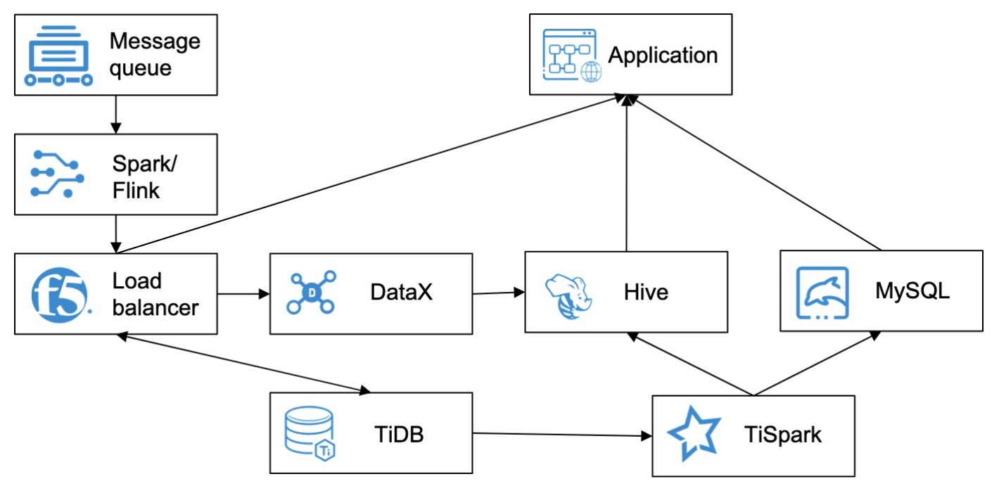

 Our new architecture after migration to TiDB 

After we migrated to TiDB, we gained many benefits:

* Our storage capacity increased. **The system's data storage period more than tripled.**
* Our database can scale out horizontally. The operations and maintenance staff can add or remove computing and storage nodes at any time. This has little impact on the applications.
* TiDB meets our high-performance OLTP application needs. Some queries' performance is slightly reduced, but they still meet our application requirements.
* The pressure on a single node was gone. OLTP and OLAP workloads are separated and no longer interfere with each other.
* TiDB supports analytics for more dimensions.
* The new architecture looks clearer than the original. The system is easier to maintain and scale.

For more details about this application scenario, see [Migrating from Exadata to TiDB](https://pingcap.com/case-studies/3x-it-efficiency-boost-use-a-scale-out-htap-database-for-near-real-time-analytics#using-tidb-plus-tispark-to-create-a-real-time-wide-table).

### Using TiDB to build a large, wide table

To build a large, wide table, we tried many solutions, such as HBase and Kudu, but they were not ideal. **We needed a  system that could quickly calculate and analyze billions of rows of data, and when we performed data analytics, the data had to be fresh.**

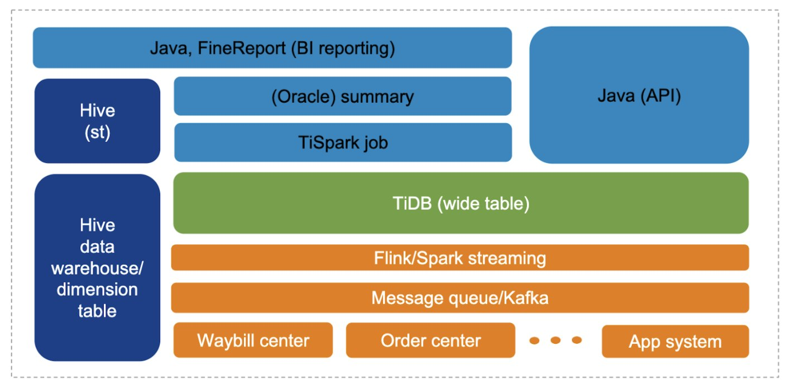

 Building a large, wide table 

Now, our wide table has 150+ fields. The data comes from 10+ topics. Main projects are accessed through Apache Flink and Spark. This method connects data generated by each application and aggregates it into TiDB to form a wide table. TiSpark outputs analytic results from the wide table and replicates 300 million rows of data to Hive.

Our cluster status:

* 137 nodes in total: 32 [TiDB](https://docs.pingcap.com/tidb/stable/tidb-architecture#tidb-server) nodes, 102 [TiKV](https://docs.pingcap.com/tidb/stable/tidb-architecture#tikv-server) nodes, 306 TiKV instances, and 3 [Placement Driver](https://docs.pingcap.com/tidb/stable/tidb-architecture#placement-driver-pd-server) (PD) nodes
* 150,000+ QPS; 350,000+ peak
* 70%+ CPU usage
* 75%+ disk load
* 47 TB of stored data

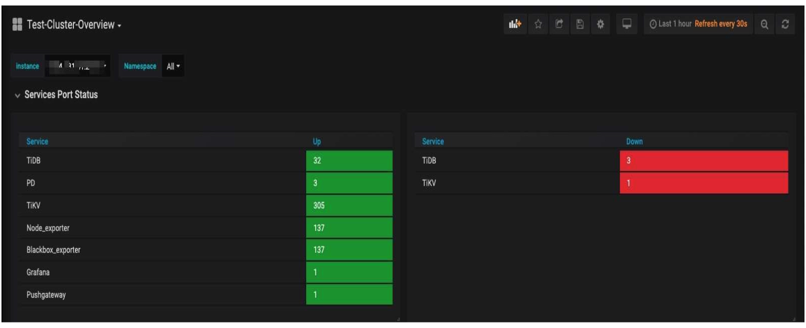

 Service port status 

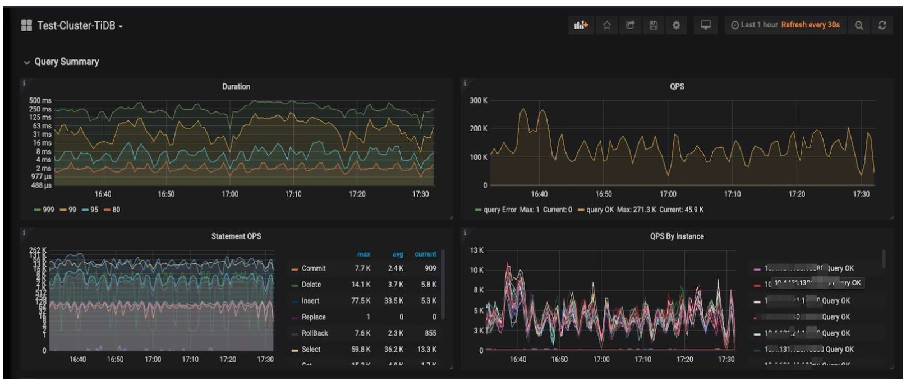

 The TiDB cluster 

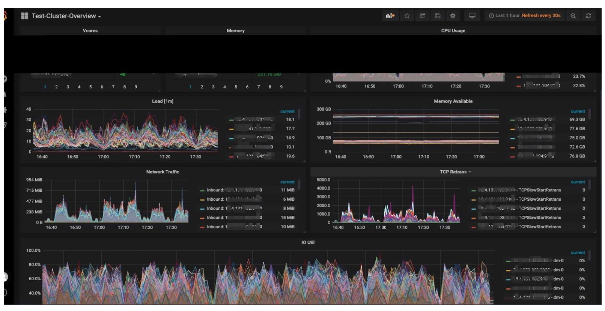

 Cluster overview 

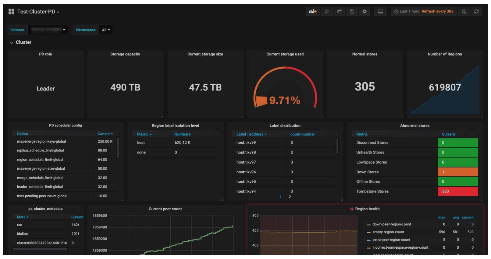

 The PD cluster 

  <a href="/download" onclick="trackViews('Using a NewSQL DBMS to Improve Data Freshness and Execute Analytical Queries in Minutes', 'download-tidb-btn-middle')"><button>Download TiDB</button></a>
  <a href="/contact-us" onclick="trackViews('Using a NewSQL DBMS to Improve Data Freshness and Execute Analytical Queries in Minutes', 'contact-us-middle')"><button>Request a Demo</button></a>

During the Double 11 Chinese shopping festival, several days before and after November 11, our sales promotion achieved 820 million+ orders, and the peak QPS reached 350,000+. Throughout the multi-day festival, hundreds of billions of rows of data were updated. More than 100+ TiSpark jobs ran in the cluster to support 7 online applications. **We executed 98% of analytical queries in less than 10 minutes, and we could analyze data from the last 7 to 15 days.**

For more details about this section, see [Using TiDB plus TiSpark to create a real-time wide table](https://pingcap.com/case-studies/3x-it-efficiency-boost-use-a-scale-out-htap-database-for-near-real-time-analytics#using-tidb-plus-tispark-to-create-a-real-time-wide-table).

### Using TiDB in the HTAP scenario

#### Why we needed TiDB's HTAP capability

We used TiDB's HTAP capability because our application team had these requirements:

* Queries needed to run faster. They must not only meet the data analytical period requirement, but the application team must also know about the updates more quickly.
* Downstream systems needed more subscription information, and not just actively pull the information.
* In big sales campaigns, TiKV was under a lot of  pressure. Therefore, we needed to separate computing and storage.
* Our clusters were too large to manage. It was difficult to troubleshoot cluster issues.

Based on these requirements, we upgraded our architecture. We introduced TiFlash and [TiCDC](https://docs.pingcap.com/tidb/stable/ticdc-overview), a tool for replicating TiDB's incremental data. Therefore, **we improved data freshness and could execute some analytic queries in minutes**.

#### Our upgraded data system architecture

The following figure shows our new system architecture with TiFlash and TiCDC:

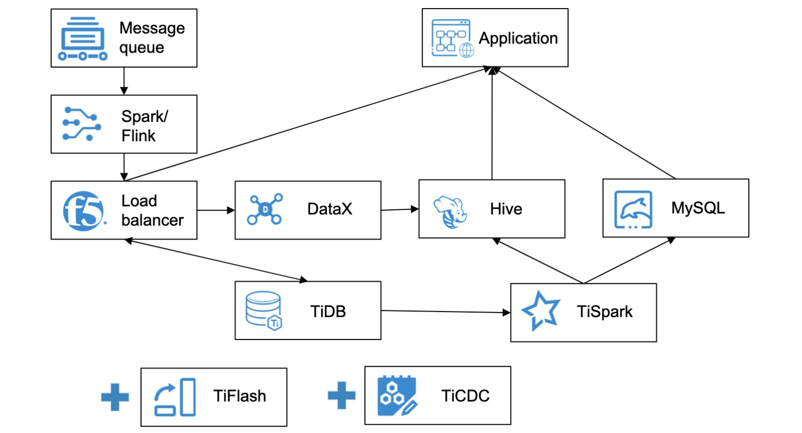

 Our new architecture with TiFlash and TiCDC 

We have two clusters, one based on TiDB 3.0 and the other based on TiDB 5.0. TiDB 3.0 analyzes data mainly based on TiSpark, and TiDB 5.0 based on TiFlash. The table below compares TiSpark and TiFlash.

<table>
  <tr>
   <td><strong>Cluster</strong>
   </td>
   <td><strong>Physical nodes</strong>
   </td>
   <td><strong>Runtime interval (min)</strong>
   </td>
   <td><strong>TiKV load</strong>
   </td>
   <td><strong>Spark nodes</strong>
   </td>
  </tr>
  <tr>
   <td>TiDB 3.0 based on TiSpark
   </td>
   <td>137
   </td>
   <td>5-15
   </td>
   <td>3000%
   </td>
   <td>60
   </td>
  </tr>
  <tr>
   <td>TiDB 5.0 based on TiFlash
   </td>
   <td>97
   </td>
   <td>1-2
   </td>
   <td>200%
   </td>
   <td>10
   </td>
  </tr>
</table>

TiDB 5.0 supports massively parallel processing (MPP) and more functions than earlier versions. Now, we use TiDB 5.1 in the production environment.

The following figures show TiDB 5.0's performance during our big sales promotion from June 16 to June 19, 2021, an annual shopping festival in China. TiDB 5.0 supported our Kanban application (visual boards for workflow management) on a mobile terminal. TiFlash calculated six key metrics. **The query response time of the cluster was stable, and we could perform data analytics in minutes. We had 4 billion+ to 5 billion+ rows of data in total, and data for analytical reports reached 1 billion+ rows.**

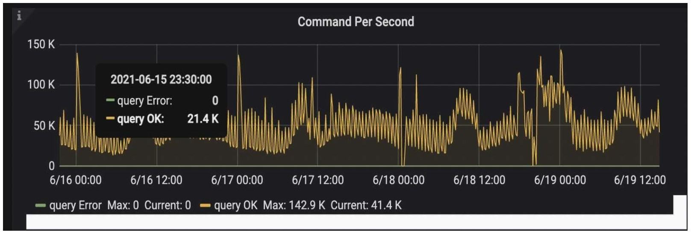

 Commands per second during our big sales promotion 

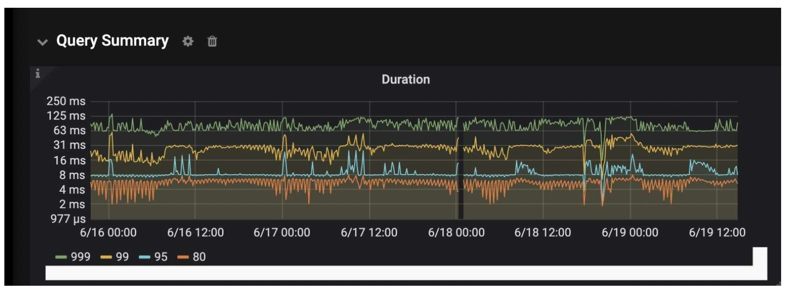

 Query duration during our big sales promotion 

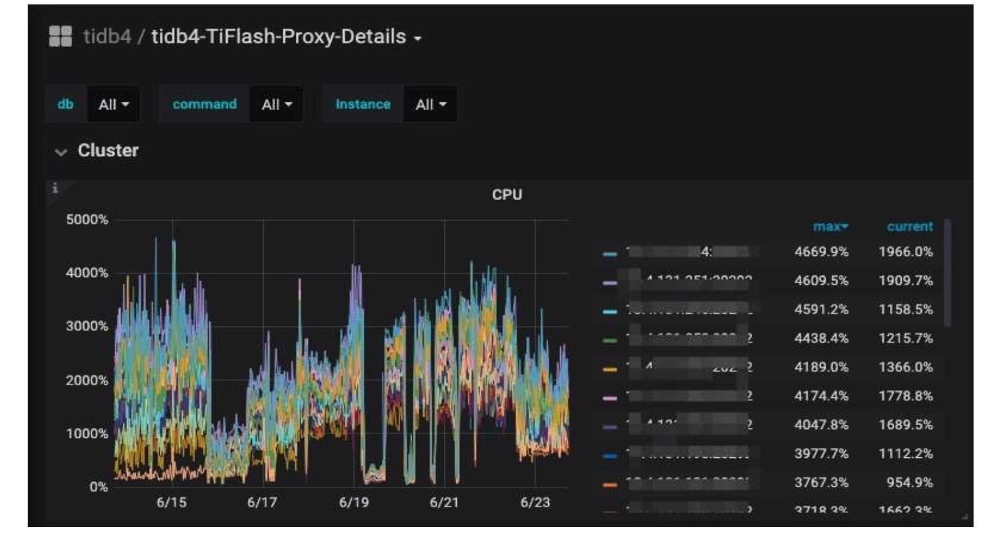

 TiFlash CPU load 

## Conclusion

Thanks to TiDB, we can easily scale out our database without worrying about its storage capacity. We can perform multi-dimensional analytics in real time. What's more, now, our data freshness has improved, and we can perform data analytics in minutes.

If you'd like to know more details about our story or have any questions, you're welcome to join the [TiDB community on Slack](https://slack.tidb.io/invite?team=tidb-community&channel=everyone&ref=pingcap-blog) and send us your feedback.
