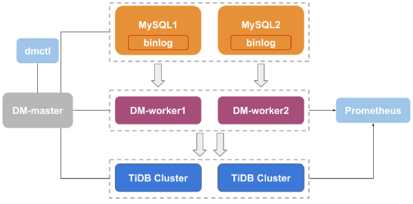

Earlier this year, Team PingCAP open-sourced TiDB [Data Migration (DM)](https://github.com/pingcap/dm), an integrated data transfer and replication management platform that supports full data migration and incremental data replication from MySQL or MariaDB instances, or Amazon Aurora, into a TiDB cluster.

Many TiDB users currently use TiDB DM to connect sharded MySQL, MariaDB, or Amazon Aurora to TiDB, treating TiDB almost as a slave, then run analytical workloads on this TiDB cluster to fulfill real-time reporting needs. TiDB DM provides good support if you need to manage multiple data replication tasks at the same time or need to merge multiple MySQL or MariaDB instances into a single TiDB cluster.

 TiDB Data Migration Architecture 

(For more detailed information on the architectural design and implementation of TiDB DM, read this deep-dive [blog post](https://pingcap.com/blog/tidb-dm-architecture-design-and-implementation-principles/).) 

To ease the learning curve of using TiDB DM, we’ve put together a [TiDB DM (Data Migration) Tutorial](https://pingcap.com/docs/dev/how-to/get-started/data-migration/) for you to experiment with this tool. While the settings used in this tutorial are certainly not for production deployment, it’s a quick and easy way to kick the tires before going further on your TiDB journey. And our team is always here—if you need help or support, just [contact us](https://pingcap.com/contact-us/). 
