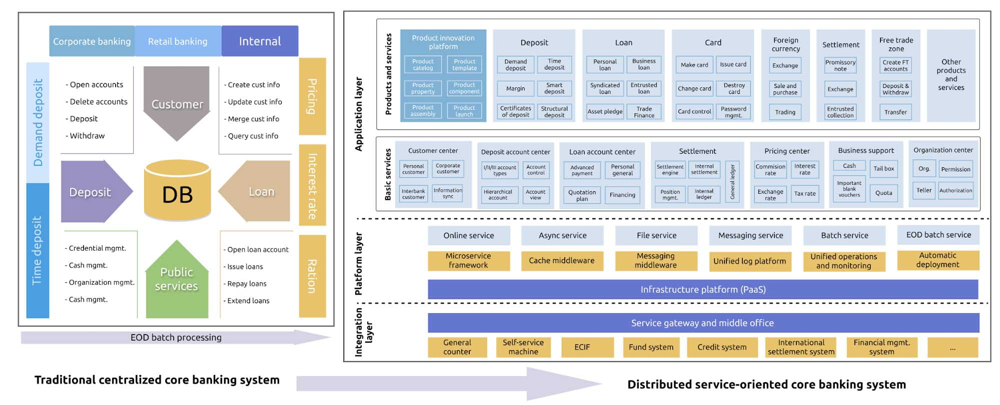
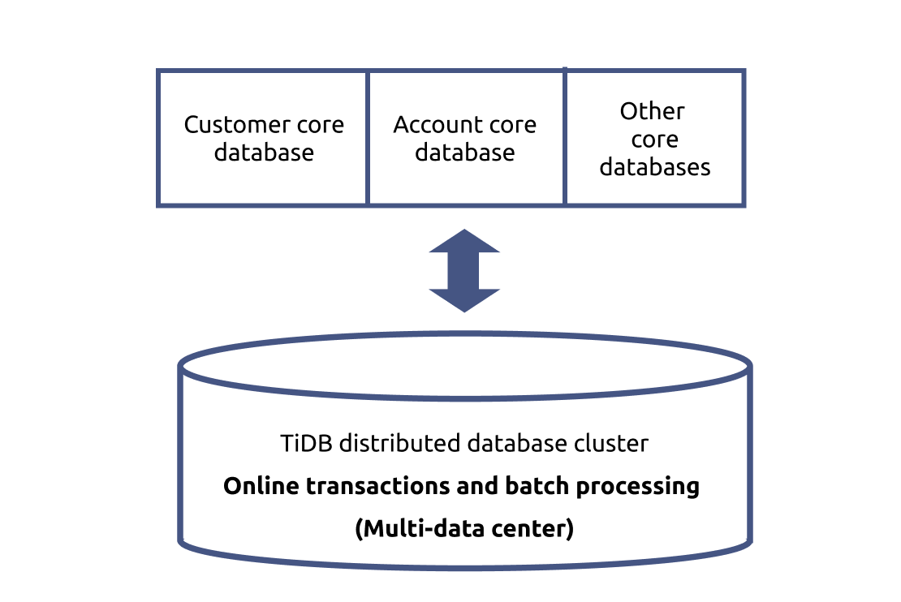
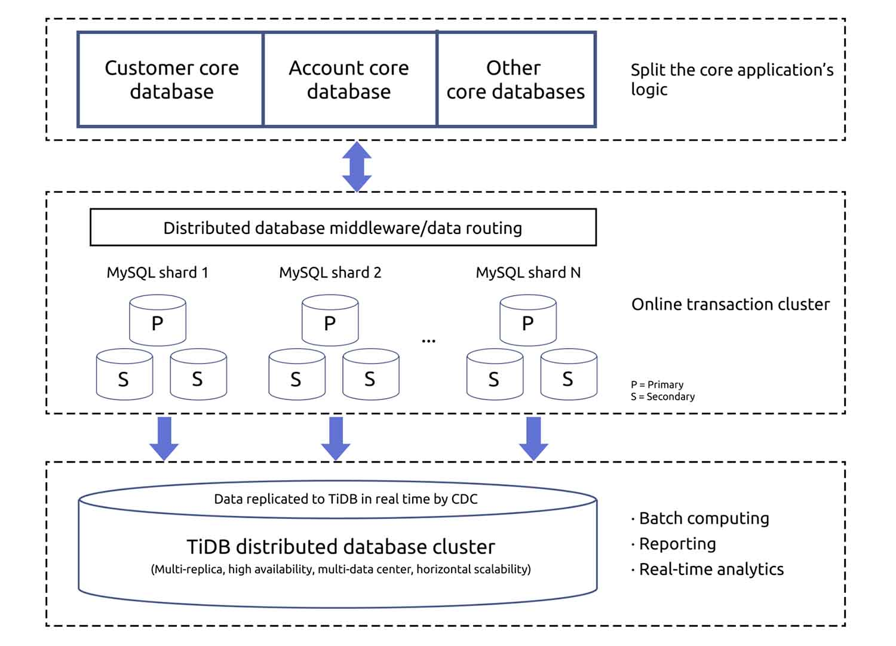
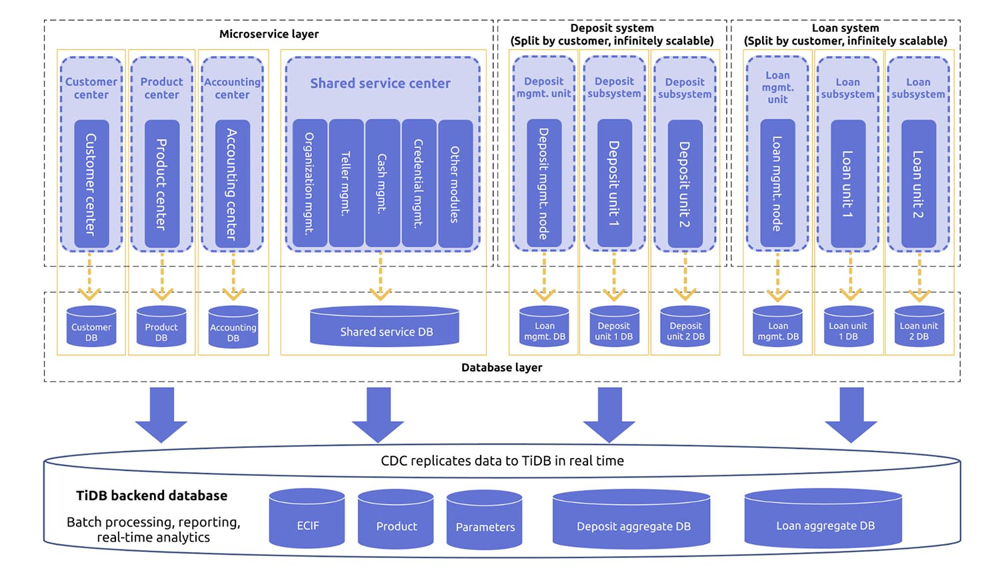
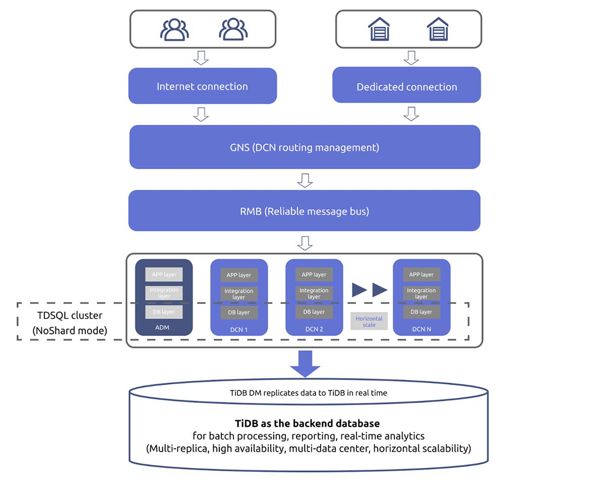

**Author:** Jun Yu (solution architect at PingCAP)

The financial industry, especially banks, needs a robust system to support their complicated transactions. With the development of technology, **the core banking system has evolved**—**from a traditional centralized system to a distributed, service-oriented architecture (SOA)**.

As an open-source, distributed SQL database, **TiDB is widely adopted by banks, securities, insurance, online payments, and FinTech companies**, and it supports our users in over twenty mission critical business scenarios.

In this article, I will introduce these critical business scenarios of the financial industry and the pain points they have using their current technology. After that, I'll also show you three TiDB solutions that tackle these problems.

## How financial services use databases

Banks have complicated businesses, from the core banking business (accounting and settlements), to peripheral business (deposits, loans, and currency exchanges), to Internet-oriented financial business.

To facilitate their future growth, **many banks have started to introduce distributed technology** into their transactional or real-time analytical applications and the data processing layers. They also try to adopt cloud computing, microservices, and serverless technology in their core banking systems.

 Mission critical scenarios in the financial industry 

In the distributed architecture, the database plays an important role and thus must meet stringent requirements:

* It should be secure, stable, and reliable.
* It offers distributed computing and distributed data management, as well as online elastic scalability.
* It achieves high throughput with high concurrency and low latency.
* It supports the hybrid workload of online transactions and end-of-day (EOD) batch processing, the workload of data reporting and data submission, and reliable, high-performance distributed online transactions.
* It supports deployment in multiple data centers (DCs)—at least three DCs in two cities—and uses multiple data centers for disaster recovery. RPO is 0, and RTO must meet the high availability requirements of the authorities and the banks.
* It shouldn't be an obstacle to developing or refactoring the core business applications.
* It should be easy to maintain and manage.

## Pain points of traditional databases

Currently, most banks use a traditional centralized database and MySQL-based sharding solutions as the database solution for the core banking system. However, a centralized database has the following disadvantages:

* It relies heavily on dedicated high-end hardware.
* It can't horizontally scale out.
* The implementation and maintenance costs are high.
* Banks might be locked in by DB2 or Oracle database technology.
* It can't work seamlessly with the next-generation distributed SOA or take advantage of cloud computing.

MySQL-based distributed databases, or say MySQL sharding solutions, also have limitations:

* Distributed middleware might not be mature or reliable enough.
* Sharding is intrusive to applications and requires lots of code changes.
* Because the application model and data model are bundled, the application is less flexible.
* It has limited capabilities in batch processing, elastic scaling, and online auto-balancing.
* It's hard to ensure distributed transactions, strong consistency, and high availability.
* It's complicated to implement disaster recovery plans, such as deploying the cluster across three centers in two cities (a working center, a disaster recovery center in the same city, and a disaster recovery center in another city) or using multiple active centers in one city.

## TiDB-based core banking solutions

[TiDB](https://github.com/pingcap/tidb) is an open-source NewSQL database that supports Hybrid Transactional and Analytical Processing (HTAP) workloads. It is MySQL compatible and features horizontal scalability, strong consistency, and high availability. TiDB is now widely used by the financial industry in North America, China, Japan, and Southeast Asia, as well as by nonfinancial companies across the globe.

Currently, TiDB provides three solutions for the core banking system. You can:

* Use TiDB as the primary database.
* Use MySQL for online transactions with TiDB as the backend.
* Use MySQL for core transactions (unitization architecture) with TiDB as the backend.

The following table compares the traditional centralized solution, the MySQL-based solution, and the TiDB-based solutions. The best performance in each category is shown in bold:

<table>
  <tr>
   <th>Solutions
   </th>
   <th>Traditional centralized solution
   </th>
   <th>MySQL-based distributed solution
   </th>
   <th>TiDB as the core database
   </th>
   <th>MySQL as the primary + TiDB core backend database
   </th>
  </tr>
  <tr>
   <td>Online transaction throughput
   </td>
   <td>Restricted by hardware resources
   </td>
   <td><strong>High, scalable</strong>
   </td>
   <td><strong>High, scalable</strong>
   </td>
   <td><strong>High, scalable</strong>
   </td>
  </tr>
  <tr>
   <td>Online transaction latency
   </td>
   <td><strong>Low</strong>
   </td>
   <td><strong>Low</strong>
   </td>
   <td>Middle or low (depends on the load)
   </td>
   <td><strong>Low</strong>
   </td>
  </tr>
  <tr>
   <td>Batch processing
   </td>
   <td>Restricted by hardware resources
   </td>
   <td>Low
   </td>
   <td><strong>High</strong>
   </td>
   <td><strong>High</strong>
   </td>
  </tr>
  <tr>
   <td>Aggregation query
   </td>
   <td><strong>High (centralized architecture)</strong>
   </td>
   <td>Low
   </td>
   <td><strong>High (real-time query)</strong>
   </td>
   <td><strong>High (real-time query)</strong>
   </td>
  </tr>
  <tr>
   <td>Application changes required
   </td>
   <td><strong>Minimal changes</strong>
   </td>
   <td>Significant changes; the database is intrusive to application logic logic
   </td>
   <td><strong>Minimal changes; the database is  transparent to applications</strong>
   </td>
   <td><strong>Minimal changes; the primary database is split into units; the backend database is transparent to applications</strong>
   </td>
  </tr>
  <tr>
   <td>Scalability
   </td>
   <td>Low
   </td>
   <td>Statically scale
   </td>
   <td><strong>Dynamically scale</strong>
   </td>
   <td><strong>Dynamically scale</strong>
   </td>
  </tr>
  <tr>
   <td>Elastic scalability
   </td>
   <td>Low
   </td>
   <td>Low
   </td>
   <td><strong>High, online scale</strong>
   </td>
   <td><strong>High, online scale</strong>
   </td>
  </tr>
  <tr>
   <td>High availability
   </td>
   <td><strong>High</strong>
   </td>
   <td>Middle (primary-secondary replication)
   </td>
   <td><strong>High (strong consistency based on Raft)</strong>
   </td>
   <td><strong>Primary database (primary-secondary architecture), backend database (strong consistency based on Raft)</strong>
   </td>
  </tr>
  <tr>
   <td>Disaster recovery
   </td>
   <td><strong>Disaster backup in both the same city and another city</strong>
   </td>
   <td>Middle (primary-secondary replication)
   </td>
   <td><strong>High (strong consistency based on Raft and scheduling)</strong>
   </td>
   <td><strong>High (strong consistency based on Raft); TiDB as the backup plan</strong>
   </td>
  </tr>
  <tr>
   <td>Build and maintenance costs
   </td>
   <td>High
   </td>
   <td>Low build cost, high maintenance cost
   </td>
   <td><strong>Low</strong>
   </td>
   <td><strong>Low</strong>
   </td>
  </tr>
</table>

### Use TiDB as the primary database

This solution uses TiDB as the primary database of the core banking system. TiDB is transparent to applications, so applications and developers use TiDB in the same way they use the traditional standalone databases. The details are transparent to the applications. The architecture of this solution is shown below.

 Use TiDB as the primary architecture 

As the core transaction application grows, the transaction may take place not only in the account dimension but also in the customers dimension. Therefore, simply sharding the database by accounts will sacrifice business flexibility. With TiDB, **you do not need to manually shard the application model, data model, or transaction model**.

Moreover, TiDB's built-in **multi-active disaster recovery mechanism** simplifies its deployment, management, and cost. Its distributed transaction model doesn't need extra application logic, which gives users the same experience as a standalone database. TiDB has a dynamic scheduling mechanism that can scale out nodes with no impact on the online services.

To sum up, **using TiDB as the primary database of the core transaction system** brings the following merits:

* It reduces the complexity and risks associated with revamping the core transaction database.
* The application model and data model don't need to adapt themselves to the database architecture.
* The computing and storage are transparent and distributed, reducing the maintenance cost.
* The throughput and performance can be scaled horizontally.
* TiDB supports standard SQL syntax, distributed transaction processing, and HTAP workloads. It ensures the flexibility of the banking business and adapts to distributed core applications.
* The core system supports strong consistency, high availability (RPO = 0 and RTO &lt; 30 seconds), and multi-data center disaster recovery.

We've made TiDB easy to integrate with the core transaction systems of many city commercial banks. We have fully adapted TiDB to the [Sunline](http://www.sunline-i.com/) core banking system's essential modules: accounts, debts, loans, credit card issuing, cash management, and asset balance. TiDB has been optimized for functionality, correctness, and performance and passed over 2,000 functionality tests, including nearly 200 batch processing tests.

In the next stage, we will partner with Sunline to test TiDB on its new core banking system and the ARM-based platform.

### Use MySQL for online transactions with TiDB as the backend

The second solution is using a MySQL cluster for Online Transactional Processing (OLTP) and TiDB for Online Analytical Processing (OLAP), as shown below:

 Use MySQL for online transactions with TiDB as the backend 

The core transaction applications are split according to their application logic. The data processing takes three steps:

1. Users perform their basic OLTP workload in MySQL and its distributed database middleware.
2. Change data capture (CDC) tools replicate data from MySQL shards to TiDB in semi-real time.
3. TiDB resolves MySQL's binlog and merges the data into its distributed cluster. The TiDB cluster provides batch processing, complicated computing, and real-time complex queries.

### Use MySQL for core transactions (unitization architecture) with TiDB as the backend

Like the previous solution, this one uses MySQL for core transactions and TiDB for the backend.  The difference here is that the applications are split into different microservices or units.

 MySQL (unitization architecture) with TiDB as the backend 

* The customer center, product center, and accounting center are three services used by all other transactions. These services can be split from the transaction system into separate units.
* For the online transactions and account services, such as the deposit system and loan system, we can split them into separate units by splitting the application logic. This way, the application layer can achieve horizontal scalability.
* We can also split the shared service center from the transaction system and integrate them into the microservice layer. The shared service center provides standard interfaces for different modules to call its services.

In this architecture, multiple databases correspond to the core database. As the backend database for the core banking system, TiDB can use CDC to ingest all the data from the global databases (the customer center, product center, and accounting center).

For sharded databases that are split vertically at the application layer, data can be aggregated through CDC into a global database in TiDB. In this global database, we can perform batch processing operations across different service units, including complex queries and reporting. Meanwhile, the databases that share services still exist in the TiDB cluster as separate logical databases and provide services for the applications.

#### WeBank's new-generation core system architecture

[WeBank](https://en.wikipedia.org/wiki/WeBank_(China)), a Chinese neobank unicorn, uses this solution for their mission critical system. (To learn more, see [their case study](https://pingcap.com/case-studies/how-we-reduced-batch-processing-time-by-58-percent-with-a-scale-out-mysql-alternative)).

WeBank has made innovations in the unitization of core banking systems. In the past four years, WeBank has adopted the data center node (DCN) distributed extensible framework for core transaction processing. The application layer is easy to extend, and the database layer is kept simple.

 WeBanks's DCN distributed architecture 

A DCN refers to a fully-functional logical "bank". Many DCNs work together to support the real bank's business. An independent organization, such as a bank branch, can accommodate its business growth by horizontally scaling DCNs. WeBank also uses an online transaction database based on MySQL sharding and separates transactions from accounting. By applying distributed database technology, WeBank transfers the batch processing and accounting operations to the backend database—the distributed cluster.

## Why use TiDB

By using TiDB as the backend database, you can enjoy the following benefits:

* It solves the challenges of aggregating data for computing and processing in the MySQL-based distributed plan.
* It supports standard SQL syntax, distributed transactions, and multi-table complex join operations, providing cross-node, high-performance batch processing capabilities for massive data.
* Its HTAP architecture has both row-based and column-based storage engines, which facilitate real-time computing.
* It provides a complete set of tools for full and incremental data replication. It can replicate data from the online database in real time and serve as a backup plan at any time.
* It can scale its throughput and performance horizontally.
* Its kernel supports the strong consistency, high availability, and multi-data center multi-active disaster recovery mechanism (RPO = 0, RTO &lt; 30 seconds).

TiDB is also ready for the core banking system and other mission critical systems in the future. It is cloud-native and can [run in Kubernetes](https://docs.pingcap.com/tidb-in-kubernetes/stable), which lays the foundation for **running in public or private clouds**. It has recently been adapted to some cloud infrastructure platforms, including OpenShift and Rancher. With TiDB's cloud resource scheduling capabilities, it will provide **multi-tenancy support** in the cloud.

TiDB also combines row store and column store in one architecture, which will **smooth the way for future applications**. TiDB is also working with Apache Flink to develop stream processing solutions that empower real-time data processing.

Finally, TiDB can schedule data across data centers. In a multi-center architecture, TiDB can dynamically associate data with data centers and establish the association between data tables according to locations. This reduces cross-site requests and lowers latency. What's more, TiDB can separate hot data from cold data and schedule them flexibly.

For more information on TiDB's practices in the financial industry, [join our Slack channel](https://slack.tidb.io/invite?team=tidb-community&channel=everyone&ref=pingcap-blog) or [stay tuned](https://share.hsforms.com/1e2W03wLJQQKPd1d9rCbj_Q2npzm) for our coming blog posts!
