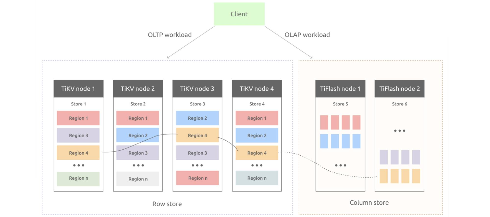

---

_"The paper is going to start a new line of research and products."_

_Reviewer, Proceedings of the VLDB Endowment_

---

At [PingCAP](https://pingcap.com/), our goal is to build a database that is a single, real-time source of truth so that the applications and the businesses on top of it can adapt to uncertainty. As we built [TiDB](https://pingcap.com/docs/stable/overview/), we benefited from databases and distributed systems research such as Raft and Spanner. Along the journey, we've developed some novel ideas, and we are thrilled to contribute them back to the academic community.

A group of our engineers have summarized what we've learned in a new research paper, "TiDB: A Raft-based HTAP Database." In this paper, we propose TiDB as a Hybrid Transactional and Analytical Processing (HTAP) database，a "one size fits many" solution for OLTP and OLAP applications.

HTAP databases require processing transactional and analytical queries in isolation to remove the interference between them. To achieve this, it is necessary to maintain different replicas of data specified for the two types of queries. To this end, we propose extending replicated state machine-based consensus algorithms to provide consistent replicas for HTAP workloads. Based on this novel idea, we present a Raft-based HTAP database: TiDB. 

 A multi-Raft storage system consisting of a row store and a column store 

The figure above shows the key architecture of TiDB. TiDB is built on a multi-Raft storage system which consists of a row store ([TiKV](https://github.com/tikv/tikv)) and a column store ([TiFlash](https://pingcap.com/docs/stable/tiflash/tiflash-overview/)). The row store is built based on the Raft algorithm to materialize updates from transactional requests. In particular, it asynchronously replicates Raft logs to learners which transform row format to column format for tuples, forming a column store. This column store allows analytical queries to read fresh and consistent data in real time. On the top of this storage system, we build an SQL engine to optimally access TiKV and TiFlash for HTAP queries. Comprehensive experiments show that TiDB achieves isolated high performance under CH-benCHmark, a benchmark focusing on HTAP workloads.

TiDB presents an innovative solution that helps consensus-algorithm-based NewSQL systems evolve into HTAP systems. NewSQL systems ensure high availability, scalability, and data durability for OLTP requests by replicating their database like Google Spanner and CockroachDB. They synchronize data across data replicas via replication mechanisms typically from consensus algorithms. Based on the log replication, NewSQL systems can provide a columnar replica dedicated to OLAP requests so that they can support HTAP requests in isolation like TiDB.

We believe that the future of the database is about unification, adaptiveness, and intelligence. When we face uncertainty in the future, we will have the unified infrastructure to adapt intelligently. We hope that "TiDB: A Raft-based HTAP Database" can inspire researchers and software engineers to make the future come earlier. The paper will be published in August, 2020, in _PVLDB_, Volume 13, Issue 12. We also look forward to discussing the paper with you at VLDB 2020.

We would like to offer a big "thank you" to authors and reviewers of the paper. We also want to thank the many contributors and users in our TiDB community. You have made TiDB what it is today, and you will continue to make it better tomorrow. 
