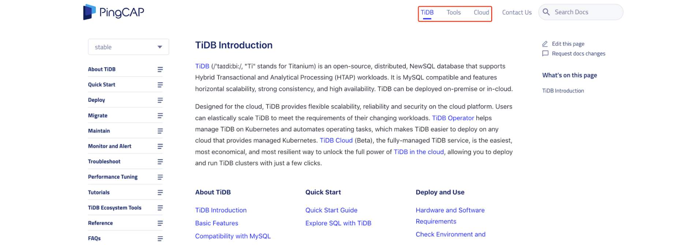
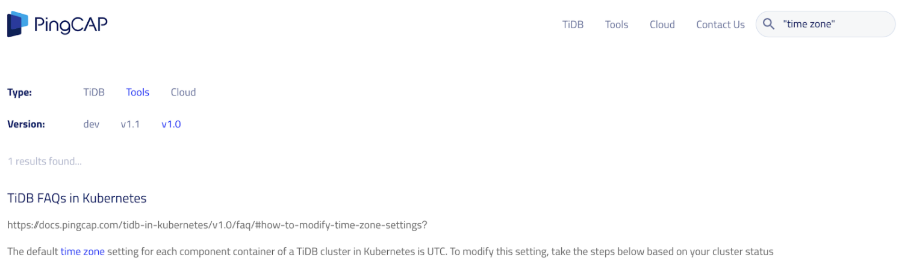

[TiDB](https://docs.pingcap.com/tidb/stable/overview) is an open-source, distributed SQL database that supports Hybrid Transactional/ Analytical Processing ([HTAP](https://en.wikipedia.org/wiki/HTAP)) workloads. Along with the rapid releases of TiDB products and projects, we also continually improve our [TiDB documentation](https://docs.pingcap.com/tidb/stable) because **developer experience and user experience matter!** To help with your TiDB journey, this post covers recent big changes, new content, and improvements in TiDB documentation.

## Big changes

First, let's take a look at the big changes made to TiDB documentation. These improvements include a new subdomain, an optimized doc structure, and a robust search feature.

### Migrating to a new subdomain

Previously, TiDB documentation was displayed at [https://pingcap.com/docs](https://pingcap.com/docs). (If you click the link now, you're automatically redirected to a new URL.) Since June 22, 2020, all the TiDB documentation has been migrated to the **docs.pingcap.com** subdomain, and its new URL is [https://docs.pingcap.com](https://docs.pingcap.com).

A separate subdomain name for TiDB documentation makes it much easier for you to quickly find the information you need from multiple sets of TiDB-related documentation.

Generally, we maintain a separate set of documentation for a product (or tool or component) that has its own release, the version number of which differs from that of [the TiDB project](https://github.com/pingcap/tidb). In the upper left of each documentation page, you'll see a drop-down list that lets you select the version number you're interested in.

### Reorganizing the documentation

We've reorganized our documentation to make it more usable and more friendly. This reorganization includes two parts: we now provide a separate link to each documentation set to give you quicker access, and we've restructured the content of documents to help you find them easier with better logic.

#### Providing a separate entry for each documentation set

The new documentation subdomain displays an entry for each documentation set:

 New entries for each documentation set 

The following table shows how the documentation is organized:

<table>
  <tr>
   <td><strong>Product/Project</strong>
   </td>
   <td><strong>Top level page</strong>
   </td>
   <td><strong>Sub-level page</strong>
   </td>
  </tr>
  <tr>
   <td>TiDB database
   </td>
   <td><a href="https://docs.pingcap.com/tidb/stable">TiDB docs</a>
   </td>
   <td><a href="https://github.com/pingcap/tidb">TiDB</a> is a MySQL-compatible, NewSQL database that features horizontal scalability, strong consistency, and high availability. You can deploy TiDB on-premise or in-cloud.
   </td>
  </tr>
  <tr>
   <td>Tools
   </td>
   <td><a href="https://docs.pingcap.com/tools/">Tools docs</a>
   </td>
   <td><a href="https://docs.pingcap.com/tidb-in-kubernetes/stable">TiDB Operator docs</a>
 
<a href="https://github.com/pingcap/tidb-operator">TiDB Operator</a> helps manage cloud-native TiDB on Kubernetes and automates operating tasks. This makes TiDB easier to deploy on any cloud that provides managed Kubernetes.
 
<a href="https://docs.pingcap.com/tidb-data-migration/stable">TiDB Data Migration docs</a>
 
<a href="https://github.com/pingcap/dm">TiDB Data Migration (DM)</a> is an integrated data replication task management platform that supports full data migration and incremental data migration from MySQL or MariaDB to TiDB. It can help reduce operating costs and simplify troubleshooting.
 
<a href="https://docs.pingcap.com/tidb/dev/ecosystem-tool-user-guide">TiDB Database Tools docs</a>
 
TiDB database tools are a collection of useful toolkits for migrating data to or from TiDB, including <a href="https://github.com/pingcap/dumpling">Dumpling</a>, <a href="https://github.com/pingcap/mydumper">Mydumper</a>, Loader, Syncer, <a href="https://github.com/pingcap/tidb-tools/tree/master/sync_diff_inspector">sync-diff-inspector</a>, <a href="https://github.com/pingcap/br">Backup & Restore (BR)</a>, <a href="https://github.com/pingcap/tidb-lightning">TiDB Lightning</a>, and <a href="https://github.com/pingcap/ticdc">TiCDC</a>.
 
<a href="https://docs.pingcap.com/tidb/dev/tiup-documentation-guide">TiUP docs</a>
 
<a href="https://github.com/pingcap/tiup">TiUP</a> is a package manager that manages components in the TiDB ecosystem, such as TiDB, TiKV, and Placement Driver (PD). You can run any component with only a single TiUP command, which makes it far easier to manage.
   </td>
  </tr>
  <tr>
   <td>TiDB Cloud
   </td>
   <td><a href="https://docs.pingcap.com/tidbcloud/beta">TiDB Cloud docs</a>
   </td>
   <td><a href="https://pingcap.com/products/tidbcloud">TiDB Cloud</a> (Beta), the fully-managed TiDB service, is the easiest, most economical, and most resilient way to unlock the full power of TiDB in the cloud, allowing you to deploy and run TiDB clusters with just a few clicks.
   </td>
  </tr>
</table>

#### Restructuring the content for each documentation set

We restructured our documentation by:

* Creating a different table of contents
* Adding more topics
* Splitting original content
* Updating or deleting outdated content

We didn't restructure all versions of the documentation, but only the following products (and projects) and versions: 

* TiDB docs: dev (the latest development version) & v4.0
* TiDB Operator docs: dev & v1.1
* TiDB Data Migration docs: dev

Earlier documentation versions retain their current structure.

### Adopting a flat directory structure

If you contribute to TiDB documentation or you're a member of TiDB [Docs SIG](https://github.com/pingcap/community/tree/master/special-interest-groups/sig-docs), you probably have found that we've adopted a flat directory structure for all the active branches in our docs repositories ([docs](https://github.com/pingcap/docs), [docs-cn](https://github.com/pingcap/docs-cn), [docs-tidb-operator](https://github.com/pingcap/docs-tidb-operator), [docs-dm](https://github.com/pingcap/docs-dm)).

Previously, the directory structure was deep, with paths such as `/how-to/configure/time-zone.md`. Now, the equivalent path is `/configure-time-zone.md`, with the documentation directly in the root directory of a branch. However, we still keep some folders for relatively independent modules in the root directory, such as `sql-statements`, `tiup`, and `tiflash`. This way, engineers or technical writers can easily find and maintain the corresponding files, and the files won't be overly scattered.

This change makes it **much more friendly for possible future changes** to the content organization. Now you can move one file to another directory or another place in the table of contents ([TOC.md](https://github.com/pingcap/docs/blob/master/TOC.md)), without affecting the usability of the original URL. As long as you don't modify the file name, you don't need to worry about redirecting the original URL to a new one, because the URL doesn't change.

You might be wondering, "If I move a file from directory A to directory B, why doesn't the URL change?" The reason is **we cut** **the directory section** from the URL by default, and **we only kept the file name section**. For example, the `/tiflash/tiflash-overview.md` file in the docs master branch is parsed to [https://docs.pingcap.com/tidb/dev/tiflash-overview](https://docs.pingcap.com/tidb/dev/tiflash-overview).

### Showing accurate, version-specific search results

To search TiDB documentation, you can use either Google Search or the embedded search box in the upper right corner of every TiDB docs page. 

Last June, we made great improvements to documentation search so you can find answers much more quickly. Here are the major changes:

<table>
  <tr>
   <td><strong>Major improvement</strong>
   </td>
   <td><strong>Example/Description</strong>
   </td>
  </tr>
  <tr>
   <td>You can use quotes to search for an exact phrase.
   </td>
   <td>Enter "CREATE VIEW" or "create view" to get the exact results with this phrase.
   </td>
  </tr>
  <tr>
   <td>You can select a specific documentation set to get better results.
   </td>
   <td>When you visit <a href="https://docs.pingcap.com">https://docs.pingcap.com</a>, the <strong>TiDB</strong> docs page is displayed by default. If you want to search other doc sets such as TiDB Operator, first click <strong>Tools</strong> on the top menu bar and select <strong>TiDB Operator</strong>.
   </td>
  </tr>
  <tr>
   <td>You can specify the exact version that you want to get results from.
   </td>
   <td>Search results for the latest "stable" version are returned by default, but you can select your version in the drop-down list in the upper left of the page. 
 
For example, if you use TiDB Operator v1.0 and want to know how to modify the time zone setting for a TiDB cluster in Kubernetes, click <strong>Tools </strong>&gt; <strong>TiDB Operator</strong>, select <strong>v1.0</strong> in the drop-down, and then enter "time zone" to search.
   </td>
  </tr>
</table>

 Accurate, version-specific search results 

## New docs

Now you're familiar with how the new TiDB doc site works, let's see how to quickly find the documentation for [TiDB 4.0](https://pingcap.com/blog/tidb-4.0-elastic-real-time-htap-database-ready-for-cloud)'s new features and [TiDB Cloud beta](https://pingcap.com/blog/announcing-tidb-as-a-service-fully-managed-tidb-offering) released in June.

### TiDB 4.0 feature docs

Along with the [TiDB 4.0 GA release](https://pingcap.com/blog/tidb-4.0-ga-gearing-you-up-for-an-unpredictable-world-with-real-time-htap-database), we've added a lot of new 4.0 topics and updated many existing topics to help you easily use TiDB 4.0, an elastic, cloud-native, real-time HTAP database. Here are some of the 4.0 documentation highlights:

* **TiUP** is a new package manager that streamlines installing, configuring, and managing a TiDB cluster into a few easy commands. [Quick Start Guide for the TiDB Database Platform](https://docs.pingcap.com/tidb/stable/quick-start-with-tidb) describes how to try out TiDB in a few minutes, even in only _one minute_. [Deploy a TiDB Cluster Using TiUP](https://docs.pingcap.com/tidb/stable/production-deployment-using-tiup) describes how to deploy TiDB clusters in the production environment.
* **TiFlash** is a key component that makes TiDB essentially a Hybrid Transactional/Analytical Processing (HTAP) database. [TiFlash Overview](https://docs.pingcap.com/tidb/stable/tiflash-overview) describes its architecture and key features, and includes links about how to [deploy a new cluster with TiFlash nodes](https://docs.pingcap.com/tidb/stable/production-deployment-using-tiup), how to [add a TiFlash node in a deployed cluster](https://docs.pingcap.com/tidb/stable/scale-tidb-using-tiup#scale-out-a-tiflash-node), and how to [use TiFlash](https://docs.pingcap.com/tidb/stable/use-tiflash).
* **Backup & Restore (BR)** is a distributed backup and restore tool that offers high backup and restore speeds for the TiDB cluster data. [BR Use Cases](https://docs.pingcap.com/tidb/stable/backup-and-restore-use-cases) describes its four use cases. [Use BR to Back up and Restore Data](https://docs.pingcap.com/tidb/stable/backup-and-restore-tool) describes the BR command line, usage examples, best practices, restrictions, and implementation principles.
* **TiDB Dashboard** (experimental) is a Web UI for monitoring, diagnosing, and managing the TiDB cluster, which makes it much easier to troubleshoot cluster problems. [TiDB Dashboard Introduction](https://docs.pingcap.com/tidb/stable/dashboard-intro) describes its main features. [Key Visualizer](https://docs.pingcap.com/tidb/stable/dashboard-key-visualizer) lets you observe your read and write volume over time so that you can quickly diagnose whether the system has read or write hotspots. [SQL statement analysis](https://docs.pingcap.com/tidb/stable/dashboard-statement-list) lets you quickly know which SQL statement is using too many system resources.
* **TiCDC** (experimental) is an incremental replication tool that directly subscribes to TiDB's data changes and replicates data at the second or even the millisecond level. [TiCDC Overview](https://docs.pingcap.com/tidb/stable/ticdc-overview) describes its architecture, replication features, and restrictions. You can learn how to [deploy a TiCDC cluster](https://docs.pingcap.com/tidb/stable/manage-ticdc#deploy-ticdc), and how to [manage your TiCDC cluster and replication tasks](https://docs.pingcap.com/tidb/stable/manage-ticdc#use-cdc-cli-to-manage-cluster-status-and-data-replication-task).

For more feature and documentation details, see [What's New in TiDB 4.0](https://docs.pingcap.com/tidb/stable/whats-new-in-tidb-4.0) and earlier versions of our [v4.0 Release Notes](https://docs.pingcap.com/tidb/stable/release-notes#40).

### TiDB Cloud docs

[TiDB Cloud](https://en.pingcap.com/products/tidbcloud) is a fully-managed Database-as-a-Service (DBaaS) product that brings everything great about TiDB to your cloud, and lets you focus on your applications, not the complexities of your database. In June, we released a complete set of TiDB Cloud documentation. Check out [TiDB Cloud Documentation](https://docs.pingcap.com/tidbcloud/beta) and [start your free trial](https://en.pingcap.com/products/tidbcloud/trial/) now!

## What's next

To offer you a better experience on your TiDB journey, we'll keep updating all the documentation ([docs](https://github.com/pingcap/docs), [docs-cn](https://github.com/pingcap/docs-cn), [docs-tidb-operator](https://github.com/pingcap/docs-tidb-operator), [docs-dm](https://github.com/pingcap/docs-dm)). And you're welcome to contribute through any of the following ways:

* [Create GitHub issues](https://github.com/pingcap/docs/issues/new/choose) to request changes, report errors, or ask uncovered questions.
* [Create GitHub pull requests](https://github.com/pingcap/docs/blob/master/CONTRIBUTING.md#how-to-contribute) (PRs) to directly update the documentation content. Once your PR is merged, you'll become a contributor to the [Docs SIG](https://github.com/pingcap/community/tree/master/special-interest-groups/sig-docs) of the TiDB Community!
* [Join TiDB Community's #sig-docs Slack channel](https://slack.tidb.io/invite?team=tidb-community&channel=sig-docs&ref=pingcap-blog) to ask or answer questions and talk with more contributors!
