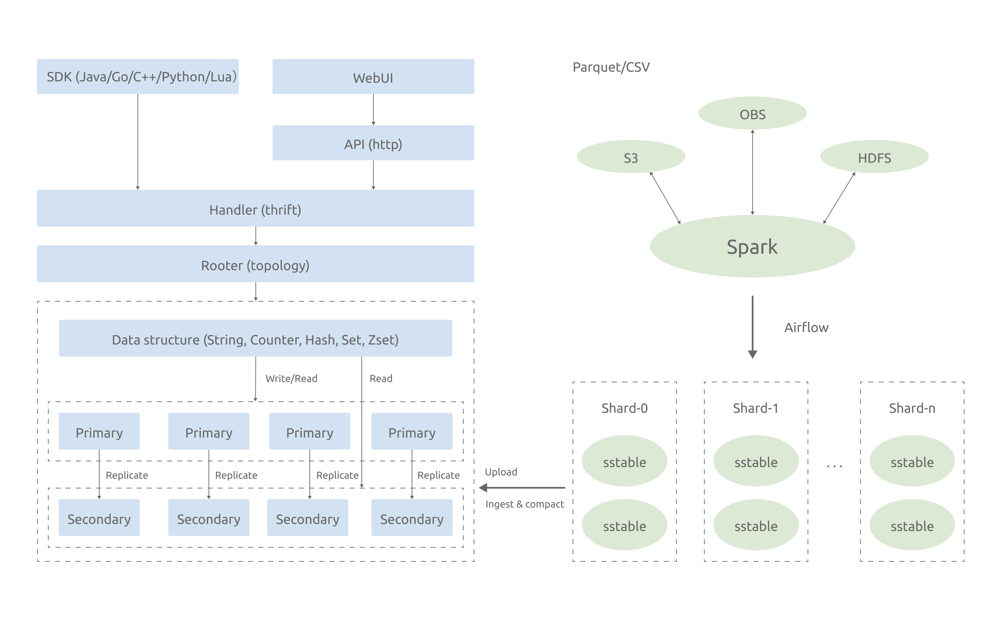
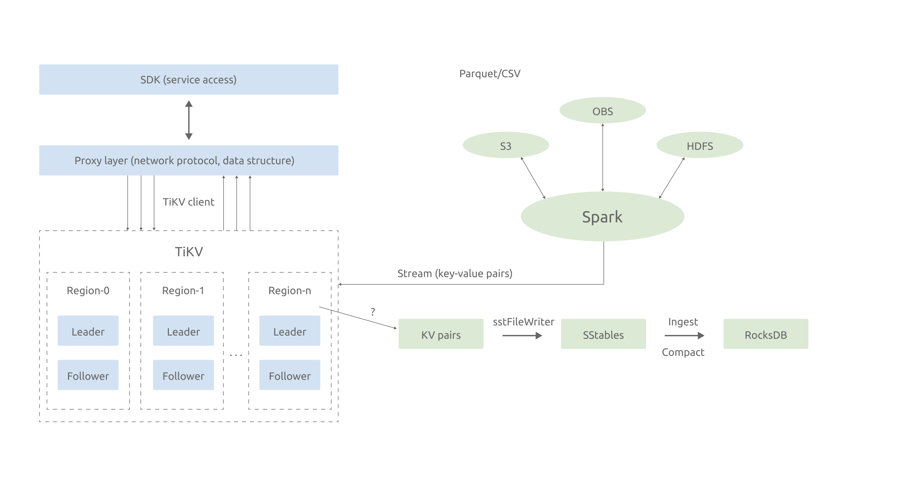

**Industry:** Internet

**Author:** Linlin Yan (Database Engineer at SHAREit Group)

**Transcreator:** [Fendy Feng](https://github.com/septemberfd); **Editors:** Tom Dewan, [Ran Huang](https://github.com/ran-huang)

[SHAREit Group](https://www.ushareit.com/) is a global internet technology company, dedicated to mobile application research and development, global mobile advertising solutions, and cross-border payment solutions. Our core app, [SHAREit](https://play.google.com/store/apps/details?id=com.lenovo.anyshare.gps&hl=en&gl=US), has seen nearly 2.4 billion downloads worldwide. Our business network has reached more than 200 countries and regions, especially Southeast Asia, South Asia, the Middle East and Africa. 

With billions of users, our products generate tremendous amounts of data every second. This requires a strong storage infrastructure to hold our application data. We tried to build our own distributed key-value (KV) database based on RocksDB, but it had drawbacks and couldn't fix all of our pain points. 

Then, we encountered [TiKV](https://docs.pingcap.com/tidb/stable/tikv-overview), an open-source distributed and transactional KV database, which exactly meets our requirements and relieves our headaches. 

In this post, I will talk about the challenges we faced with our previous storage solution, why we selected TiKV, and how TiKV fixes our pain points. I hope you find our experience useful for your future choice of database. 

## Challenges we faced with our previous distributed database

Our business generates massive amounts of data every day, up to terabytes per hour, so we need a strong KV storage that supports: 

* Real-time data generation and write. 
* Bulk load; that is, the ability to rapidly load massive data generated offline into the online KV database according to user portraits and feature-engine. This provides fast access for online services. 

To meet these two requirements, we developed our own distributed KV database based on RocksDB. Its architecture is as follows: 

 Architecture of the RocksDB-based distributed KV databse 

The structure on the left shows the process of real-time data write. This system doesn't allow real-time data write in TB/h because: 

* The write amplification in RocksDB is severe, especially in large-key scenarios.
* A single hard disk has limited network bandwidth, so a single machine can't process or hold too much data. 

Therefore, the structure on the right implements bulk load in MB/s.  It uses Spark to parse and pre-shard Parquet files and generate SSTables. Then, it uploads SSTables to RocksDB's storage nodes and ingests and compacts them to the KV layer. 

This home-brew KV store works, but it still has some drawbacks:

* It fares poorly in auto scaling and strong consistency, and isn't good at distributed transactions or dealing with large-key scenarios. All these require heavy and consistent R&D investment. 
* We don't have enough database professionals for further development and maintenance, and hiring a team of those experts would cost a fortune. 

## Why TiKV prevails

We searched for a better KV storage solution, and we found TiKV. [TiKV](https://tikv.org/) is a highly scalable, low-latency key-value database that delivers performance of less than 10 ms at any scale. It is built on top of RocksDB and inherits many of its great features. 

TiKV is exactly what we've been looking for:

* It scales. With the Placement Driver and carefully designed Raft groups, TiKV excels in horizontal scalability and can easily scale to 100+ terabytes of data. 
* It supports consistent distributed transactions. 
* TiKV separates storage from computing. We can leverage that feature to build our own KV product. 
* TiKV creates SSTables inside itself, so we can remove Spark-related code as much as possible. 
* TiKV is an open-source product with a vibrant community, and we can leverage the power of the community to further polish TiKV together. 

  <a href="https://share.hsforms.com/1e2W03wLJQQKPd1d9rCbj_Q2npzm" onclick="trackViews('Why SHAREit Selects TiKV for Data Storage for Its 2.4-Billion-User Business', 'subscribe-blog-btn-middle')"><button>Subscribe to Blog</button></a>
  <a href="/contact-us" onclick="trackViews('Why SHAREit Selects TiKV for Data Storage for Its 2.4-Billion-User Business', 'contact-us-middle')"><button>Request a Demo</button></a>

The image below shows our new architecture built on TiKV. The structure on the left explains the process of real-time data write, that is, first from SDK to online storage, then to data computing, and finally to TiKV storage engine. 

 Architecture of the TiKV-based distributed KV database 

The right side of the figure shows our main R&D effort: bulk load capability. Contrary to our previous solution, the TiKV-based KV database processes SSTable generation inside TiKV, which helps us minimize the cost of development and maintenance in Spark-related processes. It also optimizes the user experience. 

## Testing TiKV

The two tables below display the test results of the bulk load capability of our TiKV-based solution. 

| Spark concurreny | Data size (GB) | Time (s) | Speed (MB/s) | Speed (GB/h) |
| :----: | :----: | :----: | :----: | :----: | 
| 2 | 1 | 20 | 50 | 175 |
| 5 | 5 | 40| 128 | 450 | 
| 10 | 5 | 30 | 170 | 600 | 
| 20 | 5 | 20 | 256 | 900 | 
| 40 | 5 | 30 | 170 | 600 | 

 Table 1: Single-server bulk load tests (CPU: Xeon E5; vCore: 40; disk: NVMe) 

On a single server with a 40-vCore, Xeon E5 CPU and an NVMe disk, this architecture's throughput reaches a maximum of 256 MB/s. 

| Spark concurreny | P99 (ms) | P99.9 (ms) | P99.99 (ms) | Average latency (ms)) |
| :----: | :----: | :----: | :----: | :----: | 
| 2 | 6 | 9 | 23 | 0.53 | 
| 5 | 7 | 12 | 22 | 0.6 | 
| 10 | 7 | 13 | 33 | 0.64 | 
| 20 | 7 | 15 | 31 | 0.578 | 
| 40 | 6 | 13 | 37 | 0.6 | 

 Table 2: Latency (QPS: 4000; key: 16 bytes; value: 64 bytes) 

We also tested its online reading performance under bulk load. We can see from Table 2 that the read latency is stable in most cases.

These tests were performed against our demo. With further performance tuning, we believe we will get even better results. 

## Believe in the power of openness

The bulk load capability of our TiKV-based KV database was developed jointly by SHAREit and TiKV engineers at PingCAP. Thank you, PingCAP, for delivering such a powerful open-source product and for providing us strong technical support!

If you want to know more about our story or have any questions about TiKV, you can [follow TiKV on GitHub](https://github.com/tikv/tikv) or join our community discussion [on Slack](https://slack.tidb.io/invite?team=tikv-wg&channel=general&ref=pingcap-blog). You can also [request a demo](https://en.pingcap.com/contact-us) from PingCAP right now. 
