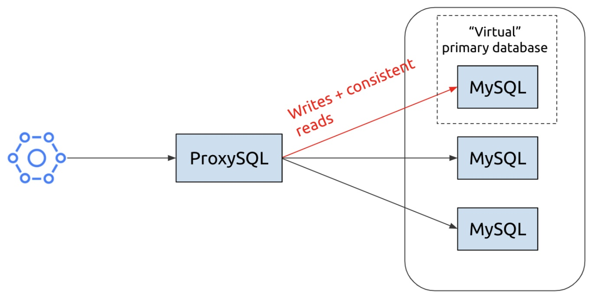
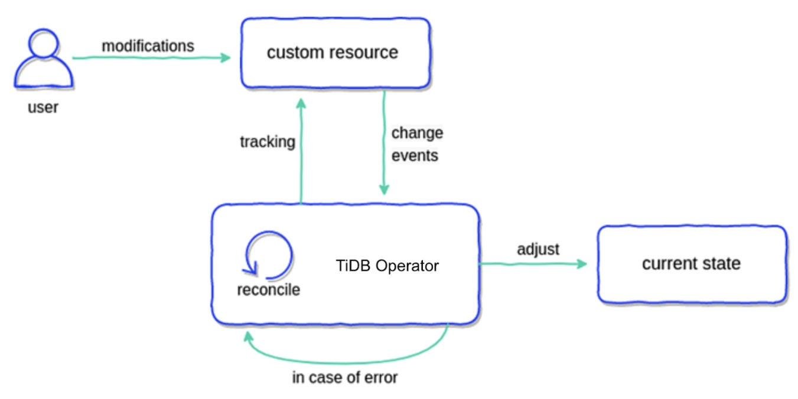

**Industry:** Logistics

**Authors:**

* Shaun Chong (Co-founder and CTO at Ninja Van)
* Mengnan Gong (Sr. Software Engineer at Ninja Van)

**Editors:** Tom Dewan, [Caitin Chen](https://github.com/CaitinChen)

[Ninja Van](https://www.crunchbase.com/organization/ninja-van-2) is Southeast Asia's fastest growing last-mile logistics company. We are now in six countries in Southeast Asia. Our customers include Amazon, Shopee, Lazada, Lineman, GradExpress, Zilingo, Tokopedia, and Sendo.

We deliver upwards of 1.5 million parcels a day. As our data size rapidly grew, our databases faced great pressure, and we had significant issues in ProxySQL, sharding, and Galera. **After we compared Vitess, CockroachDB (CRDB), and [TiDB](https://docs.pingcap.com/tidb/stable/overview), an open-source, MySQL-compatible, distributed SQL database, we found that TiDB is an optimal solution. Now, we've achieved database scalability with TiDB on Kubernetes (K8s).**

This post discusses our applications' pain points, why we chose TiDB over Vitess and CockroachDB, how we're using TiDB on K8s, and our future plans with TiDB.

## Our pain points

We deliver millions of parcels each day. Nearly all of our system applications are deployed on top of K8s. Our Online Transactional Processing (OLTP) databases are still on virtual machines (VMs), and most of our databases are on MySQL. We have over 100 microservices, and we mainly rely on MySQL for OLTP storage. Generally, our applications exhibit very high read to write ratios.

Our databases include:

* About 70 VMs
* More than 100 schemas
* Tables as large as ~3.6 TB

We ran MySQL with a Galera plugin, which formed a high availability (HA) multi-primary solution. This solution allowed all the nodes in the cluster to function as the primary database, so we could read or write to any of them. As the following diagram shows, we kept writes on a single node, and we did read/write splitting across the nodes:

 Our former database architecture 

In this diagram:

* The microservice is on the left.
* The Galera cluster is on the right.
* They are connected by ProxySQL, an open-source project that is an SQL-aware layer. ProxySQL lets you define query rules, and you can also use it to maintain high availability.

**The cluster diagram indicates that one node is a "virtual primary database."** When you have replication, and if replications are asynchronous, you sometimes have delays going to the other nodes. If a task requires strict consistency—like deductions from an account—the writes will go to the virtual primary. If you want to have a consistent read, you should also read from the virtual primary, because you risk getting stale data if you read it from the other nodes.

### Issues we faced

We can use ProxySQL to achieve consistent reads, but it's not very write scalable. We also faced issues with sharding and Galera.

#### Sharding's disadvantages

One of the ProxySQL use cases is that you can perform sharding. However, sharding has drawbacks:

* Anything more granular than schema-based sharding requires changes to the application.
* Once you use sharding, it's very difficult to go back. After your data is distributed across nodes, you can no longer perform `JOIN` operations. You need to shift so-called "cross-shard joins" to the application layer.
* You must add read/write split rules to each shard.

Based on these reasons, we've refrained from doing application-level sharding.

#### Galera's disadvantages

Galera has these issues:

* **It's very time-consuming to manage a large number of clusters**—even when we automate a lot of tasks. To be more efficient, we decided to group multiple schemas into Galera clusters so we would have fewer clusters.
* Multiple schemas per cluster don't work very well because **Galera isn't write scalable**.
* **Intra-cluster communication** due to the replication uses precious IOPS.
* When writes are blocked to allow the cluster to catch up, it could result in **flow control issues**.

Another challenge was that our OLTP volume and write volume were growing rapidly, and we also needed to add more schemas. We needed a new, easier-to-use database. But what kind?

## Our database requirements

Our major requirements were:

* **The database should be as MySQL compatible as possible.** We want to minimize the changes to our core.
* **Horizontal scalability.** We should be able to easily add or remove nodes as our data needs change.
* **High availability.** We want a 24/7, highly available database solution.
* **Ease of operations.** For example, scaling up the nodes should be as easy as possible. We want to be able to do non-locking DDLs right out of the box.
* **Change data capture (CDC).** The database must support CDC because CDC is core to our use case. We use CDC for data ingestion into our data lake in Parquet. We use CDC to index such core data in Elasticsearch, and we use it to update our cache as well. It's critical.
* **Monitoring.** We are very data driven. We want to know when something's going wrong so that we can respond to it. Availability and performance are very critical to us.
* **Cloud-native.** Last year, we tried to push everything to K8s, so K8s support is essential.

## Why we chose TiDB over Vitess and CockroachDB

We explored a few options, including Vitess, CockroachDB, and TiDB. We found that TiDB fulfills all our requirements. After we tested TiDB, we were satisfied with its performance in OLTP and Online Analytical Processing (OLAP) scenarios.

### Why we didn't choose Vitess

For Vitess, we've done a thorough investigation and exploration. Here are some points we think are missing in Vitess:

* Vitess would cause disruptive changes to our current database schemas. Although Vitess handles the sharding automatically, it still requires some disruptive schema changes like cleaning up foreign keys. On the other hand, TiDB doesn't support foreign key constraints but still can digest our current schemas and queries.
* Vitess provides `READ COMMITTED` semantics when executing cross-shard queries. This differs from MySQL and TiDB, which defaults to `REPEATABLE READ`.
* Vitess has [a long list of unsupported queries](https://github.com/vitessio/vitess/blob/master/go/vt/vtgate/planbuilder/testdata/unsupported_cases.txt), and some of them are used in our services. In general, TiDB has better MySQL compatibility.
* By default, Vitess does not support transactions that span across shards. Although there is a 2PC mechanism implemented in Vitess, even the authors of Vitess themselves don't recommend that you enable that feature due to the significant impact on performance.
* Operations are relatively heavy and complicated in Vitess.
* Vitess is not ready for Kubernetes. When we started investigating Vitess in July 2020, Vitess Operator was used to run and manage Vitess on Kubernetes. However, it was unstable and not production ready, so instead we deployed the Vitess cluster manually on Kubernetes without Vitess Operator.

### Why we chose TiDB over CockroachDB

We chose TiDB instead of CockroachDB, because:

* CockroachDB supports the PostgreSQL wire protocol and the majority of its syntax. That's a plus for companies that are using PostgreSQL, but not for us. The migration to CockroachDB could be lengthy and costly.
* Compared to CockroachDB, TiDB has a better open-source ecosystem and tools. For example, [TiDB Data Migration](https://docs.pingcap.com/tidb-data-migration/stable/overview) and [TiDB Lightning](https://docs.pingcap.com/tidb/stable/tidb-lightning-overview) are used for database migration and synchronization, and [TiCDC](https://docs.pingcap.com/tidb/stable/ticdc-overview) supports many open-source protocols and sinks. All of these tools make our lives much easier and the transition to TiDB much smoother. In contrast, CockroachDB has relatively limited tooling, and some features are enterprise only.

### TiDB test results

Our test cluster specifications were:

<table>
  <tr>
   <td><strong>Instance</strong>
   </td>
   <td><strong>Google Cloud Platform machine type</strong>
   </td>
   <td><strong>Instance number</strong>
   </td>
   <td><strong>Storage</strong>
   </td>
  </tr>
  <tr>
   <td><a href="https://docs.pingcap.com/tidb/stable/tidb-architecture#placement-driver-pd-server">Placement Driver</a>
   </td>
   <td>n1-standard-4
   </td>
   <td>3
   </td>
   <td>network SSD
   </td>
  </tr>
  <tr>
   <td><a href="https://docs.pingcap.com/tidb/stable/tidb-architecture#tikv-server">TiKV</a>
   </td>
   <td>n1-standard-16
   </td>
   <td>3
   </td>
   <td>local SSD * 5 (1875 GB)
   </td>
  </tr>
  <tr>
   <td><a href="https://docs.pingcap.com/tidb/stable/tidb-architecture#tidb-server">TiDB</a>
   </td>
   <td>n1-standard-16
   </td>
   <td>2
   </td>
   <td>-
   </td>
  </tr>
</table>

Our database size was ~6 TB.

#### OLTP scenarios

For OLTP scenarios, we did the benchmarking with Sysbench and customized Lua scripts. We are quite satisfied with the performance of TiDB in general OLTP scenarios.

#### OLAP scenarios

In Ninja Van, many operations rely on local warehouse, fleet, ops, and Business Intelligence queries on the real-time data. Currently, they run queries via [Redash](https://redash.io/) on MySQL secondaries. Here are some queries we compared between MySQL and TiDB. The SQL statements are omitted due to business sensitivity. You can see from the table that **TiDB improved performance of some queries by up to 100 times**.

<table>
  <tr>
   <td><strong>Query name</strong>
   </td>
   <td><strong>Avg. MySQL runtime (sec.)</strong>
   </td>
   <td><strong>Avg. TiDB run time (sec.)</strong>
   </td>
   <td><strong>Performance boost</strong>
   </td>
   <td><strong>Comment</strong>
   </td>
  </tr>
  <tr>
   <td>Complete address For AV Unverified Addresses
   </td>
   <td>

207.92

   </td>
   <td>

33.4

   </td>
   <td>

6.22 x

   </td>
   <td>Multiple joins on indexed columns
   </td>
  </tr>
  <tr>
   <td>Order Tags Partnerships SME Prio
   </td>
   <td>

281.94

   </td>
   <td>

4.67

   </td>
   <td>

60.37 x 

   </td>
   <td>Nested joins
   </td>
  </tr>
  <tr>
   <td>RTS For AV
   </td>
   <td>

193.17

   </td>
   <td>

14

   </td>
   <td>

13.79 x

   </td>
   <td>
   </td>
  </tr>
  <tr>
   <td>Rider Route Audit - Individual
   </td>
   <td>

207.48

   </td>
   <td>

16

   </td>
   <td>

12.96 x

   </td>
   <td>Multiple joins with complex <code>WHERE</code> conditions
   </td>
  </tr>
  <tr>
   <td>Damage Ticket Creator
   </td>
   <td>

223.85

   </td>
   <td>

2

   </td>
   <td>

<strong>111.92 x</strong>

   </td>
   <td>Multiple joins with <code>GROUP BY</code>
   </td>
  </tr>
</table>

## How we're using TiDB to scale out our databases

### What is TiDB?

[TiDB is](https://docs.pingcap.com/tidb/stable/overview) an open-source, MySQL-compatible, NewSQL database built by [PingCAP](https://pingcap.com/) and its open-source community.

It features horizontal scalability, strong consistency, and high availability. It's a one-stop solution for both OLTP and OLAP workloads. You can learn more about TiDB's architecture [here](https://docs.pingcap.com/tidb/v4.0/architecture).

### TiDB Operator auto-operates TiDB in K8s

[TiDB Operator](https://docs.pingcap.com/tidb-in-kubernetes/v1.0/tidb-operator-overview) is an automatic operation system for TiDB clusters in K8s. It provides a full management lifecycle for TiDB, including deployment, upgrades, scaling, backup, failover, and configuration changes.

As shown in the diagram below, there are two main parts:

* TiDB Operator and a reconciliation loop
* The custom resource, which in this scenario is the TiDB cluster

 How TiDB Operator works 

After you deploy the cluster, TiDB Operator takes note of any changes you make. It then makes any adjustments needed to make your current state match the desired state.

Let's look at some examples.

#### Scaling up a cluster

Let's say we only have one [TiKV](https://docs.pingcap.com/tidb/stable/tidb-architecture#tikv-server) node (TiDB's storage engine), and we want to scale up to three. Simply change the `replicas` number:

`replicas: 3`

The **Pods(default)** screen immediately updates to show three TiKV nodes running.

 Scaling up a cluster 

#### Backing up Google Cloud Storage

To backup your cluster to Google Cloud Storage (GCS), you define your backup parameters in a YAML file and then apply it to K8s. TiDB Operator performs the backup.

 Backing up Google Cloud Storage 

These operations run quite smoothly. However, you need to be aware of some pitfalls.

### Avoiding potential issues

#### Be careful when you use local SSD

There is a huge performance increase between local and regional solid-state drives (SSDs). So you might be very motivated to run your TiDB cluster on the local SSD.

However, before you try that, keep in mind the following:

* **If you run K8s on the cloud, disable auto-repair or auto-upgrade.** When you auto-repair or auto-upgrade your node, it actually could be replaced by another machine. You will lose your data because your SSD is tied to the machine.
* **Handle the disk remount carefully.** We use the local volume provisioner to expose the local SSD in K8s. But the local SSD is actually a daemon set running on K8s. Both of these daemons are set, and your machine could restart at any time. You don't want to accidentally reformat your disk and lose your data.
* **Periodically back up the cluster and, if possible, have a standby cluster**. Even if the worst case happens, you still have a way to recover.

#### Limitations in MySQL compatibility

Developers have worked hard to make TiDB as MySQL compatible as possible. However, there are still a few differences to be aware of:

* **You cannot modify ENUM elements, but you can append them.** To work around this issue:

    * Append elements, but do not shift, delete, or update them.
    * Avoid using the ENUM type. If you tie business logic to the database layer, it might make your application less extendable.

* **You cannot change column types.** For example, you can't change the date format to a timestamp or change a column's decimal precision. To work around this issue:

    * Recreate the column with the type you want; you can't alter the current one.
    * Establish a schema review workflow with your infrastructure team or DBA. This will eliminate many unnecessary type changes after your schema is created.

* **MySQL and TiDB have different case sensitivities and collations.**

    * MySQL's default collations are typically general collations, end in `_general_ci`, and are case _insensitive_. TiDB's default collations are binary collations, end in `_bin`, and are case _sensitive_.
    * If a user is not aware of the case sensitivity of the database, their queries may have unexpected results.
    * If you want to enable general collations, you must do it when you initialize your cluster. Enable the parameter `new_collations_enabled_on_first_bootstrap`.

        > **Note:**
        >
        > You can't do this step later; if you miss this opportunity, you run into problems later. (The PingCAP team will solve this issue in the future.)

#### Preventing out of memory errors

Out of memory (OOM) errors are inevitable. However, if you carefully set the following parameters, you'll have a three-part line of defense against them.

<table>
  <tr>
   <td><strong>Task</strong>
   </td>
   <td><strong>Parameter</strong>
   </td>
  </tr>
  <tr>
   <td>Based on your machine specifications, set an appropriate memory quota for queries.
   </td>
   <td>Specify <code>mem-quota-query</code>.
   </td>
  </tr>
  <tr>
   <td>If the query exceeds the memory quota, specify whether to cancel the query.
   </td>
   <td>Set <code>oom-action</code> to "cancel".
   </td>
  </tr>
  <tr>
   <td>If a single SQL statement exceeds the memory quota, use temporary storage.
   </td>
   <td>Enable <code>use-tmp-storage</code>.
   </td>
  </tr>
</table>

Even with these preventative steps, you still might have an OOM error sometimes. For example, if you have a lot of queries and they each use a lot of memory, an OOM could happen. So observe your queries carefully.

### How we plan to use TiDB in OLTP and OLAP scenarios

For OLTP scenarios, we recently started migrating all our microservices to TiDB. As a logistics company, we face similar challenges as the e-commerce industry during peaks like the [11.11 shopping day](https://en.wikipedia.org/wiki/Singles%27_Day). All of our microservices are backed by Kubernetes and auto-scaling. However, when the database is the bottleneck, we can't respond fast enough. TiDB's horizontal scalability and high availability help a lot in such scenarios.

In OLAP scenarios, some of the queries are inefficient not only because they are suboptimal, but also because our database schemas are designed for _OLTP_, not OLAP. Database normalization is not always helpful. To solve this, we are exploring a real-time data warehousing solution with Apache Flink and TiDB + [TiFlash](https://docs.pingcap.com/tidb/stable/tiflash-overview) to build wide tables in real time.

## Ninja Van's future with TiDB

We all believe that TiDB is the perfect choice for our next-generation HTAP database solution. However, Rome was not built in a day; there are some milestones we would like to achieve during our transition to TiDB.

### Changing our mindset

TiDB is highly MySQL compatible, and it makes our lives much easier. However, as a distributed system, TiDB has certain characteristics that are fundamentally different from MySQL. For example, in MySQL (with the InnoDB storage engine), the auto-increment primary key is widely used and considered a best practice. This is mainly due to the way that MySQL InnoDB indexes and stores the data. Having an auto-increment primary key can avoid unnecessary data movement, page split, and memory fragmentation.

In TiDB, data is stored in TiKV as regions. Having an auto-increment primary key will lead all the write traffic to one of the TiKV instances before one region is filled. As a result, the write traffic is imbalanced across the cluster.

Most of our knowledge about MySQL still applies to TiDB, but not all of it. We need a change of mindset to release the full potential of a distributed system like TiDB.

### Supporting our CDC scenarios

Currently, we rely on Maxwell to capture DB changes and sync them to a data lake. Maxwell can capture the executed SQL statements, and we used it to customize some logic on the consumer side. However, TiCDC cannot capture the SQL statements as it receives changes on TiKV, and it doesn't have information from the SQL layer. We have no choice but to introduce a MySQL instance as a relay to forward the SQL statements. It's not the most elegant approach, and it introduces extra complexity to the whole structure, but it works. We will see how we can improve this in the future.

### Migrating to TiDB

We hope we can migrate from MySQL to TiDB on K8s with minimal downtime, and we've developed a plan for this as well. It requires two-way sync between the original MySQL instance and the TiDB cluster we want to migrate to. First, migrate MySQL to TiDB to move the data, and then, as a plan B, synchronize MySQL with TiDB to keep the MySQL instance in sync. If anything happens, we can rollback to MySQL in the shortest time.

If you'd like to learn more about our experience with TiDB, or if you have any questions, you can join the [TiDB community on Slack](https://slack.tidb.io/invite?team=tidb-community&channel=everyone&ref=pingcap-blog).
