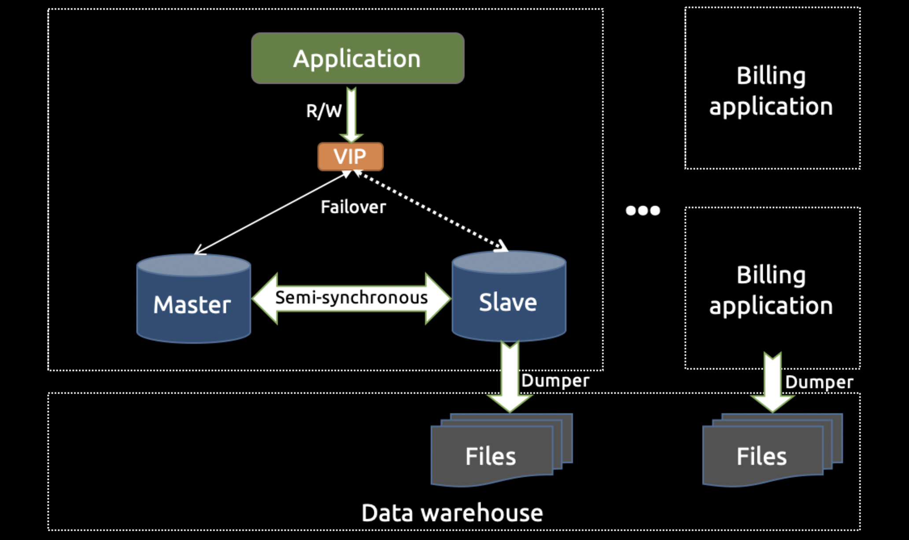
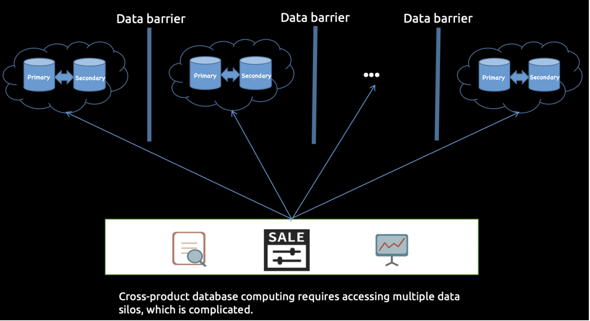
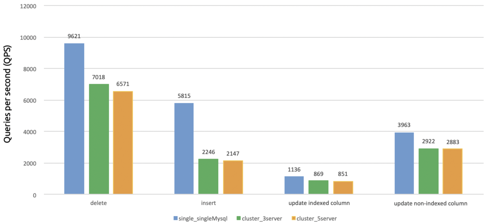
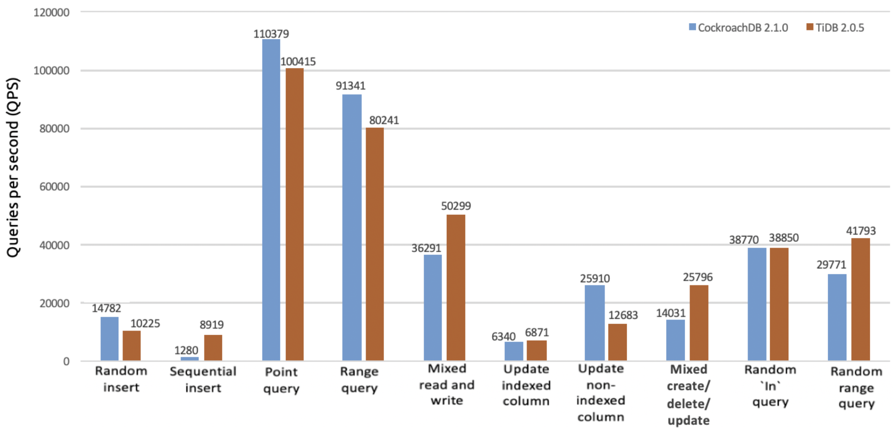
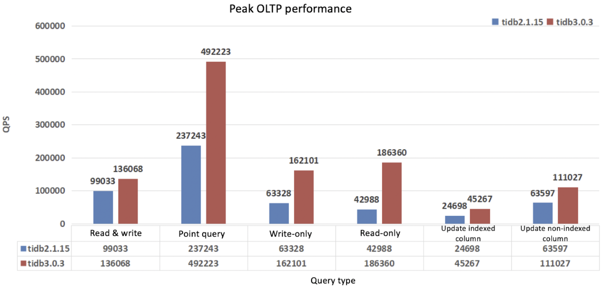
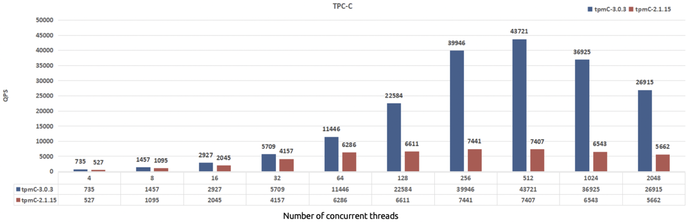
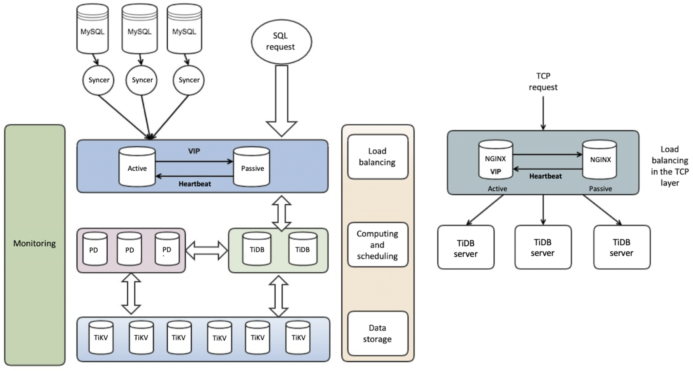

**Industry:** Gaming

**Author:** Wenjie Li (Senior Database Administrator at NetEase Games Billing Team, TiDB User Group Ambassador)

NetEase Games, affiliated with [NetEase, Inc.](https://en.wikipedia.org/wiki/NetEase), is a leading provider of self‐developed PC‐client and mobile games to worldwide users. As one of the biggest players in China's online gaming market, we currently have over 250 games in operation, some of which maintain millions of daily active users. NetEase Games has achieved more than $1 billion in revenue for the fifth consecutive quarter.

The billing team is a support department that provides unified login and payment solutions for NetEase Games products. Our billing system unifies storage for more than 280 game clients and servers and more than 300 channel vendors at home and abroad. We also provide valuable data services for business units such as the product operations team and strategy research team.

As our business boomed, the soaring data size became a nightmare for us. Every day, our billing applications processed over 3.6 billion requests, generated over 5 terabytes of log data, and wrote dozens of gigabytes of data into the database. This exposed the bottlenecks of our standalone MySQL architecture in scalability, data isolation, performance, and other areas.

In this post, I'll dive deep into why we chose [TiDB](https://en.wikipedia.org/wiki/TiDB), an open-source MySQL-compatible distributed [Hybrid Transactional/Analytical Processing](https://en.wikipedia.org/wiki/Hybrid_transactional/analytical_processing_(HTAP)) (HTAP) database, over some other MySQL-based and NewSQL storage solutions. I'll describe how we tested TiDB against its competitors, why TiDB won, and how we are using it now.

## Our pain points

In this section, I'll introduce the MySQL architecture for our billing applications and the bottlenecks we identify. As you'll see, **database scalability** and **data isolation** are our two major pain points.

### MySQL architecture for our applications

We deploy more than 10 billing applications to provide services for different game products. A big product employs a dedicated billing application, while multiple small products share the same application. Each billing application applies the standalone MySQL architecture as shown below. (The direction of the arrows indicates the flow of the data or request.)

 _Standalone MySQL architecture_ 
 

The architecture has the following characteristics:

* **Load balancing**

    Each billing application is deployed on multiple machines through [Keepalived](https://www.keepalived.org/), so the traffic is load-balanced. This guarantees the high availability of the application service.

* **MySQL master-slave structure**

    The database layer employs the MySQL master-slave structure. Its semi-synchronous replication enables data from one MySQL server (the master instance) to be copied automatically to one or more MySQL servers (the slave instances). This feature addresses latency and consistency issues.

* **Failover**

    The billing application accesses the back-end database through a virtual IP address (VIP). If the master instance is down, the application service automatically drifts to the slave through a VIP, ensuring that the service is unaffected.

* **Data backup**

    Through the master-slave semi-synchronous replication, the slave collects data from the online billing application. Then, it dumps the data files to a data warehouse through full and incremental replication. Online and offline computing tasks are performed there.

There are over 50 MySQL master-slave structures like this, involving 200~400 servers. Gigabytes of data are inserted on a daily basis.

## Bottlenecks

With our applications' traffic and data volume growing rapidly, our standalone MySQL approach reached the following bottlenecks:

* **Capacity**

    A standalone MySQL instance has limited storage space. To maintain the existing architecture, we had to delete and rotate old data to release space. 

    For example, a single table stored more than 700 GB of data because we needed to persist game users' purchase orders. With more users jumping in, the generated data surged, and the standalone MySQL instance would reach its storage limit.

* **Performance**

    Our largest single MySQL table stored 1.5 billion rows of data. With such a large number of rows, the read and write performance were severely affected. 

    When we persisted the purchase orders' data, we also had to ensure that online users could query the data in real time. The standalone MySQL servers could not deliver a satisfactory query performance.

* **Scalability**

    MySQL could not elastically scale while staying online, so the capacity bottleneck could not be easily resolved.

* **SQL statement complexity**

    Rotating a large table meant moving the older data from it into a newly created sub-table. It was performed on a daily basis. This would produce multiple sub-tables that needed to be joined when we ran a union query. The SQL statement could be too complicated and difficult to maintain. For this reason, it was not easy to analyze large amounts of data in a standalone MySQL architecture.

* **Data barriers**

    We deployed databases independently for different game products. Data was scattered on data silos (that is, isolated islands of data), which made it difficult to gain insights from data analysis. When performing cross-product calculations, we needed to maintain multiple heterogeneous data sources, and the methods to access these sources were complicated. 

 _Data silos_ 

## New database exploration

In this section, I'll describe the ideal database for our applications, and what we did to find it. 

### The ideal database for our applications

Considering our billing applications were highly coupled with MySQL, to resolve our issues we needed a new storage solution with the following features:

*   Compatible with the MySQL protocol.
*   Support for transactions—tasks are executed as transactions or rolled back in the case of error.
*   Support for indexes—especially for secondary indexes.
*   Horizontal scalability—the system can elastically scale while online, including performance scaling and capacity expansion.
*   Stability and reliability.
*   Backup and recovery.
*   Disaster tolerance.

### Our options

To meet the requirements above, we listed several optional solutions. These solutions can be grouped into two categories: MySQL-based solutions and NewSQL-based solutions (CockroachDB and TiDB).

<table>
  <tr>
   <td><strong>Solutions</strong>
   </td>
   <td><strong>Notes</strong>
   </td>
  </tr>
  <tr>
   <td>MySQL sharding
   </td>
   <td>Based on MySQL
   </td>
  </tr>
  <tr>
   <td>MySQL InnoDB cluster
   </td>
   <td>Based on MySQL
   </td>
  </tr>
  <tr>
   <td>MySQL + Vitess
   </td>
   <td>Based on MySQL
   </td>
  </tr>
  <tr>
   <td>MySQL + MyCAT
   </td>
   <td>Based on MySQL
   </td>
  </tr>
  <tr>
   <td>CockroachDB (CRDB for short)
   </td>
   <td>NewSQL
   </td>
  </tr>
  <tr>
   <td>TiDB
   </td>
   <td>NewSQL
   </td>
  </tr>
</table>

### Testing

#### MySQL versus NewSQL

At the beginning, we preferred to use MySQL-based solutions such as MySQL InnoDB clusters or MySQL with middleware. We designed some tests to verify each solution's practicality.

In MySQL clusters of two different versions—5.7.25 and 8.0.12—we performed writes on 10 tables (each had 10 million rows) with 128 concurrent threads. The same test was run for clusters with a single node (that is, a standalone architecture), three nodes, and five nodes. The results are shown below:

 _Results of testing MySQL clusters of different node sizes_ 
 

The tests showed that a multi-node MySQL cluster performed about 30% worse under write workloads than a standalone MySQL node. Other read and write tests had similar results. 

We tested MySQL with middleware solutions, and this architecture didn't meet our expectations. To sum up, we did not adopt these solutions or the MySQL sharding solution for two reasons:

* The performance did not satisfy our requirements.
* Migrating to the new application architecture was complicated. We would need to modify large amounts of application code.

In fact, solutions such as MySQL InnoDB clusters and MySQL with middleware are essentially an extension of the MySQL master-slave structure. They are not a real distributed system, but achieve horizontal scalability in a way like adding "patches"—that's why many of their characteristics did not meet our expectations.

#### CockroachDB versus TiDB

In the distributed NewSQL world, TiDB and CockroachDB (CRDB for short) are well known to many, and both are the open-source implementation of the Google Spanner and F1 papers. Our research showed that:

* TiDB is compatible with the MySQL protocol, while CRDB is compatible with the PostgreSQL protocol.
* If the application is based on the MySQL database, TiDB may be a better choice; if the application is based on PostgreSQL, CRDB may be the preferred choice.

We also conducted comprehensive tests for TiDB and CRDB. For example, in July, 2018, we created two clusters of 10 machines each. Five of the nodes in each cluster were dedicated storage nodes. We deployed CRDB 2.1.0 on one cluster and TiDB 2.0.5 on the other. We performed reads and writes on a single table of 200 million rows with 160 concurrent threads. (Both CRDB and TiDB clusters used the default configuration and were not tuned.)

Here are some testing statements we ran:

<table>
  <tr>
   <td><strong>Query type</strong>
   </td>
   <td><strong>Testing statements</strong>
   </td>
  </tr>
  <tr>
   <td>Range query
   </td>
   <td>SELECT c FROM sbtest%u WHERE id BETWEEN ? AND ?

SELECT SUM(k) FROM sbtest%u WHERE id BETWEEN ? AND ?

SELECT c FROM sbtest WHERE id BETWEEN ? AND ? ORDER BY c

SELECT DISTINCT c FROM sbtest%u WHERE id BETWEEN ? AND ? ORDER BY c
   </td>
  </tr>
  <tr>
   <td>Random `IN` query
   </td>
   <td>SELECT id, k, c, pad FROM sbtest1 WHERE k IN (?)
   </td>
  </tr>
  <tr>
   <td>Random range query
   </td>
   <td>SELECT count(k) FROM sbtest1 WHERE k BETWEEN ? AND ? OR k BETWEEN ? AND ?
   </td>
  </tr>
  <tr>
   <td>Update indexed column
   </td>
   <td>UPDATE sbtest%u SET k=k+1 WHERE id=?
   </td>
  </tr>
  <tr>
   <td>Update non-indexed column
   </td>
   <td>UPDATE sbtest%u SET c=? WHERE id=?
   </td>
  </tr>
  <tr>
   <td>Mixed read and write
   </td>
   <td>Range query + create/delete/update queries
   </td>
  </tr>
</table>

The following figure shows one of our important testing results: In general, CRDB 2.1.0 and TiDB 2.0.5 had a similar performance in most of the read and write workloads.

 _Performance comparison of reads and writes on a large table_ 
 

Conclusion:

* CRDB and TiDB were comparable in performance.

    Note: The above is the testing result for TiDB 2.0.5. In July 2019, PingCAP announced that [TiDB 3.0 reached general availability](https://pingcap.com/blog/tidb-3.0-announcement/), achieving a major performance boost. Our recent tests showed that in most scenarios TiDB 3.0's performance was multiple times better than TiDB 2.1. The following test results compare TiDB 3.0.3 and TiDB 2.1.15 in the areas of peak [online transaction processing](https://en.wikipedia.org/wiki/Online_transaction_processing) (OLTP) and [TPC Benchmark C](http://www.tpc.org/tpcc/) (TPC-C):

 _Peak OLTP performance comparison_ 

 _TPC-C performance comparison_ 

* CRDB is compatible with the PostgreSQL protocol. If we migrate our application architecture to CRDB, we have to change the protocol, which is complicated and costly.

* TiDB is compatible with the MySQL protocol, which means few code modifications and low migration costs.

#### Choosing TiDB

Finally, it was time to make our decision. For each solution in the discussion, we evaluated the factors that were most important to us:

<table>
  <tr>
   <td><strong>Solution</strong>
   </td>
   <td><strong>Scalability</strong>
   </td>
   <td><strong>OLTP</strong>
   </td>
   <td><strong>OLAP</strong>
   </td>
   <td><strong>Open Source</strong>
   </td>
  </tr>
  <tr>
   <td>MySQL sharding
   </td>
   <td>No
   </td>
   <td>Yes
   </td>
   <td>No
   </td>
   <td>Yes
   </td>
  </tr>
  <tr>
   <td>MySQL InnoDB cluster
   </td>
   <td>No
   </td>
   <td>Yes
   </td>
   <td>Yes
   </td>
   <td>Yes
   </td>
  </tr>
  <tr>
   <td>MySQL + Vitess
   </td>
   <td>No
   </td>
   <td>Yes
   </td>
   <td>No
   </td>
   <td>Yes
   </td>
  </tr>
  <tr>
   <td>MySQL + MyCAT
   </td>
   <td>Yes
   </td>
   <td>Yes
   </td>
   <td>No
   </td>
   <td>Yes
   </td>
  </tr>
  <tr>
   <td>CockroachDB (CRDB)
   </td>
   <td>Yes
   </td>
   <td>Yes
   </td>
   <td>Yes
   </td>
   <td>No
   </td>
  </tr>
  <tr>
   <td>TiDB
   </td>
   <td>Yes
   </td>
   <td>Yes
   </td>
   <td>Yes
   </td>
   <td>Yes
   </td>
  </tr>
</table>

It seemed like TiDB has a competitive edge over the others. Then, we listed what TiDB empowered us to do:

* **MySQL compatibility saves application migration efforts and costs.**

    TiDB is highly compatible with MySQL and supports indexes (including secondary indexes) and ACID transactions. It also has an ecosystem of tools such as [Syncer](https://pingcap.com/docs/stable/reference/tools/syncer/) and [TiDB Data Migration](https://pingcap.com/docs/stable/reference/tools/data-migration/overview/) (TiDB DM) for seamless migration from MySQL.

* **Horizontal scalability brings large capacity storage and lower operation costs.**

    TiDB expands storage simply by adding new nodes. The database can elastically scale out in real time without taking any node offline. This makes our infrastructure capacity planning much easier and more cost-effective than traditional relational databases that only scale vertically. In addition, our database administrators are finally free from the drudgery of frequently purging older data from MySQL. 

* **Horizontal scalability makes storing data in a large database pool and big data mining possible.**

    Horizontal scalability ensures large capacity storage in TiDB. This enables us to store different game products' data in the same database pool. This removes data barriers and is very important for business analytics.

* **No need for sharding.**

    TiDB supports efficient reads and writes on super large tables.

* **A stateless computing engine guarantees high queries per second (QPS) performance.**

    As the computing layer, TiDB server is stateless and supports multi-node reads and writes. It is easy to increase QPS by adding new TiDB servers as long as the storage layer is not under-powered.

* **The [Raft consensus algorithm](https://raft.github.io/) ensures high availability and strong consistency.**

    TiDB uses the Raft consensus algorithm to ensure that data is replicated to multiple replicas throughout storage in Raft groups. If a node fails, a Raft group automatically elects a new leader for the failed member and self-heals the TiDB cluster. Thus, one node failure does not affect application service.

* **TiDB's ecosystem of tools simplifies data backup and recovery.**

    You can deploy TiDB across data centers or across regions. We can use [Mydumper](https://pingcap.com/docs/stable/reference/tools/mydumper/) and [Loader](https://pingcap.com/docs/stable/reference/tools/loader/) to concurrently export and restore data with multiple threads. TiDB also has the [TiDB Binlog](https://pingcap.com/docs/stable/reference/tidb-binlog/overview/) tool, which collects the logical changes made to a TiDB cluster and provides incremental backup and replication to the downstream (TiDB, Kafka, or MySQL).

As far as we were concerned, TiDB was the most cost-effective solution to fit in our scenarios, and we wanted to give it a try!

## Using TiDB for our applications

Throughout our journey with TiDB, we've used multiple versions for testing or production, including versions 1.0, 2.0.5, 2.0.11, 2.1.5, 2.1.15, and 3.0.3. We've witnessed the great improvements TiDB has made over the years. In this section, I'll describe how we're currently using TiDB for our billing applications.

### TiDB architecture

We deploy the TiDB cluster in a highly-layered structure as shown below. [NGINX](https://www.nginx.com/) is used for load balancing in the front end.

 _TiDB architecture for billing applications_ 

Inside the TiDB cluster, there are three main components:

* [TiDB server](https://github.com/pingcap/tidb) is a stateless SQL layer that processes SQL requests, accesses data from the storage layer, and returns the computing results to the application. It is MySQL-compatible and sits on top of TiKV.

* [TiKV server](https://github.com/pingcap/tikv) is the distributed transactional key-value storage layer where the data persists. It uses the Raft consensus protocol to ensure that data has multiple replicas and will not be lost if a node fails.

* [PD (Placement Driver) server](https://github.com/pingcap/pd) is a metadata cluster powered by [etcd](https://github.com/etcd-io/etcd) that manages and schedules TiKV nodes.

### TiDB use cases

#### Application scenarios

* TiDB mirrors the MySQL databases in the production environment. TiDB collects data from online MySQL databases, assembles it into the data pool, and manages the data intensively.

* TiDB supports data platform services, including reporting, monitoring, operations, generating user profiles, and computing big data.

* HTAP scenarios that involve both OLTP and [online analytical processing](https://en.wikipedia.org/wiki/Online_analytical_processing) (OLAP) workloads.

#### Cluster

* In our testing environment, we use a TiDB 3.0.3 cluster to evaluate new features.

* In our production environment, we also have a TiDB 3.0.3 cluster that serves two kinds of workloads: 80% of them are offline big data computing, while the other 20% are online services.

#### Scale

<table>
  <tr>
   <td>Environment
   </td>
   <td>41 servers

88 instances

38 Syncer real-time replication streams (will upgrade to \
<a href="https://pingcap.com/docs/stable/reference/tools/data-migration/overview/">TiDB Data Migration</a>)
   </td>
  </tr>
  <tr>
   <td>Storage
   </td>
   <td>20 TB data (50 TB total)

2.3 million Regions
   </td>
  </tr>
  <tr>
   <td>Performance
   </td>
   <td>4 k/s average QPS

10 k/s QPS at peak time (sustained for 4 hours)

1:5 read/write ratio
   </td>
  </tr>
  <tr>
   <td>Latency
   </td>
   <td>80% of latencies below 8 ms

95% of latencies below 125 ms

99.9% of latencies below 500 ms
   </td>
  </tr>
</table>

## Conclusion

In this post, I discussed why we adopted a new storage solution for our billing applications and why we chose TiDB over other alternatives. Our current success with using TiDB gives us the confidence to move more of our services to TiDB in the future. This scale-out distributed SQL database enables us to gain insights from data and create value for our users.

In my next post, I'll share some first-hand experiences on how we migrated applications from MySQL to TiDB, as well as how we managed and maintained a TiDB cluster. Stay tuned.
