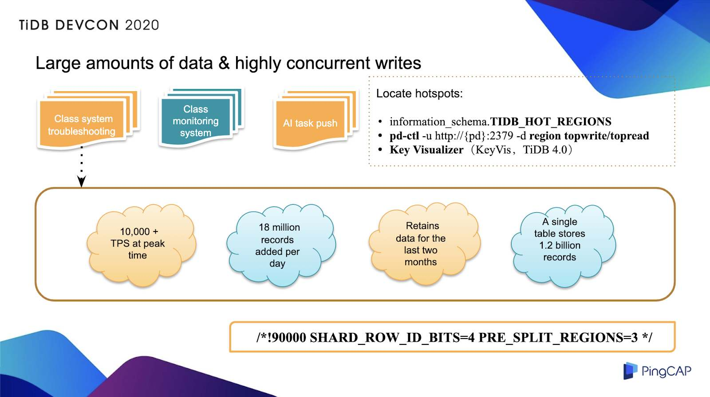
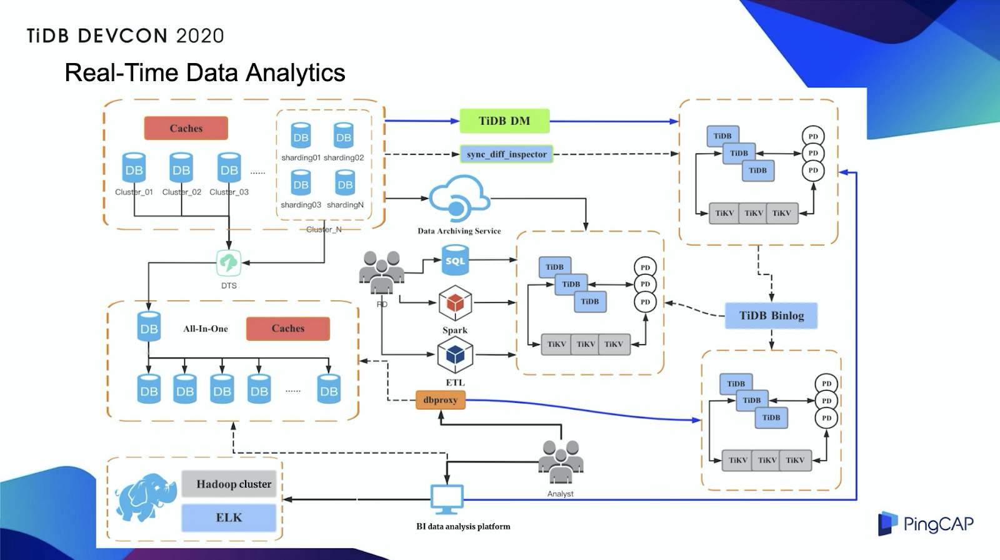
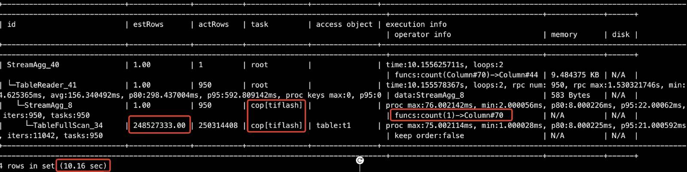
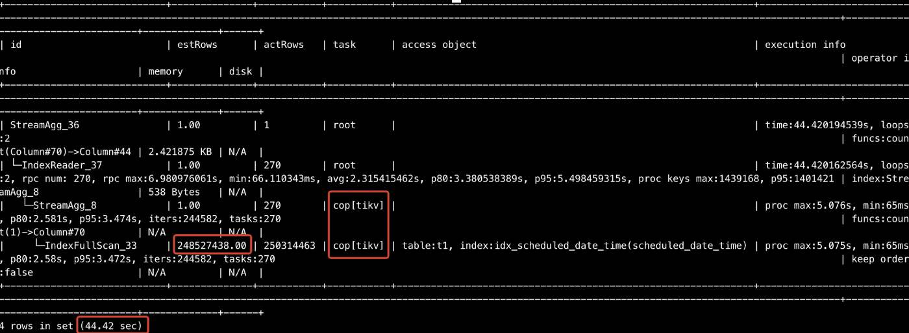
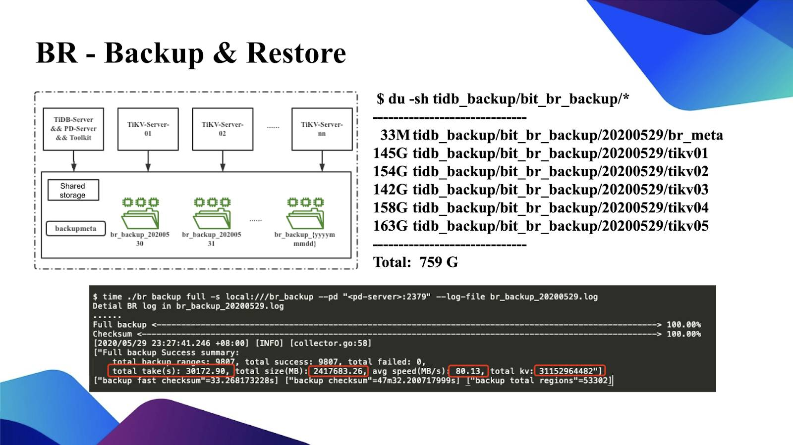

**Industry:** EdTech

**Author:** Chao Xu (Senior DBA Engineer at VIPKid)

[VIPKid](https://en.wikipedia.org/wiki/VIPKid) is an online English education company based in China that serves children aged 4-15 and their parents. Through our online classroom portal and video chat platform, children in China can get a 25-minute English lesson from a fluent English speaking teacher in the United States or Canada. Currently, we have more than 700,000 paying students.

We use MySQL as our backend database. But as our application data grew rapidly, standalone MySQL's storage capacity became a bottleneck, and it could no longer meet our application requirements. We tried MySQL sharding on our core applications, but it was difficult to run multi-dimensional queries on sharded data. Therefore, we adopted [TiDB](https://docs.pingcap.com/tidb/stable/overview), an open-source, distributed SQL database that supports [Hybrid Transactional/Analytical Processing](https://en.wikipedia.org/wiki/HTAP) (HTAP) workloads. **TiDB supports creating secondary indexes on large tables. We can use it to perform multi-dimensional SQL queries.** We don't need to worry about cross-shard, multi-dimensional queries for sharding any more.

I'm a senior DBA engineer at VIPKid, and I'd like to discuss how we use TiDB to do multi-dimensional queries on sharded data and enhance our real-time analytics capability. First, I'll discuss the application scenarios in which we use TiDB, and then I'll share the benefits TiDB gives us.

## Why we chose TiDB

Previously, we used MySQL as our backend database. But as our data size sharply increased, a standalone MySQL database had limited storage capacity and couldn't provide services for us.

**We tried MySQL sharding but found it had these disadvantages:**

* It increased application complexity, and the application became difficult to maintain.
* It was difficult to perform cross-shard queries.
* If the load among shards became unbalanced, we needed to reshard data.

Therefore, we looked for a new database and found that [TiDB](https://docs.pingcap.com/tidb/stable/overview) is a good solution.

[TiDB](https://github.com/pingcap/tidb) is an open-source, distributed SQL database built by [PingCAP](https://pingcap.com/) and its open-source community. It is MySQL compatible and features horizontal scalability, strong consistency, and high availability. It's a one-stop solution for both Online Transactional Processing (OLTP) and Online Analytical Processing (OLAP) workloads. You can learn more about TiDB's architecture [here](https://docs.pingcap.com/tidb/v4.0/architecture).

TiDB has many [advantages](https://docs.pingcap.com/tidb/stable/overview#key-features), of which the following attract us most:

* **It's compatible with the MySQL protocol, common MySQL features, and the MySQL ecosystem.** To migrate a production application to TiDB, we only need to modify a small amount of code.
* **It supports horizontally scaling in or out.** The TiDB architecture design separates computing from storage and enables us to separately scale out or scale in the computing or storage capacity online as needed. The scaling process is transparent to application operations and maintenance staff.
* It's suitable for various use cases that require **high availability and strong consistency with large-scale data**.

## How we use TiDB at VIPKid

We've found that TiDB is especially helpful to us in these application scenarios:

* Working with large amounts of data and highly concurrent writes
* Multi-dimensional queries for sharded core applications
* Data life cycle management
* Real-time data analytics

### Working with large amounts of data and highly concurrent writes

The following figure shows the application scenarios with large data volumes and highly concurrent writes. To understand this scenario, consider our classroom troubleshooting system. This system collects information on classroom events in real time, including when students enter and leave the classroom and when services are initialized. This information is reported through the parent and the teacher applications. The application team can use this information to quickly locate faults in the classroom system and do some troubleshooting, such as switching lines, to ensure class quality.

 Massive-data and high-concurrent-write scenarios 

The system's current peak workload is about 10,000 transactions per second (TPS), and about 18 million rows of data is added each day. This table only retains the data for the last two months. Currently, a single table has about 1.2 billion rows of data. This amount of data is actually too big. If we store this amount of data in MySQL, the maintenance cost will be high, so we migrated all system data to TiDB.

During the migration process, we made some minor changes to the table schema. We removed the original auto-increment ID, and when we built the table, we scattered [Regions](https://docs.pingcap.com/tidb/stable/glossary#regionpeerraft-group) in advance by specifying the configuration. When there are highly concurrent writes, this approach avoids writing hotspots. In TiDB 4.0, [TiDB Dashboard](https://docs.pingcap.com/tidb/stable/dashboard-intro) makes it easier to find hotspots because it graphically displays information such as the write volume and read volume.

### Multi-dimensional queries for sharded core applications

In the earlier stages of our company, we implemented sharding on many of our core applications—such as class scheduling. Generally, when we do sharding, only one application column is used as the sharding key. However, a scheduling task may involve several dimensions including classrooms, teachers, students, and courses. In addition, other applications may also access the data. For example, when the teacher application accesses data, the data is displayed in the teacher's view. But if data is split based on the student's view, the teacher's access request will be broadcast to all shards, which is not allowed online.

We tried several solutions with limited success. Finally, we used [TiDB Data Migration](https://docs.pingcap.com/tidb-data-migration/stable/overview) (DM) to replicate all sharded tables from upstream to downstream in real time and merge them into a global table. All multi-dimensional queries run on TiDB, whether they are on the management application operation platform or on the application indicator monitoring system.

The logic of DM sharding is simple. DM pulls the binlog of all shards online, and then, based on the blocklist and allowlist, matches the binlog events that need to be replicated. Then, DM matches the predefined routing rules, rewrites the rules, and then applies the rules to the downstream global table.

For DM, we did two things:

* We changed the DM delay monitoring mechanism. In most cases, when we merge shards, the replication delay is within 200 milliseconds.
* We achieved high availability for DM.

If you'd like to learn the details of our DM modification, you can join the [TiDB community on Slack](https://slack.tidb.io/invite?team=tidb-community&channel=everyone&ref=pingcap-blog).

### Data life cycle management

If you've used MySQL, you might know that the cost of maintaining large tables in MySQL is high; so in general, many companies will do hierarchical data archiving. We now divide the data into multiple levels according to the specific application and read and write volumes. We put the cold data, warm data, and online read traffic in TiDB.

To transfer data, we must ensure that the table schema of cold and hot data is the same. However, there is a lot more cold data than hot data. This can impact efficiency of table schema changes. For example, if you've changed the table schema for the hot data, such as adding a column, and you want to do the same thing for cold data, the cost will be very high—perhaps 10 times greater than the hot table or even more. So we decided to use TiDB to do this. On the one hand, TiDB's DDL has some useful features. For example, you can add or subtract fields in seconds. On the other hand, with TiDB's horizontal scalability, we can reuse a set of TiDB archive clusters for each application.

### Real-time data analytics

We used TiDB for real-time data analytics. The following figure shows our infrastructure:

 Using TiDB for real-time data analytics 

This scenario is mainly used by business intelligence (BI) analysts and some BI platforms. We use DM to replicate all online data to TiDB. With the help of TiDB's horizontal scalability and computing pushdown capabilities, we do real-time data analytics.

## What benefits does TiDB 4.0 bring us?

### TiFlash, TiDB's columnar storage engine

[TiFlash](https://docs.pingcap.com/tidb/dev/tiflash-overview) is an extended analytical engine and columnar store for TiDB. A TiDB database that incorporates TiFlash lets you perform real-time HTAP analytics.

TiFlash offers you:

* **Strong consistency in real time.** TiDB replicates updated data to TiFlash in real time to ensure that TiFlash processes the latest (not just fresh) data.
* **Automatic storage selection.** TiDB intelligently determines whether to select row storage or column storage to cope with various query scenarios without your intervention.
* **Flexibility and workload isolation.** Both row and column stores scale separately.

#### TiFlash benefits

##### Performance improvement

I did a simple test with five TiKV nodes, one TiFlash node, and one table with 250 million rows of data. I tried to count the table records. When I queried by index in TiKV, it took me more than 40 seconds to get the result. But when I queried in a single TiFlash node, it took only 10 seconds. If I added more TiFlash nodes, the speed would further improve.

 Querying with only one TiFlash node 

 Querying with five TiKV nodes 

##### Decreased costs

We used to have a cluster for BI, but it ran an older version of TiDB. We've replaced it with a TiDB 4.0 cluster with TiFlash. The following table shows the resource allocation when the new and old clusters are under the same load. Deploying a new cluster with TiFlash has reduced our overall costs by 35%.

<table>
  <tr>
   <td><strong>Cluster</strong>
   </td>
   <td><strong>CPU virtual cores</strong>
   </td>
   <td><strong>Memory</strong>
   </td>
   <td><strong>Storage capacity</strong>
   </td>
  </tr>
  <tr>
   <td>Old cluster
   </td>
   <td>240
   </td>
   <td>1.5 T
   </td>
   <td>36 T + 3 T
   </td>
  </tr>
  <tr>
   <td>TiDB 4.0 cluster
   </td>
   <td>152
   </td>
   <td>0.75 T
   </td>
   <td>12 T + 2 T
   </td>
  </tr>
</table>

##### Improved stability

If there was an SQL query involving a full table scan, the TiKV cluster load would increase. This could increase the overall response time of OLTP queries. Now, I can add a TiFlash node to automatically add a copy of TiFlash for the large table in the corresponding cluster. Now, if an SQL query involves a full table scan, data can go to TiFlash first. This ensures that TiKV is affected as little as possible.

#### TiFlash limitations

We found TiFlash had these limitations:

* If your SQL statement includes functions that TiFlash hasn't implemented yet, it's impossible to push down operators. The SQL statement just uses TiFlash's capability to speed up calculations.

    If your statements don't implement pushdowns, you can [open an issue](https://github.com/pingcap/tidb/issues/new/choose) on GitHub.

* TiFlash has very limited support for JOIN operation between large tables.

    The PingCAP team has optimized the JOIN operation between a large table and a small table. They'll continually optimize the rest of JOIN operations.

### TiDB Dashboard: easier troubleshooting for TiDB

TiDB 4.0 introduces [TiDB Dashboard](https://docs.pingcap.com/tidb/stable/dashboard-intro), a graphical interface with various built-in widgets that let you easily diagnose, monitor, and manage your clusters. TiDB Dashboard makes TiDB easier to use right out of the box and gives you important insights into your data and database performance.

In a single interface, you can check a distributed cluster's runtime status and manage the cluster, including:

* Quickly finding cluster hotspots
* Analyzing SQL statements' execution performance
* Viewing slow queries
* Generating cluster diagnostic reports
* Searching and exporting logs
* Profiling instances

For more details, see [TiDB Dashboard: Easier Troubleshooting for Distributed Databases](https://pingcap.com/blog/easier-troubleshooting-for-distributed-databases).

### Backup & Restore: a distributed backup and restore tool

In the past, TiDB only supported logical backups, and backing up large amounts of data was not very efficient. Now, TiDB's [Backup & Restore](https://docs.pingcap.com/tidb/stable/backup-and-restore-tool) (BR) tool uses physical backups, which is very impressive. BR is a distributed backup and restore tool, that offers high backup and restore speeds—[1 GB/s or more for 10 TB of data](https://pingcap.com/blog/back-up-and-restore-a-10-tb-cluster-at-1-gb-per-second).

We gave BR a try, as shown in the figure below:

 Backup & Restore 

PingCAP suggested that to make a backup, we use the same shared storage on the BR machine and all TiKV machines. We backed up a TiDB instance of approximately 2.4 TB. The backup took several hours. However, I think we can optimize this time further, because the average backup speed is about 80 MB per second, which may be limited by the bandwidth of the current Serial Attached SCSI (SAS) disk. If we make adjustments later, it will be faster. The figure above shows the size of each directory backed up by BR. As you can see, the overall backup size is 700+ GB.

## Summary

As our application data grew quickly, standalone MySQL's storage capacity could no longer meet our application requirements. After we sharded our core applications, it was difficult to run multi-dimensional queries on sharded data. Therefore, we adopted [TiDB](https://docs.pingcap.com/tidb/stable/overview), an open-source, distributed, HTAP database, which features MySQL compatibility, horizontal scalability, high availability, and strong consistency.

Thanks to TiDB's support for multi-dimensional SQL queries on sharded tables, we don't need to worry about multi-dimensional queries across shards. In addition, TiDB has powerful functionalities and ecosystem tools. They helped improve our query performance, easily troubleshoot cluster problems, and quickly back up data.
